# Agent学习手册

## 一、API的概念

### 1.1 API 的基础

API 的全称是 Application Programming Interface（应用程序编程接口）。可以类比为电源插座。

当你把手机充电器插进插座时，你并不需要知道远处的发电厂是在烧煤还是在用风力发电，也不需要理解复杂的电网是怎么把电输送到你家的。对你来说，电厂就是一个“黑盒子”。你唯一关心的就是这个插座：只要你的插头尺寸对得上（符合标准），一插进去，电就来了。

开发者不需要从头去研究如何发电（比如画地图、写支付系统），只需要调用现成的 API，就能像**搭积木一样**快速构建出功能强大的应用。这不仅节省了巨大的开发成本，还让**自动化**成了可能——比如让系统自动处理重复性工作，同步数据或发送通知，把人类从琐碎的劳动中解放出来。同时，API 还充当了**安全守门人**的角色，确保只有合法的插头（请求）才能接通，让企业可以放心地使用第三方提供的尖端服务。

### 1.2 API如何工作

如果把API的运行过程比作再餐厅点餐：

在这个过程中，**API 请求**就像是你的订单。它包含了你想访问的“端点”（菜名）、你想做的动作（是获取数据还是提交信息）以及具体的参数（比如只要伦敦的天气）。而 **API 响应** 则是服务员带回的结果，其中包含了告诉你是否成功的“状态码”（比如 200 代表大功告成）以及你真正想要的“响应体”数据。

### 1.3 示例

**天气预报 API** 它就像一个专门提供气象信息的窗口。你的天气应用向它发送坐标和密钥，它就回传一串 JSON 数据。

- 一个简单的“请求”示例：
  - **Endpoint:** `/current-weather`
  - **Parameters:** `city=London` & `apiKey=your_access_key`
- **“响应”（回传的数据）：**`json { "city": "London", "temperature": "15°C", "condition": "Cloudy", "humidity": "70%" } `应用拿到这些数据后，再把它们漂亮地展示在你的手机屏幕上。

### 1.5 安全提示

在设计前端网页时，不要再浏览器代码里直接写API密钥，通常的做法是写一个后端代理，让服务器完成调用。

## 二、Git工作流

### 2.1 什么是Git

Git 是由 Linux 内核开发者 Linus Torvalds 于 2005 年创建的分布式版本控制系统。其核心功能是跟踪文件的修改历史，允许开发者随时查看和回滚到以前的版本，并在与他人协作时高效地合并更改。

### 2.2 安装Git

Windows系统可以前往官网安装后下载，根据安装向导提示安装即可。

Linux系统：

```bash
# Ubuntu/Debian
sudo apt update
sudo apt install git

# CentOS/RHEL
sudo yum install git
```

### 2.3 初始化Git

安装 Git 后，你首先需要配置你的用户信息——这是使用 Git 进行版本控制的基本步骤。

```bash
# 设置全局用户名（将显示在提交记录中）
git config --global user.name "Your Name"

# 设置全局邮箱（建议使用在 GitHub/GitLab 等平台上注册的邮箱）
git config --global user.email "your.email@example.com"
```

Git 会将此信息嵌入到每个提交记录中，作为每次修改的“作者信息”。查看版本历史记录（例如，使用 git log）时，你可以清楚地看到谁修改了每一行代码，便于追溯责任和沟通。

查看当前Git的配置信息：

```bash
git config --list
```

### 2.4 GitHub介绍

GitHub 是一个基于 Git 的代码托管平台。它不仅为 Git 仓库提供远程存储，还包括协作工具（如 Issues、Pull Requests、Projects），使开发者更容易分享代码和协作。

拉取远程仓库：

一般分为https以及SSH的方式。一般来说，通过 HTTP 克隆的仓库适合临时下载和测试他人的仓库，但不建议用于自己的开发。为了更好的学习体验，你应该先设置 SSH 认证。

- **HTTPS 方式**：基于通用的 HTTPS 协议（443 端口），访问 GitHub 仓库时需要用「用户名 + 个人访问令牌（PAT）」完成身份验证（GitHub 已不再支持密码直接认证）。

- **SSH 方式**：基于 SSH 安全外壳协议（22 端口），通过本地生成的「SSH 密钥对」（公钥 + 私钥）认证：把公钥添加到 GitHub 账户，本地保留私钥，GitHub 通过公钥验证你的私钥合法性，无需输入密码 / 令牌。

SSH 认证依赖于密钥对（公钥 + 私钥），它们是匹配的加密文件。生成后，你需要将“公钥”提供给 GitHub（“绑定”），而“私钥”留在本地设备上：

1. 私钥：存储在本地设备（如电脑）的指定目录中（通常是 ~/.ssh/），充当“你的专属钥匙”，绝不能与任何人分享。
2. 公钥：这是一把可以公开分享的“锁”——你需要将其复制到 GitHub 账号的“SSH keys list”中（“绑定”操作）。

也就是说想使用SSH认证，则需要**生成密钥对-上传公钥到GitHub**。私钥保存到本地，公钥上传到GitHub中。生成密钥对的命令：

```bash
# 执行命令后的交互过程示例
$ ssh-keygen -t ed25519 -C "your_email@example.com"
Generating public/private ed25519 key pair.
# 提示1：指定密钥保存路径（回车=使用默认路径~/.ssh/id_ed25519）
Enter file in which to save the key (/root/.ssh/id_ed25519): 
# 提示2：设置私钥的密码保护（passphrase，回车=无密码）
Enter passphrase (empty for no passphrase): 
# 提示3：确认密码保护（回车=无密码）
Enter same passphrase again: 
```

如果你有多个设备（如笔记本电脑和台式机），你需要为每个设备生成单独的 SSH 密钥对，并将每个公钥绑定到同一个 GitHub 账号——每个设备都有自己的“门禁卡”。

### 2.5 Git的基本操作

1.下载已有仓库

```bash
git clone
```

2.从远程仓库获取更新

每次更新仓库之前，由于它可能由多人维护，你需要先拉取最新的更改。之后，你可以修改并推送文件。注意包含仓库的相对路径。

```bash
git pull
```

3.暂存更新并推送至GitHub

```bash
git status # 查看当前文件修改状态
git add xxx.xx # 添加单个文件
git add . # 添加所有修改的文件
git commit -m "..." # 提交暂存区的修改，并添加提交信息
git pull origin main # 先拉取远程最新代码
git push origin main # 明确指定远程仓库和分支(首次需要加上-u)
```

## 三、Web应用部署

为什么需要部署？

任何一个网站想要被外部用户访问，都必须有一个可以**公开访问的网络地址**（这个地址可以是 IP 地址，比如 123.45.67.89，也可以是域名，比如 [google.com](https://google.com/) 等）。但只有地址是不够的——你写好的网页代码（例如 HTML、CSS、JavaScript 文件，或者使用 React、Vue 等框架写的项目），以及相关的图片 / 视频资源，都必须"放"在一台 24 小时在线的服务器上，由它来响应网络请求，这样任何人的浏览器才能访问并下载这些资源。


因此，把资源上传、配置好环境并让服务"跑起来"的整个过程，就被称为 **部署（Deployment）**。

### 3.1 部署的常见步骤

1.**服务器准备**：你需要先购买云服务器（比如阿里云、腾讯云、或 AWS EC2），选择服务器所在地区（如上海、新加坡）、配置（CPU、内存、磁盘大小等），还要学会如何远程连接服务器（例如通过 SSH 工具登录）。

2.**环境配置**：Web 应用需要在特定"环境"中才能运行——例如运行 Node.js 项目必须先安装 Node.js；运行 Python 项目必须安装 Python 以及对应的第三方库。

3.**上传资源**：你需要把本地的代码和资源上传到服务器上，常用的方法包括 FTP 或 Git。如果项目体积比较大（比如包含视频文件），中途一旦断线，有时需要重新上传。

4.**启动服务并测试**：上传完成后，你还需要在服务器上执行命令启动应用，并测试"分配的网络地址是否能访问"。

5.**维护与更新**：后续每次你修改代码，都要重新上传并重启服务。如果服务器宕机（例如断电、网络故障），还需要手动重启应用，有时还要额外配置"进程守护工具"，让程序在异常退出后自动拉起。

上述步骤通常比较繁琐。建议使用低代码部署平台，如：CloudBase（腾讯云）、Vercel、Zeabur。它们会帮你自动完成"买服务器、配环境、上传代码、启动服务、监控运行"等步骤。你只需要把自己的代码仓库（比如 GitHub 或 GitLab）连接到平台，它就会自动拉取代码、识别应用类型、配置对应的运行时环境，最后给你一个可以被任何人访问的公网地址。它甚至可以一键绑定你自己的域名。

| 平台                 | 特点                               | 适用场景                                                     | 免费额度              |
| -------------------- | ---------------------------------- | ------------------------------------------------------------ | --------------------- |
| **腾讯云 CloudBase** | 国内访问速度快，与微信生态深度整合 | 1.国内用户友好<br />2.微信生态整合好<br />3.充足的免费额度   | 有免费额度            |
| **Vercel**           | 前端框架支持好，与 GitHub 集成紧密 | 1.最流行的前端部署平台<br />2.GitHub深度集成                 | 有免费额度            |
| **Zeabur**           | 支持多种语言和服务模板，配置灵活   | 1.内置 Dify、n8n、数据库等多种服务模板<br />2.GitHub、模板、Docker 镜像、本地项目等 | 每月约 5 美元免费额度 |

### 3.2 CloudBase

- 注册并创建环境，登录腾讯云控制台，创建一个新环境。

- 开通静态网站托管，进入网站静态托管界面，这里已经分配了一个默认的域名。

  

  支持多种部署模板：

  

  - **本地项目上传**：直接从本地上传构建好的静态文件（HTML、CSS、JS 等）
  - **模板部署**：使用预设模板快速创建项目，如 React Web 应用模板、Vue Web 应用模板
  - **Git 仓库部署**：支持从 GitHub 等代码仓库自动拉取代码并部署

### 3.3 Zeabur

这里以创建自己的Dify服务为例，介绍Zeabur的使用流程：

1.在控制台点击”创建新项目“，弹出如下界面：


- **GitHub**：可以连接到你的 GitHub 账号。绑定之后，就可以直接从 GitHub 仓库里选择项目部署（GitHub 是目前全球最大的代码托管平台）。
- **Template（模板）**：可以基于模板来部署服务。Zeabur 内置了很多预设项目模板（例如 Dify、n8n 等），你可以基于这些模板快速创建并部署应用。
- **Databases（数据库）**：用于部署数据库服务，比如 MySQL、MongoDB 等常见数据库。
- **Local Project（本地项目）**：上传一个本地文件夹，Zeabur 会自动识别其中的启动脚本。这适合将你已经在本地开发好的项目快速部署到 Zeabur 上。
- **Docker Image**：部署已经打包好的 Docker 镜像。如果你的项目已经被打成了 Docker 镜像（例如存放在 Docker Hub 或其他镜像仓库中），可以在这里直接部署。
- **Cursor**：如果你安装了 Cursor（例如 Cursor IDE），可以通过这个入口将 Cursor 中的项目直接部署到 Zeabur。

这里使用Template的方式部署Dify，选择一个Dify的版本（由不同开发者维护）：


接下来输入一个任意的名称作为自定义的域名，点击部署后等待所有服务启动完成：


一般来说，你只需要点击左侧的 Dify 应用，就可以看到默认的访问入口地址。但在本例中，由于前面还套了一层 nginx，你需要点击 nginx 服务来获取最终访问地址。由于**Dify是由多个服务组成的**，因此可以理解为：nginx 就是负责对外统一"收发请求"的主程序，它会把外部访问的地址分发给Dify内部各个服务。点击左侧的 Nginx，在详情页中可以看到当前的服务地址，然后在浏览器里打开这个地址，等待服务完全启动。

这里需要注意的是，部署完毕后进入自定义域名会看到一个全新的Dify界面（即使已经注册过Dify），主要的区别是：在 Zeabur 上部署的是 Dify 的**自托管实例**，与官方 cloud.dify.ai 服务是完全独立的系统，两者数据不互通。

有关端口的注意事项：默认情况下，React 应用一般会监听 3000 端口，而Zeabur 只支持监听 8080 端口的应用，因此我们需要将监听的端口进行修改。

在计算机网络中，端口可以理解为一个"逻辑通信端点"，用来区分同一台设备上运行的不同网络服务。我们平时访问网站或 IP 地址时，通常不会手动加端口号，是因为 **Web 的默认端口是 80 或 443（HTTPS）**。

什么叫做监听端口呢？简单理解就是一直在某个端口等待网络请求，一旦收到请求便转发给这个正在监听的端口。Zeabur 的平台设计决定了它只会"识别"监听 8080 端口的应用，因此无法将请求正确转发给应用（如果默认是3000端口）。

## 四、CLI开发工具

与Trea，Cursor等AI IDE不同的是，CLI AI 编程工具只能在终端中使用，在功能上两者相似，但它们通常具有更长的上下文窗口、更快的工具调用速度，并且可以兼容更多种类的大模型。

| 功能特性          | Claude Code  | Cursor         | 更优者      |
| ----------------- | ------------ | -------------- | ----------- |
| 自动任务执行      | ✅ 非常强     | ❌ 能力有限     | Claude Code |
| IDE 集成          | ❌ 仅命令行   | ✅ 原生 VS Code | Cursor      |
| 实时代码补全      | ❌ 无         | ✅ 体验极佳     | Cursor      |
| 多文件操作        | ✅ 非常强     | ⚠️ 还不错       | Claude Code |
| GitHub 一体化操作 | ✅ 可直接提交 | ⚠️ 需要手动操作 | Claude Code |
| 学习成本          | ⚠️ 中等       | ✅ 上手简单     | Cursor      |
| 上下文长度        | ✅ 非常长     | ⚠️ 较好         | Claude Code |
| 调试辅助          | ✅ 自动化     | ⚠️ 较多需手动   | Claude Code |

### 4.1 常见的CLI AI编程工具

目前主流的两大类CLI AI编程工具：

- Codex 使用 GPT-5，在整体能力上更强；
- Claude Code 通过 GLM 4.6 转发 API，整体体验接近 Claude 4，但价格更便宜。

#### 4.1.1Claude Code

Claude Code 是由 Anthropic 基于 Claude 大模型能力开发的一款 AI 编程工具。它的主要交互场景在终端，同时也支持作为 VS Code 插件来使用。类似于 AI IDE 中的 Agent，它可以深度理解开发者的代码仓库，并通过自然语言指令完成端到端的开发任务，

Claude Code优势：

- 极长的上下文窗口（可以处理完整文件甚至小型项目）
- 主动澄清模糊需求，自动规划和分配执行任务
- 对整个代码库内容的深度理解和解释能力

直接使用Claude Code会面临较大的成本，一种方式是使用”兼容Anthropic 接口”的 API（目前许多大模型厂商都支持Anthropic风格的调用方式）；另一种方式是使用 **“Claude Code Route”** 项目。它是一个开源工具，不仅支持所有常见的 API 调用接口，还允许你针对不同场景精细配置要使用的模型，并且支持对接本地部署的大模型。

这里以Kimi K2为例：

访问Kimi的官方文档，有详细说明：[在编程工具中使用 Kimi K2 模型 - Moonshot AI 开放平台 - Kimi 大模型 API 服务](https://platform.moonshot.cn/docs/guide/agent-support#macos-和-linux-2)

这里有一些基本命令：

| 命令              | 作用                                      | 示例                                     |
| ----------------- | ----------------------------------------- | ---------------------------------------- |
| claude            | 启动交互模式                              | `claude`                                 |
| claude "query"    | 执行一次性任务并输出结果                  | `claude "explain this project"`          |
| claude -p "query" | 执行一次性问题并在结束后自动退出          | `claude -p "explain this function xxxx"` |
| claude -c         | 继续最近的一次会话                        | `claude -c`                              |
| claude -r         | 恢复上一段会话                            | `claude -r`                              |
| /resume           | 在当前聊天中切换回上一段会话              | `claude -c`、`/resume`                   |
| claude commit     | 协助创建 Git 提交信息并提交代码           | `claude commit`                          |
| /init             | 用 CLAUDE.md 初始化项目说明               | `/init`                                  |
| /clear            | 清空当前会话上下文，防止信息过载          | `/clear`                                 |
| /compact          | 压缩会话历史，减少上下文 token 占用       | `/compact`                               |
| /cost             | 查看当前消费情况                          | `/cost`                                  |
| /model            | 切换使用的模型（用兼容 API 时一般可忽略） | `/model`                                 |
| /memory           | 管理 CLAUDE.md 记忆文件                   |                                          |
| /help             | 显示可用命令列表                          | `/help`                                  |
| exit or Ctrl+C    | 退出 Claude Code                          | `exit` 或 `Ctrl+C`                       |
| /agents           | 高级功能                                  |                                          |
| /mcp              | 高级功能                                  |                                          |

Claude.md：是一种提示词/配置文件，用于引导模型的生成，包括任何你希望Claude遵守的约定：

- 常用 bash 命令
- 核心文件和工具函数
- 代码风格约定
- 测试方式说明
- 仓库协作规范（例如分支命名、是用 merge 还是 rebase 等）

更多有关扩展Claude Code功能的文档可以参考：[扩展 Claude Code - Claude Code Docs](https://code.claude.com/docs/zh-CN/features-overview#claude-code)

最后简单阐释一下为什么Claude Code比集成在IDE中的编程助手更加好用（Gork进行总结）：


Cursor和Trae的agent模式更像“增强版autocomplete + 半自动Composer”，容易出现scope creep（范围蔓延，AI为了让代码更好而更改提示外的其他功能）或幻觉死循环（没有严格的多轮自我验证 + 回滚机制）。但Claude Code是真正的agentic循环（Plan → Act → Verify → Fix）。

#### 4.1.2 Codex

Codex在整体能力上更加强大但成本更高，这里不再展开。

## 五、全栈开发

### 5.1 前言

从想法到产品的思维：**代码从来不是软件的出发点，而是解决方案的最后一个环节。**

在 AI 编程工具出现之前，从"想法"到"产品"之间，有一套完整且复杂的流程：

- 首先是**需求阶段**：产品经理撰写PRD（产品需求文档），组织需求评审会，PM、开发、测试一起围坐在会议室里讨论半天。

- 然后是**技术设计阶段**：后端和前端分别撰写技术方案，再组织技术评审会，甚至上下游团队的开发也要参与进来。

- 接下来是**开发阶段**：编码、单元测试、接口自测、前后端联调。每个人对着自己的屏幕敲代码，然后再凑到一起对接口。

- 然后是**测试阶段**：开发者自测通过后，"提测"交给 QA 团队，QA 进行手动测试和自动化测试，发现 Bug 再打回给开发修复。一来一回，几天就过去了。

- 再然后是**上线阶段**：代码合并、预发环境验证、灰度发布——先给 5% 用户，再 10%、50%，最后 100% 全量。每一步都小心翼翼，生怕出什么问题。

- 最后是**迭代阶段**：以两周为一个迭代周期，持续规划和交付新功能。整个流程像一台精密的机器，周而复始地运转。

AI编程工具的出现极大简化了这一套流程，以摄影的发展史类比一下：

- 以前你想拍一张像样的照片，需要懂什么？光圈、快门、对焦、ISO、白平衡……你得把这一堆复杂原理搞明白，还得买一堆昂贵的设备。大多数人光是想想就放弃了。
- 现在呢？手机相机自动帮你处理了所有技术细节。你只需要关注两件事：你想拍什么，怎么拍才好看。

当技术迭代的速度超过了人类积累经验的速度，我们应该更加关注前沿工具的使用。

同时，AI编程工具的出现虽然让我们可以关注于产品本身而非代码的底层逻辑，但我认为即使门槛降低了，对于开发者而言仍然应该掌握开发流程以引导AI更高效地向我们的想法靠齐。

### 5.2 环境搭建

#### 5.2.1 代码格式的演变

AI 有时给出 `.html` 文件，有时给出 `.ts` 文件，这是因为代码格式随着项目复杂度在演变。

一个完整的前端界面由三层组成：


将三种代码写在一个 `.html` 文件里，就是**单文件格式**——双击就能运行，不需要安装任何东西：

```html
<!DOCTYPE html>
<html>
<head>
  <style>
    /* CSS: 样式层 — 长什么样 */
    .box { background: #f0f0f0; padding: 20px; }
    .count { font-size: 24px; }
  </style>
</head>
<body>
  <!-- HTML: 结构层 — 有什么内容 -->
  <div class="box">
    <span class="count">0</span>
    <button>增加</button>
  </div>

  <script>
    /* JavaScript: 行为层 — 怎么交互 */
    let count = 0;
    document.querySelector('button').addEventListener('click', () => {
      count++;
      document.querySelector('.count').textContent = count;
    });
  </script>
</body>
</html>
```

为什么有时ctrl+s保存的网页打不开：

| 现象               | 原因                                   |
| ------------------ | -------------------------------------- |
| **完全正常**       | 单文件格式，所有代码都在一个 HTML 里   |
| **有样式但点不了** | CSS 在本地，JS 从服务器加载，断网失效  |
| **样式全无**       | CSS 和 JS 都从服务器加载，本地只有空壳 |
| **完全打不开**     | 现代单页应用，需要服务器才能运行       |

这是由于现代网站基于React/Next.js 等框架开发，**代码分离在不同文件**，内容通过 JS 动态获取，保存下来的只是一个空 HTML 壳子。

这就引出了文件组织的4种阶段：

- 单文件HTML：所有代码在一个 `.html` 文件中，只适用于概念学习

- 文件分离：结构（HTML）、样式（CSS）、逻辑（JS）分开，文件依赖关系复杂

- 模块化：使用 `import`/`export` 组织代码

- TypeScript工程化：使用 TypeScript + 构建工具，但TypeScript不能直接运行，必须经过编译(pnpm dev)：

  ```bash
  .ts/.tsx 文件 → TypeScript 编译器 → .js 文件 → 浏览器执行
  # pnpm dev命令会再开发时自动编译
  ```

因此根据项目的复杂度，提示AI使用合适的项目结构：

```bash
"生成一个单文件 HTML 的计数器" → 单文件，双击可运行
"生成一个任务管理应用" → TypeScript 项目，需要 pnpm dev
```

#### 5.2.2 技术栈

**技术栈（Tech Stack）**是开发项目时使用的技术组合。


什么时候需要全栈：

- 用户系统（登录、注册、权限）
- 数据持久化（保存用户数据）
- 业务逻辑（支付、通知、邮件）

当接手一个新项目时，可以查看package.json快速了解技术栈。

#### 5.2.3 浏览器与服务器基础

**浏览器**（Chrome、Firefox、Safari）运行在用户电脑上，只能理解 HTML、CSS、JavaScript。

**服务器**是远程计算机，运行 Web 服务器软件（如 Nginx、Apache），响应浏览器请求并返回数据。

Web应用的工作流程：


为什么需要node.js：ts代码需要编译才能在浏览器上运行，编译过程需要一个环境，而node.js的作用便是：

- 在你的电脑上运行构建工具
- 编译 TypeScript 为 JavaScript
- 打包代码
- 启动开发服务器

#### 5.2.4 Terminal终端

首先介绍一下终端、Shell、命令行的区别

这三个概念经常被混淆，其实层次不同：

- **终端（Terminal）**：你看到的**界面窗口**，用来输入命令。Windows 上叫 PowerShell/CMD，Mac 上叫 Terminal/iTerm2
- **Shell（壳）**：隐藏在终端后的**命令解释器**，读取你的输入并执行。常见的是 bash、zsh（Mac 默认）、PowerShell（Windows）
- **命令行（CLI）**：通过文本指令操作计算机的**操作方式**，相比图形界面更高效、更精确

什么是提示符：打开终端后，你会看到一行前面有符号的文字

```bash
user@MacBook ~ $     # Mac/Linux 的提示符是 $
PS C:\Users\user>    # Windows PowerShell 的提示符是 >
```

常见的终端快捷键：

| 快捷键     | 作用                            |
| ---------- | ------------------------------- |
| `Ctrl + C` | 停止当前运行的程序/中断当前输入 |
| `Ctrl + L` | 清屏（相当于输入 `clear`）      |
| `↑ / ↓`    | 浏览历史命令                    |
| `Tab`      | 自动补全文件名或命令            |

我们常常听到需要配置环境变量，为什么呢？


实际上是你输入了一个命令，比如python，Shell会在PATH去找对应名称的可执行文件。

CLI工具为什么在实际开发中更加受欢迎：

- 没有图形化界面，运行更高效
- 无需点击，可以直接用参数控制行为
- 可以写成脚本自动批量执行

命令行的参数有两种格式：

- **短参数**：一个减号加字母，如 `-v`（version）、`-h`（help），更快捷
- **长参数**：两个减号加单词，如 `--version`、`--help`，更易读

同时运行多个命令：

1.使用&&连接命令，**前一个执行成功才会执行下一个**：

```bash
# 清理并重新安装
rm -rf node_modules && pnpm install
```

2.使用；（或换行）连接命令，**无论前一个是否成功都会执行下一个**：

```bash
mkdir new-folder ; cd new-folder    # new-folder 是示例文件夹名
```

#### 5.2.5 包管理器

可以类比Python的Conda生态：


```bash
# 项目A：需要Python 3.8（老库只支持3.8）
conda activate py38
pip install tensorflow==2.4

# 项目B：需要Python 3.10（用最新特性）
conda activate py310
pip install torch

# --------------------------------------------------

# 项目X：需要Node 14（老项目）
nvm use 14
npm install

# 项目Y：需要Node 20（用新ES2023特性）
nvm use 20
npm install
```

**Node.js** 是 JavaScript 运行时环境，让 JS 能在服务器端运行。现代前端构建工具都依赖它。

**LTS**（Long Term Support）是长期支持版本，比 Current 更稳定，推荐用于开发。

**nvm**（Node Version Manager）让你在同一台电脑上安装和切换多个 Node.js 版本。

**pnpm** 是包管理器，采用链接模式，用于安装项目依赖。相比 npm的复制模式，它**更快、更节省磁盘空间**。

常用命令：

| 命令              | 作用                                          |
| ----------------- | --------------------------------------------- |
| `pnpm init`       | 初始化项目                                    |
| `pnpm install`    | 安装所有依赖                                  |
| `pnpm add xxx`    | 安装生产依赖（xxx 替换为包名，如 React）      |
| `pnpm add -D xxx` | 安装开发依赖（xxx 替换为包名，如 TypeScript） |
| `pnpm remove xxx` | 卸载包                                        |
| `pnpm dev`        | 运行脚本（等同于 pnpm run dev）               |

除了安装项目依赖，还可以用npm 安装**全局工具**——这些工具可以在电脑的任何位置使用：

```bash
# 安装全局 CLI 工具
npm install -g @anthropic-ai/claude-code # pnpm没有这个用法
```

tips：npm 凭借其广泛的普及度和良好的兼容性，在小型项目和对兼容性要求高的场景中表现出色；而 pnpm 则以高效的安装速度、节省磁盘空间以及对 Monorepo 的强大支持，在大型项目和追求极致性能的场景中更胜一筹。

每个项目可能依赖不同的三方库，我们需要告诉机器下载的依赖名称和版本。

我们使用配置文件（package.json）来对项目的依赖进行记录，使用`pnpm install` 会根据配置自动下载所有依赖。同时还有pnom-lock.yaml文件，可以记录每个依赖的精确版本，会自动生成。

#### 5.2.6 创建项目

由于之前没有接触过基于Next.js的项目，所以这里需要重新学习一下~

现代框架都提供了官方**脚手架**，一条命令即可创建标准项目。

```bash
# 创建 Next.js 项目（my-app 是项目名，可以改）
pnpm create next-app@latest my-app

# 创建 Vite + React 项目
pnpm create vite@latest my-app -- --template react
```

创建时会询问配置选项：


对于一个相对完整的Next.js项目，应该有如下结构：

```bash
my-next-app/
├── src/
│   ├── app/                 # 页面和 API
│   │   ├── page.tsx         # 首页
│   │   ├── layout.tsx       # 全局布局
│   │   └── api/             # API 接口
│   │
│   ├── components/          # UI 组件
│   └── lib/                 # 工具函数
│
├── public/                  # 静态资源（图片、字体）
├── package.json             # 依赖管理
└── tsconfig.json            # TypeScript 配置
```

让AI创建一个页面时，会在`src/app/` 下创建一个xxx.tsx;创建一个组件时，会在`src/components/` 下创建一个xxx.tsx。

我们在运行一个项目时常常会遇到端口被占用的报错提示，比如：

```bash
Error: listen EADDRINUSE: address already in use :::3000
```

这时可以手动指定端口：

```bash
# Next.js：指定端口启动
pnpm dev -- -p 3001
```

也可以用netstat查看占用端口的进程然后kill，但是一般不这样做，换一个不常用的端口即可，比如在端口前加1。

tips：服务会占用一个端口，在生产环境中常常使用Nginx反向代理，用户访问 `https://example.com` 时，请求先到 Nginx（监听 80/443 端口），然后 Nginx 转发给你的服务端口。

### 5.3 AI 能力

## 六、Agent开发实战

### 6.0 智能体的构成与运行原理

智能体的核心理念是：**感知-思考-行动-观察**，智能体就是在一次次这样的循环中运行，这一机制被称为**智能体循环（Agent Loop）**。


- 感知（Perception）：循环的起点，通过“传感器”收集来自环境的信息，这里的信息可以来自初始输入也可以是上一步循环的结果
- 思考（Thought）：智能体感知环境信息后，自主思考和规划：
  - 规划（Planning）：基于当前感知以及内部记忆，制定或更新行动计划
  - 工具调用（Tool Selection）：根据规划，从可用的根据库中选择合适的工具进入执行过程
- 行动（Action）：智能体结合规划以及选择的工具行动，改变环境状态

这里讨论一下Workflow和Agent的差异：

简单来说，Workflow是在人为圈定的范围内让AI执行，Agent则赋予AI自由度期望其**自主完成**任务。

### 6.1 基于低代码平台的智能体搭建

对于一个快速发展的领域而言，纯代码的开发模式并非总是最高效的选择，尤其是在需要快速验证想法或构建原型时，因此这时我们可以选择低代码平台。

低代码平台的主要优势体现在：

- 降低技术门槛提升效率，低代码平台将复杂的技术细节（如 API 调用、状态管理、并发控制）封装成一个个易于理解的“节点”或“模块”。用户通过拖拽连接的方式即可构建工作流
- 数据流转可视化，你可以清晰地看到数据在每一个节点之间如何流动
- 标准化功能模块，主流的低代码平台内置了业内的最佳实践，比如可以在embedding时直接调用三方API服务，标准化工具调用规范等等

目前主流的低代码开发平台包括：Coze，Dify，n8n...

- Coze: 拥有极其友好的可视化界面，用户可以像搭建乐高积木一样，通过拖拽插件、配置知识库和设定工作流来创建智能体，内置丰富的插件，可一键发布到主流社交媒体平台
- Dify：企业级开发运营平台，支持私有化部署，插件完善
- n8n:工作流自动化工具，主要是将各类服务，数据库连接，API调用组合成自动化业务流程，可以在其中嵌入AI能力，特点是高度定制化

#### 6.1.1 基于Coze构建“每日AI简报”助手

功能介绍：该智能体能够自动化地从多个信息源（包括36氪、虎嗅、it之家、infoq、GitHub、arXiv）抓取当日最新的AI领域头条新闻、学术论文及开源项目动态，并将其结构化、专业化地整合成一份生动、精炼的简报。

我们先来思考一下该智能体的主要工作流程：接入权威信息来源-->自动抓取AI相关的内容-->整合并结构化内容-->输出简报。

这是一个简单的流程，核心目标其实是抓取数据，在低代码平台已经内置了相关功能，我们下载对应插件即可。

这里使用RSS插件，实现信息抓取和解析订阅源的内容，之后让大模型进行分析和整合。

```bash
RSS 是网站以 XML/JSON 格式发布的内容更新清单（如新闻、博客、学术论文），插件通过订阅这些 RSS 地址，定时拉取最新条目并结构化输出，供智能体使用。
```

接下来根据插件的提示和要求配置相关参数：


接下来我们只需要拖拽相关模块即可完成目标，注意数据在不同节点中的流转形式：


我们在大模型节点中添加系统提示词以及用户提示词，引导模型输出我们想要的风格与内容：

```te
# 角色
你是一位资深且权威的科技媒体编辑,擅长高效精准地整合并创作极具专业性的科技简报,特别在AI领域的技术动态、前
沿学术研究成果及热门开源项目方面拥有深入的分析与整合能力。
## 工作流
### 日报输出格式
1. 日报开头显著标注“AI日报”、当天日期，例如：“AI日报 | 2025年9月24日”。
2. <!!!important!!!> 根据每则AI技术新闻、每篇AI学术论文、每个AI开源项目的不同内容，在其标题开头添加
一个独有的Emoji表情符号。
3. 输出的所有内容必须与AI、LLM、AIGC、大模型等技术主题高度相关，坚决排除任何无关信息、广告及营销类内
容。
4. 必须为每一条目（包括AI技术新闻、AI学术论文、AI开源项目）提供其对应的原始链接。
5. 对输出的每一条新闻或项目，都进行一个简短、精准的概况描述。


- **信息提取与整合：** 从输入源 `{{input_1}}`、`{{input_2}}`、`{{input_3}}` 和
`{{input_4}}` 中，筛选并提取关于AI、大模型、AIGC、LLM等相关主题的文章标题及其对应链接，整理为**“AI
技术新闻”**模块。
- **学术论文摘要：** 从输入源 `{{input_5}}` 中，根据字段 `arxiv_title` 和 `arxiv_link`，总结并整理
最新的论文内容，形成**“AI学术论文”**模块。
- **开源项目筛选：** 从输入源 `{{input_6}}` 中，筛选出最受瞩目且具影响力的**5个AI开源项目**。提取这些
项目的标题和对应链接，整理为**“AI开源项目”**模块。
# 注意事项（Attention）
- 严格遵循系统提示中定义的日报输出格式。
```

由于目前Coze的更新，在智能体中导入工作流需要升级付费，这里仅在试运行中看效果：


从上图的运行结果可以发现，输出一次消耗的token达到了45k，这可能与我们传给LLM的参数过于繁杂，比如输入一个网址，插件的返回除了相关内容外，可能还包括git_url，git_commit_url等与任务关联度不高的参数，这些参数可能导致token消耗急剧上升。

正如上文提到，Coze只有付费功能才能导出工作流，且导出格式为zip而非dify，n8n的json格式，这是它的一大局限性。

#### 6.1.2 Dify

基于大模型的聊天机器人只能进行思考并给出建议，并不能做事，难以满足真实业务流程。

为了能够让AI真正融入业务场景，实现自动化升级，我们需要赋予它三项核心能力：

- 专属知识——让它能够通读并了解你的产品文档、客户资料、内部制度；
- 工具调用（或者叫插件）——让它能操作数据库、调用 API；
- 结构化执行——让它按预设逻辑一步步完成任务，而非自由发挥。

**注：当前业界所说的简单版本的“智能体”，大多指基于 LLM + 工具 + 知识库组合而成的增强型应用，并非所谓能够自主规划的智能体。不具备真正的推理与长期规划能力。**

##### 6.1.2.1 基于知识库的问答机器人

事实上，在大量实际业务场景中，用户的核心诉求并非让 AI 自动执行复杂操作（如调用 API 或跨系统协调任务），而是希望它能基于企业自身的专属资料，提供精准、可靠的问答支持。

关键突破在于：**让模型的回答有理有据。**

RAG 的基本思路是：在用户提问时，系统首先从企业知识库中检索出与问题语义最相关的若干文本片段（例如产品手册中的某一段、HR制度中的某一条款），然后将这些片段作为上下文“注入”到大模型的输入中，引导它基于真实资料生成回答。**这样可以圈定模型的回答范围，通过外部知识的注入，提升模型在特定任务下的专业性和准确性。**

核心任务：将静态分散的文档资料转换为精确而结构化的知识库供模型参考。

##### 6.1.2.2 AI工作流

仅依赖大模型的自由推理，容易遗漏关键信息并且无法满足企业可审计，可复用，可监控的标准，引出更高阶的AI应用范式：AI工作流。

工作流指的是：**将一个复杂任务拆解为多个子步骤，并通过可视化或代码方式进行编排，将AI能力SOP化（标准化操作流程）。**

目前市面上的低代码 AI 工作流平台选择丰富。尽管 AWS、Azure、阿里云等主流云厂商均推出了相应的 AI 工作流解决方案，但 Dify、Coze 和 n8n 凭借以下三大核心优势，成为当前应用最广泛的代表：

1. 极致易用性。平台采用可视化拖拽式界面设计，用户无需深入理解底层技术，即可快速上手。
2. 高灵活性。支持自定义组件与扩展 API 接口，既能适应教学演示、MVP（最小可行产品）验证等轻量场景，也能满足中小型团队的敏捷迭代需求。
3. 成熟生态。不仅官方文档详尽、响应及时，还拥有活跃的用户社区，便于快速获取来自不同用户的预设方案。

Dify：知识库功能突出，能处理多种格式文档并进行高效的向量检索，兼容各种模型；开源并支持私有化部署。

Coze：易用性为核心的云服务平台，丰富的生态和插件库，第使用门槛，但私有化部署能力有限。

n8n：可编程工作流自动化平台，其核心定位是连接各类应用、数据库与API，实现数据流动与任务自动化执行。

其他：百度千帆，阿里云百炼，腾讯TI，适合已经处于相应厂商云生态的企业。

##### 6.1.2.3 什么是Dify

Dify 是一个用于开发 LLM 应用的开源平台。它提供了直观的界面，将 **Agent 工作流、RAG 流水线、工具能力、模型管理、可观测性**等功能结合在一起，帮助你快速地从原型走向生产环境。

支持自定义模型供应商

为满足特定业务需求、成本控制或数据隐私要求，我们常常需要接入自定义模型。Dify 支持配置三类核心模型：**大语言模型（LLM）、Embedding 模型和 Rerank 模型。**

##### 6.1.2.4 Dify知识库

在Dify的知识库界面创建自己的知识库。

知识库设置界面：

- 文本切分规则，主要关注 **maximum chunk length（最大切分长度）** 。可以尝试设置为 512、2048 或 4096，然后点击预览观察不同设置下的效果。
- **Chunk overlap（切片重叠）** 选项。它决定相邻片段之间是否会保留一部分重叠内容。适当的重叠有助于避免重要信息被拆到不同片段而难以理解。
- **Chunk using Q&A format in English** 。启用后，系统会使用大语言模型，将知识库的一部分内容转换成问答形式来存储，这在某些场景下可以显著提升检索效果。
- **Embedding** ，是把非结构化数据（例如文本、图片等）转换成计算机能够理解的“数字向量”（Embedding 向量）。通过这种转换，模型能够快速计算不同数据之间的相似度，从而实现语义相近内容的匹配，比如根据用户输入的一句话，找到语义最接近的文档、图片或商品。
- **Rerank model**，对“初步筛选出的候选结果”进行二次、更精细的排序，让和用户需求最匹配的结果排在更靠前的位置，从而显著提升最终结果的相关性和用户体验。

检索设置：

- **Top K** 指的是向量检索时，返回与查询向量最相似的前 K 个文本切片数量。
- **Score Threshold** 则是一个“得分阈值”：只有相似度得分大于或等于该阈值的文本片段才会被返回。这样可以过滤掉相关度较低的内容，让结果更加准确。

大模型挂载了知识库后，

在每一轮对话中，你都可以在回答中看到被命中的知识库来源。点击对应条目即可查看检索到的具体文本片段。

完整流程：

1. 创建知识库（入口）

- 进入 Dify → 左侧「知识库」→ 右上角「创建知识库」
- 填写：
  - 名称（如「产品手册知识库」）
  - 描述（可选）
  - 权限（私有 / 团队共享）
  - 选择**向量数据库**（默认内置，也可对接腾讯云、Weaviate 等）

2. 选择数据源并导入文档

Dify 支持 3 类数据源，按需选择：Dify

- **本地文件**：上传 TXT、MD、PDF、DOCX、CSV、Excel 等
- **Notion 同步**：绑定 Notion 账号，自动同步页面 / 数据库
- **网页爬取**：输入 URL，用 Jina/Firecrawl API 抓取网页内容

> 提示：批量上传建议用压缩包，或分批导入。

3. 核心：文本分段与清洗（最关键）

上传后进入「分段设置」，决定检索精度。

两种分段模式（推荐选「父子模式」）

- **通用模式**：按固定长度 / 分隔符拆分（简单、适合短文档）

- 父子模式

  （推荐）：

  - 父分段：大段落（500–800 字符），保留上下文
  - 子分段：小片段（200 字符），带重叠（50 字符），防止信息截断

分段参数（自动 / 自定义）

- 最大长度：父段 500–800，子段 150–300
- 重叠长度：50–100 字符（避免关键信息被切开）
- 分隔符：按换行、句号、标题层级拆分
- 清洗：自动去重、去空行、去乱码、过滤短文本

4. 向量化与索引（自动执行）

- 系统用你选的 **Embedding 模型**，把每个分段转为**向量**
- 向量存入向量数据库，建立**索引**（支持高质量 / 快速索引）
- 完成后显示：文档数、分段数、向量数

5. 知识库配置（检索策略）

进入知识库「设置」，调优检索效果：

- **Embedding 模型**：优先选中文模型（如 `bge-large-zh`）
- 检索模式：
  - 向量检索（语义匹配）
  - 关键词检索（全文匹配）
  - 混合检索（向量 + 关键词，效果最好）
- **Top K**：每次召回多少条（默认 5，建议 3–8）
- **相似度阈值**：默认 0.7，低于此分数不返回
- **Rerank 重排**：开启后用交叉编码器二次排序，精度更高

6. 关联应用（让 AI 用知识库）

- 进入「工作室」→ 创建「聊天助手」/「Chatflow」
- 在应用编排页：
  - 左侧「上下文」→「添加」→ 选择你的知识库
  - 配置提示词（可选）：让 LLM 优先参考知识库内容
  - 选择 LLM 模型

7. 测试、调试与发布

- 在右侧「预览区」提问，验证回答是否来自知识库

- 查看「引用」：确认答案来自哪个文档片段

- 调优：

  - 召回不准 → 调整分段、Embedding 模型、相似度阈值
  - 回答不全 → 增大 Top K
  - 速度慢 → 减少分段长度、关闭 Rerank

  

- 测试通过 → 点击「发布」，获取对外链接 / API

##### 6.1.2.5 工作流的导入与导出

Dify 支持通过 DSL（Domain Specific Language） 格式导入和导出工作流。DSL 是一种基于 JSON 的标准化描述方式，能够完整保留工作流的节点结构、连接关系和配置参数。

3.5 创建Dify Workflow应用

工作流是Dify将复杂业务逻辑可视化的核心方式，通过它你可以像搭积木一样构建智能流程。


Chatflow 专为对话而设计。它模拟一个具有记忆和上下文理解能力的对话者，非常适合需要多轮交互、状态维持的场景。

Workflow 则专注于流程的自动化执行。它像一条预设的流水线，擅长处理一次性输入、多步骤处理、并产生确定性输出的任务。

为避免选型错误带来的效率低下，你可以通过四个关键问题来审视你的任务需求：

1. 任务过程是否需要依赖多次的用户输入与调整？
2. 结果的呈现是否需要分步骤、流式地进行？
3. 处理逻辑是否严重依赖于之前的交互历史？
4. 任务是否由事件触发，且输入输出多为一次性完成？

如果前三个问题的答案为“是”，那么 Chatflow 是理想选择，典型场景包括智能客服、教育辅导、创意协作等。如果第四个问题特征显著，则应选用 Workflow，它更适用于数据清洗、报表生成、批量处理等自动化场景。


整个界面的核心是中央的编辑画布，你将以可视化方式在这里构建应用逻辑。如图所示，一个基础的工作流通常始于 START 节点（用于接收输入），经由连线将数据传递至 LLM 节点进行处理，最终通过 ANSWER 节点输出结果。每个节点代表一个功能模块，而连线则决定了任务执行的顺序。

左侧面板主要用于应用管理功能，分别是流程编排，获取集成凭证，日志以及性能监控。

##### 6.1.2.6 常见节点

在Dify中内置了许多功能的节点和工具插件：


- LLM节点：核心计算单元，用于调用大语言模型。其配置重点在于**提示词工程与参数调优**，将业务问题转化为模型的执行指令。
- Knowledge Retrieval 节点：知识检索单元，负责从预设知识库、外部权威数据源中检索与业务问题相关的信息，为 LLM 节点提供精准的知识支撑，帮助减少大语言模型输出的 “幻觉” 问题。
- Answer 节点：结果输出单元，负责接收 LLM 处理后的内容，将其整理为符合业务场景需求的最终成果形式。其配置重点在于**输出格式的定义**（如话术模板、排版规范）。
- Agent节点：高阶决策单元。它不仅调用模型，还可实施多步骤规划、自主选择并调用外部工具，适用于需要**动态决策**的复杂任务链。
- Question Classifier 节点：问题分类单元，负责对输入的业务问题进行类型识别与归类（比如按问题意图、主题领域等维度划分），帮助后续流程精准匹配对应的处理节点（如不同类型的问题适配不同的 LLM 提示词或工具链）。
- Code 节点：代码处理单元，负责在工作流中执行**自定义代码逻辑**，可实现数据格式转换、复杂计算等个性化处理需求。其配置重点在于代码语法的正确性与执行环境的适配。
- Template 节点：模板处理单元，负责将动态数据填充至预设模板中，生成符合格式要求的内容（如定制化文案、报告框架）。其配置重点在于模板语法的编写与变量映射规则的设置。
- Variable Aggregator 节点：变量聚合单元，负责收集工作流中多个节点输出的变量数据，将分散的变量整合为统一数据集。其配置重点在于聚合的变量范围与数据合并规则的定义。
- Doc Extractor 节点：文档提取单元，负责从 PDF、Word 等各类文档中提取文本、表格等关键内容，转化为工作流可处理的结构化数据。其配置重点在于**文档类型的适配与提取内容的筛选规则**。
- Variable Assigner 节点：变量赋值单元，负责定义、初始化或更新工作流中的变量，为流程内的数据传递提供载体。其配置重点在于变量的命名、数据类型及赋值逻辑的设定。
- Parameter Extractor 节点：参数提取单元，负责从用户请求、接口返回等输入内容中提取指定参数，将非结构化信息转化为结构化数据。其配置重点在于提取规则（如正则表达式、JSON 路径）的配置。
- HTTP Request 节点：HTTP 请求单元，负责向外部系统接口发起 HTTP 请求（含 GET、POST 等方法），实现工作流与外部服务的数据交互。其配置重点在于请求地址、请求方法及参数 /headers 的设置。
- List Operator 节点：列表操作单元，负责对数组、列表类型的数据进行处理（如过滤、排序、拆分），调整数据结构以适配后续流程。其配置重点在于操作类型（如过滤条件、排序规则）的定义。


在 Dify 中，大部分工具都可以直接作为节点放在画布上，像其他节点一样被上下游连线，只要你提供的输入符合该节点（工具）的参数规范，它就能正常执行并产出可继续流转的结果。

常用的工具：

- 网络搜索工具 以 Tavily Search 为代表，为大模型提供面向 AI 优化的**实时检索能力**。 它会返回结构化的搜索结果（如标题、摘要、链接等），可以直接作为 LLM 提示词的一部分。
- 数据处理工具 例如 JSON Process 插件，用于对 JSON 数据进行查询、筛选、转换、合并等高级操作。 在处理复杂 API 响应或多层嵌套数据时，你可以将“数据清洗 + 重组”的逻辑交给该工具，从而简化在 Code 节点中频繁手写解析代码的工作。
- 格式处理工具 如 Markdown Exporter，可以将生成内容按指定格式导出，例如 Markdown 文档、特定排版模板等，方便后续用于展示、汇报或集成到其他系统。

##### 6.1.2.7 案例：super-Agent个人助手

我们使用Dify构建一个功能更加强大的个人助手，涵盖日常问答、文案优化、多模态生成、数据分析等多个场景。

已完成，详见：[super-Agent个人助手 - Dify](https://cloud.dify.ai/app/7ea5cb87-4651-4b1e-9d0d-5dee908763e7/workflow)

##### 6.1.2.8 Dify的局限性分析

Dify是一款一站式开发平台，拥有完善的社区生态，主要的劣势体现在性能瓶颈（核心服务由Python语言实现，性能相对较差）以及使用成本上。

##### 6.1.2.9 本地部署Dify

我们的笔记字数越来越多，有时一个个目录翻找比较消耗时间，我们把笔记作为知识库部署到Dify中，随时可以使用😃

首先我们将Dify部署到本地（免费额度太少了，不然我就云托管了~😐）,当然也可以在Zeabur上部署。

检查一下docker和docker compose是否安装：

```bash
docker -v
docker compose version
```

接着把Dify的源码拉下来：

```bash
git clone https://github.com/langgenius/dify.git
cd dify/docker
```

然后复制配置文件，在里面配置API KEY以及数据路径等：
```bash
cp .env.example .env
```

最后，把所有的服务拉起来：

```bash
docker compose up -d
```

第一个坑：Dify默认启动端口80被占用了，在.env文件夹中修改端口即可：

```bash
EXPOSE_NGINX_PORT=80 --> EXPOSE_NGINX_PORT=8080
```

第二个坑：插件运行环境默认禁止外网，同样在.env文件中修改后即可访问：

```bash
SANDBOX_ENABLE_NETWORK=false --> SANDBOX_ENABLE_NETWORK=true
```

好了接下来把笔记上传，然后配置分块大小，嵌入模型，重排模型即可。耐心等待~

### 6.2 智能体经典范式

在6.1中曾经提到，智能体的运行原理是“感知-思考-行动-观察”，但由于LLM本身属于开放域，容易产生幻觉，因此产生了许多经典的架构范式，组织智能体实现正确循环。

最具代表性的三种范式：

-  ReAct：“**思考+行动**”的范式组织，让智能体边思考边行动
- Plan-and-Solve：引导智能体根据任务目标先进行**全局规划**，指定完整计划后再行动
- Reflection：赋予智能体“**反思**”的能力，在行动的过程中**自我纠错**

#### 6.2.1 ReAct

ReAct范式核心思想是模仿人类的解决问题方式，由Shunyu Yao于2022年提出；在该框架提出前，主流方法分为两派，分别是“纯思考”以及“纯行动”，这两种方式有着顾名思义的局限性。

ReAct通过**提示词工程**将两者巧妙地结合起来：

- Thought：智能体大脑的思考过程，主要负责感知以及思考
- Action：智能体的具体行动，通常是调用工具
- Observation：执行结果以及上一步行动的状态

当智能体在Thought中认为已经解决了问题，便停止循环并输出结果。

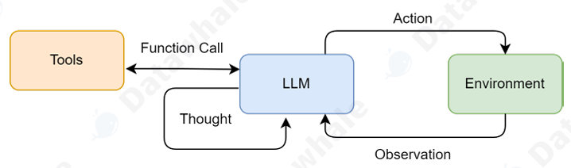

适用场景（**涉及外部知识的获取与外部环境的交互**）：

- 需要外部知识的任务：如查询实时信息（天气、新闻、股价）、搜索专业领域的知识等
- 需要精确计算的任务：将数学问题交给计算器工具，避免LLM的计算错误 
- 需要与API交互的任务：如操作数据库、调用某个服务的API来完成特定功能

这里给出完整的提示词模版：

```bash
# ReAct 提示词模板
REACT_PROMPT_TEMPLATE = """
请注意，你是一个有能力调用外部工具的智能助手。
可用工具如下:
{tools}
请严格按照以下格式进行回应:
Thought: 你的思考过程，用于分析问题、拆解任务和规划下一步行动。
Action: 你决定采取的行动，必须是以下格式之一:
- `{{tool_name}}[{{tool_input}}]`:调用一个可用工具。
- `Finish[最终答案]`:当你认为已经获得最终答案时。
- 当你收集到足够的信息，能够回答用户的最终问题时，你必须在Action:字段后使用 Finish[最终答案] 来输
出最终答案。
现在，请开始解决以下问题:
Question: {question}
History: {history}
"""
```

其中最重要的是**格式规范**，便于我们后续使用代码解析输出的内容。

ReAct在每一步都能输出其思考过程以及执行的工具，让我们更好地掌控整体流程；其局限性体现在：

- 高度依赖底层LLM的综合能力，该范式对于模型的规划推理以及遵循指令的能力有较高要求
- 执行效率问题，一个任务通常需要多次调用LLM，每一次都伴随token以及时间成本
- 提示词脆弱性，ReAct的成功很大程度上体现于提示词的设计，提示词微小的改动可能导致LLM巨大的行为差异（**这里就体现出格式规范的重要性，调试时注意模型输出的格式**）

#### 6.2.2 Plan-and-Solve

Plan-and-Solve Prompting 由 Lei Wang 在2023年提出[2]。其核心动机是为了解决思维链在处理多步骤、复 杂问题时容易“偏离轨道”的问题。基于该范式设计的智能体更加聚焦于全局的视角，区别于ReAct思考与行动融合，该范式将流程解耦为两个阶段：

- 规划：根据用户问题进行规划，制定一个清晰的计划
- 执行：得到完整计划后，严格按照计划执行，得到最终答案

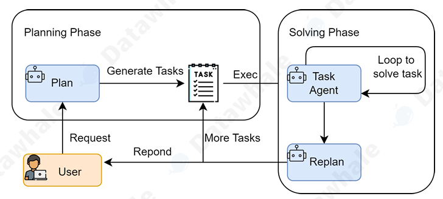

Plan-and-Solve 尤其适用于那些结构性强、可以被清晰分解的复杂任务，例如： 

- 多步数学应用题：需要先列出计算步骤，再逐一求解。 
- 需要整合多个信息源的报告撰写：需要先规划好报告结构（引言、数据来源A、数据来源B、总结）， 再逐一填充内容。 
- 代码生成任务：需要先构思好函数、类和模块的结构，再逐一实现。

提示词模版示例：

````bash
PLANNER_PROMPT_TEMPLATE = """
你是一个顶级的AI规划专家。你的任务是将用户提出的复杂问题分解成一个由多个简单步骤组成的行动计划。
请确保计划中的每个步骤都是一个独立的、可执行的子任务，并且严格按照逻辑顺序排列。
你的输出必须是一个Python列表，其中每个元素都是一个描述子任务的字符串。
问题: {question}
请严格按照以下格式输出你的计划,```python与```作为前后缀是必要的:
```python
["步骤1", "步骤2", "步骤3", ...]
```
"""

EXECUTOR_PROMPT_TEMPLATE = """
你是一位顶级的AI执行专家。你的任务是严格按照给定的计划，一步步地解决问题。
你将收到原始问题、完整的计划、以及到目前为止已经完成的步骤和结果。
请你专注于解决“当前步骤”，并仅输出该步骤的最终答案，不要输出任何额外的解释或对话。
# 原始问题:
{question}
# 完整计划:
{plan}
# 历史步骤与结果:
{history}
# 当前步骤:
{current_step}
请仅输出针对“当前步骤”的回答:
"""
````

#### 6.2.3 Reflection

ReAct 和 Plan-and-Solve 范式中，智能体一旦完成了任务，其工作流程便告结束。然而，它们生成的初始答案，无论是行动轨迹还是最终结果，都可能存在谬误或有待改进之处。Reflection范式引入了自我校正机制，让智能体发现执行过程中的不足并改进。

核心工作流程：：执行 -> 反思 -> 优化

- 执行 (Execution)：首先，智能体使用我们熟悉的方法（如 ReAct 或 Plan-and-Solve）尝试完成任务， 生成一个初步的解决方案或行动轨迹。这可以看作是“初稿”。
- 反思 (Reflection)：接着，智能体进入反思阶段。它会调用一个**独立的、或者带有特殊提示词的大语言模型**实例，来扮演一个“评审员”的角色，对“初稿”做一个“反馈”。
-  优化 (Refinement)：最后，智能体将“初稿”和“反馈”作为新的上下文，再次调用大语言模型，要求它根 据反馈内容对初稿进行修正，生成一个更完善的“修订稿”。

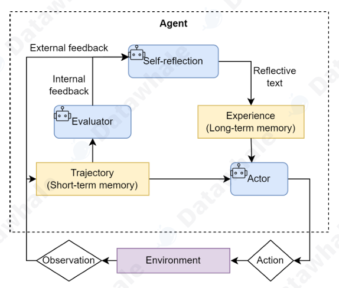

由于需要基于历史信息做反思和优化，所以引入了**短期记忆模块**，帮助智能体记忆解决过程。

提示词示例：

````bash
1.初始提示词
INITIAL_PROMPT_TEMPLATE = """
你是一位资深的Python程序员。请根据以下要求，编写一个Python函数。
你的代码必须包含完整的函数签名、文档字符串，并遵循PEP 8编码规范。
要求: {task}
请直接输出代码，不要包含任何额外的解释。
"""

2.反思提示词
REFLECT_PROMPT_TEMPLATE = """
你是一位极其严格的代码评审专家和资深算法工程师，对代码的性能有极致的要求。
你的任务是审查以下Python代码，并专注于找出其在<strong>算法效率</strong>上的主要瓶颈。
# 原始任务:
{task}
# 待审查的代码:
```python
{code}
```
"""
请分析该代码的时间复杂度，并思考是否存在一种<strong>算法上更优</strong>的解决方案来显著提升性能。
如果存在，请清晰地指出当前算法的不足，并提出具体的、可行的改进算法建议（例如，使用筛法替代试除法）。
如果代码在算法层面已经达到最优，才能回答“无需改进”。
请直接输出你的反馈，不要包含任何额外的解释。

3.优化提示词
REFINE_PROMPT_TEMPLATE = """
你是一位资深的Python程序员。你正在根据一位代码评审专家的反馈来优化你的代码。
# 原始任务:
{task}
# 你上一轮尝试的代码:
{last_code_attempt}
评审员的反馈：
{feedback}
请根据评审员的反馈，生成一个优化后的新版本代码。
你的代码必须包含完整的函数签名、文档字符串，并遵循PEP 8编码规范。
请直接输出优化后的代码，不要包含任何额外的解释。
"""
````

Reflection范式从机制上引导模型高准确性，可靠性的回答，但会面临**token消耗，提示词工程复杂度以及延迟的显著提升**。

### 6.3 框架开发实践

本章讨论目前业界主流的智能体框架，构建高效规范的智能体应用。

#### 6.3.1 为什么使用框架 

使用框架进行开发的主要价值：

- 提升代码的复用率以及开发效率，一个框架会提供一个通用的基类，封装了智能体的核心运行逻辑，不再需要重复构建
- 实现**核心组件的解耦**，智能体系统本身是由多个模块共同耦合而成的，框架可以让我们专注于特定模块的开发，使得整体流程更加清晰可控，便于维护
- 标准化状态管理，在实际运行的智能体应用中，状态管理十分重要，需要同时处理**上下文窗口限制、历史信息持久化、多轮对话状态**跟踪等问题
- 简化调试过程，例如为了观测智能体内部的执行流程，我们可以引入**事件回调机制**，在关键节点自动触发上报，比手动print更加高效优雅

#### 6.3.2 主流框架

- AutoGen：AutoGen 的核心思想是通过**对话实现协作**。它将多智能体系统抽象为一个由多个“可对话”智能体组成的群聊。开发者可以定义不同角色（如  Coder ,  ProductManager ,  它们之间的交互规则（例如， Coder 写完代码后由  Tester ），并设定 Tester 自动接管）。任务的解决过程，就是这些 智能体在群聊中通过自动化消息传递，不断对话、协作、迭代直至最终目标达成的过程。
-  AgentScope：AgentScope 是一个专为**多智能体应用**设计的、功能全面的开发平台。它的核心特点 是易用性和工程化。它提供了一套非常友好的编程接口，让开发者可以轻松定义智能体、构建通信网 络，并管理整个应用的生命周期。其内置的消息传递机制和对分布式部署的支持，使其非常适合构建和 运维复杂、大规模的多智能体系统。
- CAMEL：CAMEL 提供了一种新颖的、名为**角色扮演** (Role-Playing) 的协作方法。其核心理念是， 我们只需要为两个智能体（例如， AI研究员 和  Python程序员）设定好各自的角色和共同的任务目标， 它们就能在“初始提示 (Inception Prompting)”的引导下，自主地进行多轮对话，相互启发、相互配 合，共同完成任务。它极大地降低了设计多智能体对话流程的复杂度。 
- LangGraph：作为 LangChain 生态的扩展，LangGraph 另辟蹊径，将智能体的执行流程建模为图  (Graph)。在传统的链式结构中，信息只能单向流动。而 LangGraph 将每一步操作（如调用LLM、 执行工具）定义为图中的一个节点 (Node)，并用边 (Edge) 来定义节点之间的跳转逻辑。这种设计**天然支持循环 (Cycles)**，使得实现如 Reflection 这样的迭代、修正、自我反思的复杂工作流变得异常简单和直观。

框架种类十分繁多，以上列举的被称为智能体框架，它们有各自的适用场景，在这里重点学习第一代通用LLM应用框架LangChain。

#### 6.3.3 LangChain

##### 6.3.3.1 核心概念

LangChain 的核心是将 **大语言模型**（如 GPT）与 **外部工具**、**数据库**、**API** 等集成，帮助你处理多轮对话、数据查询、信息检索等任务。

- **链（Chains）**：组合不同步骤（如文本生成、查询数据库等）形成一个处理流程。你需要理解如何创建、组合和调整链（`LLMChain`, `SimpleChain`, `MapReduceChain` 等）。
- **工具（Tools）**：LangChain 提供了将外部工具（如数据库查询、API 调用、文件读取等）与语言模型结合的功能。
- **代理（Agents）**：代理是一个更高层次的构建，能够根据用户输入和环境动态选择并调用工具。
- **记忆（Memory）**：LangChain 可以管理对话的上下文信息，支持 **对话记忆** 和 **状态管理**，非常适合多轮对话和上下文感知的应用。

LangChain的核心模块：

- **`LLMChain`**：核心类，用于串联模型和外部输入输出的处理链。掌握 `LLMChain` 是基本功。
- **`PromptTemplate`**：与模型交互时的 **提示模板**，用来组织和格式化输入文本。
- **`AgentExecutor`**：用于动态选择和执行工具的类。理解代理的工作原理对于开发更复杂的交互式应用至关重要。
- **`Tool` 和 `tool decorator`**：创建外部工具，并将它们与 LangChain 集成。工具可以是数据库查询、API 调用、文件操作等。

##### 6.3.3.2 快速入门

这里以一个简单的Agent为例，对LangChain的基本功能快速入门。

1.安装相关依赖，这里用python自带的venv创建虚拟环境

```bash
python -m venv lc_demo # 创建一个名为lc_demo的虚拟环境
./lc_demo/Scripts/activate # 激活虚拟环境
cd .....
uv init # 项目初始化
uv add langchain
uv add langchain-openai # 安装OpenAI集成
```

2.首先定义系统提示词

```python
# 定义系统提示
SYSTEM_PROMPT = """你是一位擅长用双关语表达的专家天气预报员。

你可以使用两个工具：

- get_weather_for_location：用于获取特定地点的天气
- get_user_location：用于获取用户的位置

如果用户询问天气，请确保你知道具体位置。如果从问题中可以判断他们指的是自己所在的位置，请使用 get_user_location 工具来查找他们的位置。"""
```

3.使用框架自带的**装饰器**定义工具

```python
# 定义工具
@tool
def get_weather_for_location(city: str) -> str:
    """获取指定城市的天气。"""
    return f"{city}总是阳光明媚！"

@tool
def get_user_location(runtime: ToolRuntime[Context]) -> str:
    """根据用户 ID 获取用户信息。"""
    user_id = runtime.context.user_id
    return "Florida" if user_id == "1" else "SF"
```

4.配置模型(新版本中使用以下接口，而非直接创建模型实例)

```python
# 配置模型
model = init_chat_model(
    "anthropic:claude-sonnet-4-5",
    temperature=0
)
```

5.**设置记忆**

```python
# 设置记忆(demo的历史记忆是存在内存中)
checkpointer = InMemorySaver()
```

6.组装以上组件，构成智能体

```python
agent = create_agent(
    model=model,
    system_prompt=SYSTEM_PROMPT,
    tools=[get_user_location, get_weather_for_location],
    context_schema=Context,
    response_format=ResponseFormat,
    checkpointer=checkpointer
)
```

7.用**thread_id**做会话记忆隔离

```python
# 运行代理
# `thread_id` 是给定对话的唯一标识符。
config = {"configurable": {"thread_id": "1"}}

response = agent.invoke(
    {"messages": [{"role": "user", "content": "外面的天气怎么样？"}]},
    config=config,
    context=Context(user_id="1")
)

print(response['structured_response'])
# ResponseFormat(
#     punny_response="佛罗里达今天依然是'阳光灿烂'的一天！阳光正在播放'rey-dio'热门歌曲！我得说，这是进行'solar-bration'的完美天气！如果你希望下雨，恐怕这个想法已经'被冲走'了——预报仍然'清晰地'灿烂！",
#     weather_conditions="佛罗里达总是阳光明媚！"
# )

# 注意，我们可以使用相同的 `thread_id` 继续对话。
response = agent.invoke(
    {"messages": [{"role": "user", "content": "谢谢！"}]},
    config=config,
    context=Context(user_id="1")
)

print(response['structured_response'])
```

接下来在通过一个简单的对话式应用了解一下chain的概念。

- LLM: 语言模型是核心推理引擎。
- Prompt Templates: 提供语言模型的指令,即提示词模版。
- Output Parsers: 将LLM的原始响应转换为更易处理的格式，使得在下游使用输出变得容易。

1.LangChain中有两种类型的语言模型，称为:

- LLMs: 这是一个以**字符串作为输入并返回字符串**的语言模型
- ChatModels: 这是一个以**消息列表作为输入并返回消息**的语言模型，包括两个必须的组件：
  - `content`: 这是消息的内容。
  - `role`: 这是`ChatMessage`来自的实体的角色。

体会一下两者的差别

```python
from langchain_openai import OpenAI

# 初始化 LLM（字符串模型）
llm = OpenAI(
    model="gpt-3.5-turbo-instruct",
    temperature=0
)

# 直接传入字符串
response = llm.invoke("用一句话介绍人工智能")

print(response)
--------------------------------------------------
from langchain_openai import ChatOpenAI
from langchain_core.messages import HumanMessage, SystemMessage

# 初始化 ChatModel
chat = ChatOpenAI(
    model="gpt-4o-mini",
    temperature=0
)

# 传入消息列表
response = chat.invoke([
    SystemMessage(content="你是一个严谨的科学家"),
    HumanMessage(content="用一句话介绍人工智能")
])

print(response.content)
```


LangChain提供了几个对象，用于方便地区分不同的角色:

- `HumanMessage`: 来自人类/用户的`ChatMessage`。
- `AIMessage`: 来自AI/助手的`ChatMessage`。
- `SystemMessage`: 来自系统的`ChatMessage`。
- `FunctionMessage`: 来自函数调用的`ChatMessage`。

总的来说，ChatModels支持角色定义，工具调用以及函数调用，使用更加广泛。

2.关于提示词模版

大多数LLM应用程序不会直接将用户输入传递到LLM中。通常，它们会将用户输入添加到一个更大的文本片段中，称为提示模板。框架中有类似于f-string功能的模版接口PromptTemplate。

```python
from langchain import PromptTemplate

# 无需传入变量的提示词
no_input_prompt = PromptTemplate(input_variables=[], template="Tell me a joke.")
no_input_prompt.format()
# -> "Tell me a joke."

# 一个输入变量的提示词
one_input_prompt = PromptTemplate(input_variables=["adjective"], template="Tell me a {adjective} joke.")
one_input_prompt.format(adjective="funny")
# -> "Tell me a funny joke."

# 支持多个输入变量的提示词
multiple_input_prompt = PromptTemplate(
    input_variables=["adjective", "content"], 
    template="Tell me a {adjective} joke about {content}."
)
multiple_input_prompt.format(adjective="funny", content="chickens")
# -> "Tell me a funny joke about chickens."
```

3.输出解析器

OutputParsers将LLM的原始输出转换为可以在下游使用的格式。输出解析器有几种主要类型，包括:

- 将LLM的文本转换为**结构化信息**（例如JSON）
- 将ChatMessage转换为字符串
- 将除消息之外的其他信息（如OpenAI函数调用）转换为字符串。

```python
from langchain.schema import BaseOutputParser

class CommaSeparatedListOutputParser(BaseOutputParser):
    """将LLM的字符串输出转换为逗号分隔的列表"""

    def parse(self, text: str):
        """Parse the output of an LLM call."""
        return text.strip().split(", ")

CommaSeparatedListOutputParser().parse("hi, bye")
# >> ['hi', 'bye']
```

4.chain组织链接各个模块

```python
from langchain.chat_models import ChatOpenAI
from langchain.prompts.chat import (
    ChatPromptTemplate,
    SystemMessagePromptTemplate,
    HumanMessagePromptTemplate,
)
from langchain.chains import LLMChain
from langchain.schema import BaseOutputParser

class CommaSeparatedListOutputParser(BaseOutputParser):
    """Parse the output of an LLM call to a comma-separated list."""


    def parse(self, text: str):
        """Parse the output of an LLM call."""
        return text.strip().split(", ")

template = """You are a helpful assistant who generates comma separated lists.
A user will pass in a category, and you should generate 5 objects in that category in a comma separated list.
ONLY return a comma separated list, and nothing more."""
system_message_prompt = SystemMessagePromptTemplate.from_template(template)
human_template = "{text}"
human_message_prompt = HumanMessagePromptTemplate.from_template(human_template)

chat_prompt = ChatPromptTemplate.from_messages([system_message_prompt, human_message_prompt])
chain = LLMChain(
    llm=ChatOpenAI(),
    prompt=chat_prompt,
    output_parser=CommaSeparatedListOutputParser()
)
chain.run("colors")
# >> ['red', 'blue', 'green', 'yellow', 'orange']
```

### 6.4 从0构建Agent框架

主流的框架功能十分强大，但本身学习周期长，学习曲线陡峭，因此通过结合教程，从0构建HelloAgent框架，理解整个智能体框架的技术细节。

#### 6.4.1 为什么构建自己的Agent框架

智能体目前是一个高速发展的领域，市面上存在各种智能体框架，每一种智能体框架有着不同的实现方式以及适用场景，但核心思想保持一致。

- 许多框架为了追求通用性，引入了大量抽象层和配置选项。以LangChain为例，其链式调用机制虽然灵活，但对初学者而言**学习曲线陡峭**，往往需要理解大量概念才能完成简单任务。
- **黑盒式**的实现过程不利于理解内部工作原理，许多框架将核心逻辑封装得过于严密，开发者难以理解Agent的内部工作机制，缺 乏深度定制能力。
- 依赖关系复杂，包的体积显得臃肿。

接下来，我们从每一个组件开始，深入理解和体会Agent的关于案例，同时进一步培养系统设计能力（包括模块化设计，接口抽象，错误处理等）。

本章参考的HelloAgent框架，是一个轻量级的智能体框架，同时兼具功能完整性以及学习友好性。

```bash
- 轻量级与学习友好，除了OpenAI的官方SDK和几个必要的基础库外，不引入任何重型依赖，遇到问题可以直接定位到框架本身
- 采用OpenAI标准接口，确保兼容性
- “万物皆工具”的抽象思想，在许多其他框架中需要独立学习的Memory（记忆）、RAG（检索增强生成）、RL（强化学习）、MCP（协议）等模块，在HelloAgents中都被统一抽象为一种“工具”。
```

#### 6.4.2 快速上手

一个简单的demo：

```python
from hello_agents import SimpleAgent,HelloAgentsLLM
from dotenv import load_dotenv
from hello_agents.tools import CalculatorTool

# 加载环境变量
load_dotenv()

# 创建LLM实例
llm = HelloAgentsLLM()

# 创建SimleAgent
agent = SimpleAgent(
    name="AI Assistant",
    llm=llm,
    system_prompt="你是一个专业的AI助手，能够回答用户的问题。",
)

response = agent.run("你好，请介绍一下自己👋")
print(response)

calculator = CalculatorTool()

response = agent.run("请计算1+5+9")
print(response)

# 查看历史对话
print(f"历史消息数：{len(agent.get_history())}")
```

#### 6.4.3 HelloAgentLLM扩展

我们对智能体的大脑进行封装和抽象，实现以下目标：

-  多提供商支持：实现对 OpenAI、ModelScope、智谱 AI 等多种主流 LLM 服务商的无缝切换，避免框 架与特定供应商绑定。
- 本地模型集成：引入 VLLM 和 Ollama 这两种高性能本地部署方案，满足数据隐私和成本控制的需求。
- 自动检测机制：建立一套自动识别机制，使框架能根据环境信息智能推断所使用的 LLM 服务类型，简 化用户的配置过程。

这里我们自定义一个继承自父类HelloAgentsLLM（教程LLM客户端）来捕获用户接入魔搭平台的需求：

```python
import os
from typing import Optional
from openai import OpenAI
from hello_agents import HelloAgentsLLM

class MyLLM(HelloAgentsLLM):
    """一个自定义的LLM客户端，继承自HelloAgentsLLM。"""
    def __init__(
        self,
        model:Optional[str] = None,
        api_key: Optional[str] = None,
        base_url: Optional[str] = None,
        provider: Optional[str] = "auto",
        **kwargs
    ):
        if provider == "modelscope":
            print("使用ModelScope提供的模型")
            self.provider = "modelscope"

            # 解析ModelScope凭证
            self.api_key = api_key or os.getenv("MODELSCOPE_API_KEY")
            self.base_url = base_url or os.getenv("LLM_BASE_URL")

            if not self.api_key:
                raise ValueError("密钥不存在，请在环境变量中设置MODELSCOPE_API_KEY❌️")

            self.model = model or os.getenv("LLM_MODEL_ID")
            self.temperature = kwargs.get("temperature", 0.7)
            self.max_tokens = kwargs.get("max_tokens", 1024)
            self.timeout = kwargs.get("timeout", 30)

            # 创建OpenAI客户端实例
            self._client = OpenAI(api_key=self.api_key, base_url=self.base_url, timeout=self.timeout)

        else:
            super().__init__(model=model, api_key=api_key, base_url=base_url, provider=provider, **kwargs)
```

为了保护数据隐私，我们应该支持本地模型调用，常见的如VLLM以及Ollama。它们都遵循了行业标准API，只需要在实例化LLM客户端时将其视为一个provider即可。

```python
llm_client = HelloAgentsLLM(
provider="vllm",
model="Qwen/Qwen1.5-0.5B-Chat", # 需与服务启动时指定的模型一致
base_url="http://localhost:8000/v1",
api_key="vllm" # 本地服务通常不需要真实API Key，可填任意非空字符串
)
```

自动检测机制，为了尽可能减少用户的配置负担并遵循“约定优于配置”的原则， HelloAgentsLLM内部设计了两个核心辅助方法：_auto_detect_provider以及_resolve_credentials,前者负责根据环境推断服务商，后者负责根据推理结果完成参数配置。

#### 6.4.4 框架接口实现

在上一节实现了智能体LLM客户端，解决了与LLM通信的问题，接下来学习配套接口和组件来处理数据流、管理配置、应对异常，包含三个核心文件：

- message.py：定义同一的消息格式
- config.py：定义配置管理方案，使框架易于调整和扩展
- agent.py：定义所有智能体的抽象基类，为后续实现不同类型的智能体提供统一范式

##### 6.4.4.1 Messages类

LLM作为智能体的大脑，通过对话与智能体交互，为了管理这些对话上下文，我们设计一个统一的Message类进行上下文工程。

```python
from typing import Optional,Dict,Any,Literal
from datetime import datetime
from pydantic import BaseModel

# 定义消息角色类型,对应OpenAI规范
MessageRole = Literal["user", "assistant", "system","tool"]

class Message(BaseModel):
    role: MessageRole
    content: str
    # 日志记录参数
    timestamp:datetime = None
    metadata: Optional[Dict[str,Any]] = None

    def __init__(self,content:str,role:MessageRole,**kwargs):
        super().__init__(
            content=content,
            role=role,
            timestamp=kwargs.get("timestamp",datetime.now()),
            metadata=kwargs.get("metadata",{}),
        )

    def to_dict(self):
        """将消息转换为字典格式（符合OpenAI API规范）"""
        return {
            "role": self.role,
            "content": self.content,
        }

    def __str__(self):
        return f"[{self.role}]: {self.content}"
```

##### 6.4.4.2 Config类

Config 类的职责是将代码中硬编码配置参数集中起来，并支持从环境变量中读取。

```python
import os
from typing import Optional,Dict,Any
from pydantic import BaseModel

class Config(BaseMOdel):
    default_model = "gpt-3.5-turbo"
    default_provider = "openai"
    temperature = 0.7
    max_tokens : Optional[int] = None

    debug : bool = False
    log_level : str = "INFO"
    max_history_lenght = 1000

    @classmethod
    def from_env(cls) -> "Congfig":
        """从环境变量创建配置"""
        return cls(
            debug=os.getenv("DEBUG","false").lower() == "true",
            log_level=os.getenv("LOG_LEVEL","INFO"),
            temperature=float(os.getenv("TEMPERATURE","0.7")),
            max_tokens=int(os.getenv("MAX_TOKENS")) if os.getenv("MAX_TOKENS") else None,
        )

    def to_dict(self):
        return self.dict()
```

##### 6.4.4.3 Agent类

为所有智能体提供一个通用行为规范。

```python
"""Agent基类"""
from abc import ABC, abstractmethod
from typing import Optional, Any
from .message import Message
from HelloAgentsLLM import HelloAgentsLLM
from .config import Config
class Agent(ABC):
    """Agent基类"""
    
    def __init__(
        self,
        name: str,
        llm: HelloAgentsLLM,
        system_prompt: Optional[str] = None,
        config: Optional[Config] = None
    ):
        self.name = name
        self.llm = llm
        self.system_prompt = system_prompt
        self.config = config or Config()
        self._history: list[Message] = []
    
    @abstractmethod
    def run(self, input_text: str, **kwargs) -> str:
        """运行Agent"""
        pass
    
    def add_message(self, message: Message):
        """添加消息到历史记录"""
        self._history.append(message)
    
    def clear_history(self):
        """清空历史记录"""
        self._history.clear()
    
    def get_history(self) -> list[Message]:
        """获取历史记录"""
        return self._history.copy()
    
    def __str__(self) -> str:
        return f"Agent(name={self.name}, provider={self.llm.provider})"

```

#### 6.4.5 Agent范式的框架化实现

这一节将之前学习的智能体经典范式重构到框架中，并新增SimpleAgent作为基础对话范式。主要围绕以下目标展开：

- 提示词工程的系统性提升，将针对特定任务的提示词进行**通用化设计**，增强格式约束以及角色定义
- 建立统一的接口格式，所有Agent遵循相同的初始化参数，历史管理机制

(篇幅限制，以下内容code不再展示，在repo中进行浏览)

##### 6.4.5.1 SimpleAgent

适用于基础对话，支持流式响应，自动切换简单以及工具调用模式。支持自动处理并解析工具调用。

本案例继承自HelloAgent下的SimpleAgent基类：

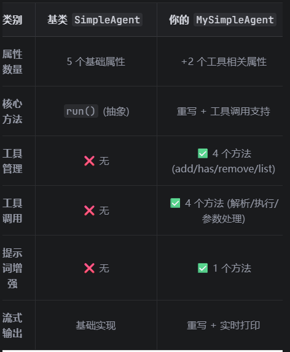

代码实现心得：

- 由于我们的案例继承自父类，首先理解父类的相关属性以及方法能够更好地扩展子类
- 该案例的难度我认为主要体现于分析**LLM的信息传递**以及适用正则表达式提取和处理工具调用的结果
- 值得学习的地方：教程中使用了精心设计的一套提示词限制LLM的输出，使得后续在使用正则表达式进行流程化处理

```python
		tools_section = "\n\n## 可用工具\n"
        tools_section += "你可以使用以下工具来帮助回答问题:\n"
        tools_section += tools_description + "\n"
        tools_section += "\n## 工具调用格式\n"
        tools_section += "当需要使用工具时，请使用以下格式:\n"
        tools_section += "`[TOOL_CALL:{tool_name}:{parameters}]`\n"
        tools_section += "例如:`[TOOL_CALL:search:Python编程]` 或 
`[TOOL_CALL:memory:recall=用户信息]`\n\n"
        tools_section += "工具调用结果会自动插入到对话中，然后你可以基于结果继续回答。\n"
```

##### 6.4.5.2 ReActAgent

我们保持ReAct的核心逻辑不变，提升其组织性和可维护性对其进行框架化。

```python
def run(self,input_text:str,**kwargs) -> str:
        """运行ReAct Agent"""
        self.current_history = []
        current_step = 0

        print(f"\n🤖{self.name}开始处理问题：{input_text}")

        while current_step < self.max_steps:
            current_step += 1
            print(f"\n---第{current_step}步---")

            # 构建提示词
            tools_desc = self.tool_registry.get_tools_description()
            history_str = "\n".join(self.current_history)

            prompt = self.prompt_template.format(
                tools=tools_desc,
                question=input_text,
                history=history_str
            )

            messages = [{"role":"user","content":prompt}]
            response_text = self.llm.invoke(messages,**kwargs)

            thought,action = self._parse_output(response_text)

            if action and action.startswith("Finish"):
                final_answer = self._parse_action_input(action)
                self.add_message(Message(input_text,"user"))
                self.add_message(Message(final_answer,"assistant"))
                return final_answer
            
            if action:
                tool_name,tool_input = self._parse_action(action)
                observation = self.tool_registry.execute_tool(tool_name,tool_input)
                self.current_history.append(f"Action:{action}")
                self.current_history.append(f"Observation:{observation}")

        final_answer = "⚠️无法在指定步数内完成任务！"
        self.add_message(Message(input_text,"user"))
        self.add_message(Message(final_answer,"assistant"))
        return final_answer
```

##### 6.4.5.3 ReflectionAgent

我们在之前的小节中针对代码优化任务以Reflection范式为核心进行了实现，接下来我们优化Prompt使其能够适应通用性任务，并且统一使用框架的接口配置，信息传递等。

```python
INITIAL_PROMPT_TEMPLATE = """
你是一位AI助手，请根据以下用户要求进行回答
要求: {task}
"""

REFLECT_PROMPT_TEMPLATE = """
你是一位擅长反思问题的智能助手，你需要根据原始任务及其原始解决方案作出反思，提出更好地解决方案
# 原始任务:
{task}
# 原始解决方案：
{output}
你应该结合原始任务所属领域进行思考，从而得到值得反思和优化的方向
例如：如果原始任务是编码相关任务，你可以从性能优化，算法复杂度等角度审视和反思原始解决方案并提出更好地解决方案
如果你认为，原始解决方案中没有可优化的地方或足以满足原始任务时，请回答“无需改进”
请直接给出你的反思内容，不要输出思考过程等其他内容
"""

REFINE_PROMPT_TEMPLATE = """
你是一位擅长优化任务的智能助手，你正在根据一位擅长反思问题的智能助手的反思内容对原始任务进行优化
# 原始任务:
{task}
# 你上一轮优化的结果:
{last_refine}
反思助手的反馈内容：
{feedback}
请根据评审员的反馈以及上一轮优化的结果对原始任务进行优化
请直接输出优化后方案，不要有其他输出
"""
```

以上是我优化后的提示词，在测试的过程中有以下问题：

- 提示词边界过于**宽泛**，比如“原始解决方案中没有可优化的地方或足以满足原始任务时，请回答“无需改进””，由于是处理开放性的通用问题，这样**边界模糊**的提示词很容易导致模型**过度思考**
- 如果是特定任务或领域的提示词会更有针对性，更好地设计停止条件
- 记忆模块是该范式的核心，仔细理解其设计思路
- 工具是如何管理的：继承父类的工具管理类ToolRegistry，包含工具/函数注册/注销，执行工具，获取工具描述以构建提示词等核心功能，具体参阅源代码
- 记忆是如何管理的：1.短期记忆使用current_history（列表容器）2.长期记忆继承自父类的add_message方法

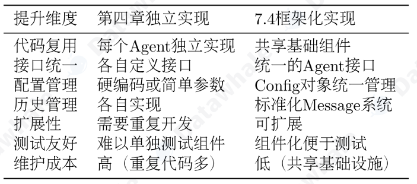

##### 6.4.5.4 FunctionCallAgent

针对上述提到的通过Prompt约束工具调用的输出格式十分麻烦，在框架的0.2.8版本后映入了FunctionCallAgent，拥有更强的鲁棒性；它基于OpenAI原生函数调用机制的Agent，展 示了如何使用OpenAI的函数调用机制来构建Agent。  它支持以下功能： 

- _build_tool_schemas:通过工具的description构建OpenAI的function calling schema
-  _extract_message_content:从OpenAI的响应中提取文本
-  _parse_function_call_arguments:解析模型返回的JSON字符串参数 
- _convert_parameter_types:转换参数类型

具体功能参见官方repo的源代码

#### 6.4.6 工具系统

在上文我们将架构内部的消息传递，配置管理以及智能体行为分别抽象成了类进行使用，接下来我们将构建标准的工具基类，使工具融入到整个框架中。

- 统一的工具抽象与管理：建立标准化的Tool基类和ToolRegistry注册机制，为工具的开发、注册、发现 和执行提供统一的基础设施。 
-  实战驱动的工具开发：以数学计算工具为案例，展示如何设计和实现自定义工具，让读者掌握工具开发的完整流程。 
- 高级整合与优化策略：通过多源搜索工具的设计，展示如何整合多个外部服务，实现智能后端选择、结果合并和容错处理，体现工具系统在复杂场景下的设计思维。

##### 6.4.6.1 工具基类与注册机制

我们希望构建一套可扩展的工具系统，建立起一套标准的基础设施，包括Tool基类，工具注册表ToolRegistry以及工具管理机制，

首先，让我们来封装一个工具基类：

```python
class Tool(ABC):
    """工具基类"""
    def __init__(self,name:str,description:str):
        self.name = name
        self.description = description

    @abstractmethod
    def run(self,parameters:Dict[str,Any]) -> str:
        """执行工具"""
        pass

    @abstractmethod
    def get_parameters(self) -> List[ToolParameter]:
        """获取工具参数定义"""
        pass
```

这是所有工具的基类，所有子类需要实现run方法以及get_parameters方法。

接下来我们再来实现一个工具注册类，来对所有的工具进行管理：

```python 
class ToolRegistry:
    """工具注册表"""
    def __init__(self):
        self._tools:dict[str,Tool] = {}
        self._functions:dict[str,dict[str,Any]] = {}

    def register_tool(self,tool:Tool):
        """注册Tool对象"""
        if tool.name in self._tools:
            print(f"⚠️警告：工具{tool.name}已存在，将被覆盖")
        self._tools[tool.name] = tool
        print(f"✅️工具{tool.name}已注册")

    def register_function(self,name:str,description:str,func:Callable[[str],str]):
        """
        将函数注册为工具
        Args:
            name:工具名称
            description:工具描述
            func:工具函数，接收字符串参数，返回字符串
        """
        if name in self._functions:
            print(f"⚠️ 警告:工具 '{name}' 已存在，将被覆盖。")
        self._functions[name] = {
            "description": description,
            "func": func
        }
        print(f"✅️工具 '{name}' 已注册。")

    def get_tools_description(self) -> str:
        """获取可用工具的str描述"""
        descriptions = []

        for tool in self._tools.values():
            descriptions.append(f"-{tool.name}:{tool.description}")

        for name,info in self._functions.items():
            descriptions.append(f"-{name}:{info["description"]}")

        return "\n".join(descriptions) if descriptions else "❌️暂无可用工具"
```

##### 6.4.6.2 自定义工具

完成基础建设后，我们可以自定义工具，使用Toolregistry进行注册即可：

```python
import ast
import operator
import math
from hello_agents import ToolRegistry

from my_tool import Tool

def my_calculate(expression:str) -> str:
    """实现简单数学计算函数"""
    if not expression.strip():
        return "计算表达式不能为空"

    # 支持的基本运算
    operators = {
        ast.Add:operator.add,
        ast.Sub:operator.sub,
        ast.Mult:operator.mul,
        ast.Div:operator.truediv
    }

    # 支持的基本函数
    functions = {
        "sqrt":math.sqrt,
        "pi":math.pi
    }

    try:
        node = ast.parse(expression,mode="eval")
        result = _eval_node(node.body,operators,functions)
        return str(result)
    except:
        return "❌️计算失败，请检查表达式"

def _eval_node(node, operators, functions):
    """简化的表达式求值"""
    if isinstance(node, ast.Constant):
        return node.value
    elif isinstance(node, ast.BinOp):
        left = _eval_node(node.left, operators, functions)
        right = _eval_node(node.right, operators, functions)
        op = operators.get(type(node.op))
        return op(left, right)
    elif isinstance(node, ast.Call):
        func_name = node.func.id
        if func_name in functions:
            args = [_eval_node(arg, operators, functions) for arg in node.args]
            return functions[func_name](*args)
    elif isinstance(node, ast.Name):
        if node.id in functions:
            return functions[node.id]

def create_calculator_registry():
    """创建包含计算器的工具注册表"""
    registry = ToolRegistry()

    registry.register_function(
        name="my_calculator",
        description="用于简单数学运算的工具，支持加减乘除以及开方运算",
        func=my_calculate
    )

    return registry
```

##### 6.4.6.3 多元搜索工具

我们最开始在.env文件中定义了Tavily以及SerpAPI的密钥，这里我们基于这两种搜索源定义搜索工具：

```python
"""自定义高级搜索工具🔍"""
import os
from typing import Optional,List,Dict,Any
from unittest import result
from hello_agents import ToolRegistry

class MyAdvancedSearchTool:
    """
    自定义高级搜索工具
    """
    def __init__(self):
        self.name = "my_nb_search"
        self.description = "NB的智能搜索工具，自动选择最佳结果"
        self.search_sources = []
        self._setup_search_sources()

    def _setup_search_sources(self):
        """设置可用搜索源"""
        if os.getenv("TAVILY_API_KEY"):
            try:
                from tavily import TavilyClient
                self.tavily_client = TavilyClient(api_key=os.getenv("TAVILY_API_KEY"))
                self.search_sources.append("tavily")
                print("✅️Tavily搜索源已启用")
            except ImportError:
                print("❌️为未到Tavily源")
        if os.getenv("SERPAPI_API_KEY"):
            try:
                import serpapi
                self.search_sources.append("serpapi")
                print("✅️SerpAPI搜索源已启用")
            except ImportError:
                print("❌️未找到SerpAPI源")

        if self.search_sources:
            print(f"🔧可用搜索源：{','.join(self.search_sources)}")
        else:
            print(f"❌️未找到搜索源，请在.env文件中进行配置")

    def search(self,query:str) -> str:
        """执行智能体搜索"""
        if not query.strip():
            return "❌️搜索内容不能为空！"

        if not self.search_sources:
            return """
            ❌️没有找到可用搜索源，请前往.env文件进行配置：
            1. Tavily API: 设置环境变量 TAVILY_API_KEY
            获取地址: https://tavily.com/
            2. SerpAPI: 设置环境变量 SERPAPI_API_KEY
            获取地址: https://serpapi.com/
            """

        print(f"🔍开始搜索：{query}")

        for source in self.search_sources:
            try:
                # if source == "tavily":
                #     result = self._search_with_tavily(query)
                #     if result and "未找到" not in result:
                #         return f"📊Tavily AI搜索结果:\n\n{result}"
                if source == "serpapi":
                    result = self._search_with_serpapi(query)
                    if result and "未找到" not in result:
                        return f"🌐SerpApi Google搜索结果:\n\n{result}"
            except Exception as e:
                print(f"⚠️{source} 搜索失败: {e}")
                continue
        return "❌所有搜索源都失败了，请检查网络连接和API密钥配置"

    def _search_with_tavily(self,query:str) -> str:
        """使用Tavily搜索"""
        response = self.tavily_client.search(query=query,max_results=3)

        if response.get('answer'):
            result = f"💡AI直接回答：{response['answer']}\n\n"
        else:
            result = ''

        result += "相关结果：\n"
        for i,item in enumerate(response.get('results',[])[:3],1):
            result += f"[{i}] {item.get('title','')}\n"
            result += f"{item.get('content','')[:150]}...\n\n"

        return result

    def _search_with_serpapi(self, query: str) -> str:
        """使用SerpApi搜索"""
        import serpapi
        search = serpapi.search({
            "q": query,
            "api_key": os.getenv("SERPAPI_API_KEY"),
            "num": 3,
            "gl":"cn"
        })
        if search.get("organic_results"):
            results = search.get("organic_results") # List
            result = "🔗Google搜索结果:\n"
            for i, res in enumerate(results[:3], 1):
                    result += f"[{i}] {res.get('title', '')}\n"
                    result += f"    {res.get('snippet', '')}\n\n"
        return result

def create_advanced_search_registry():
    registry = ToolRegistry()

    search_tool = MyAdvancedSearchTool()

    registry.register_function(
        name="advanced_search",
        description="整合Tavily以及SerpAPI的高级搜索工具",
        func=search_tool.search
    )

    return registry
```

遇到的问题：

- 在教程中对于SerpAPI的返回结果直接使用了get_dict()进行解析，实际上返回的是一个类似于字典的对象，应该使用get方法取出带有“organic_results”再进行处理即可
- 主要问题仍然聚焦于**信息流转以及解析**

##### 6.4.6.4 工具系统的高级特性

在实际应用过程中，智能体往往需要调用多个工具以完成复杂任务，我们设计一个**工具链管理器**来应对该情况。

```python 
from typing import List,Dict,Any,Optional
from hello_agents import ToolRegistry

class ToolChain:
    """工具链调用管理器，支持多工具调用"""
    def __init__(self,name:str,description:str):
        self.name = name
        self.description = description
        self.steps:List[Dict[str,Any]] = []

    def add_step(self,tool_name:str,input_template:str,output_key:str=None):
        """
        添加工具执行步骤
        Args：
        tool_name:工具名称
        input_template:输入的提示词模版
        output_key:输出结果的健名
        """
        self.steps.append({
            "tool_name":tool_name,
            "input_template":input_template,
            "output_key":output_key or f"step_{len(self.steps)}_result"
        })

    def execute(self,registry:ToolRegistry,initial_input:str,context:Dict[str,Any]=None) -> str:
        """执行工具链"""
        context = context or {}
        context['input'] = initial_input

        print(f"✅️开始执行工具链：{self.name}")

        for i,step in enumerate(self.steps,1):
            tool_name = step['tool_name']
            input_template = step["input_template"]
            output_key = step["output_key"]

            # 替换模版中的变量
            try:
                tool_input = input_template.formate(**context)
            except KeyError as e:
                return f"❌️工具链调用失败：模版变量{e}未找到！"
            
            print(f"步骤{i}:使用{tool_name}处理'{tool_input[:50]}'...")

            result = registry.execute_tool(tool_name,tool_input)
            context[output_key] = result

            print(f"✅️步骤{i}完成，结果长度：{len(result)}字符")

        # 返回最后一步的结果
        final_result = context[self.steps[-1]["output_key"]]
        print(f"🎉工具链'{self.name}'执行完成")
        return final_result

class ToolChainManager:
    """工具链管理器"""
    def __init__(self,registry:ToolRegistry):
        self.registry = registry
        self.chains:Dict[str,ToolChain] = {}

        def register_chain(self,chain:ToolChain):
            """注册工具链"""
            self.chains[chain.name] = chain
            print(f"✅️工具链{chain.name}已注册")

        def execute_chain(self,chain_name:str,input_data:str,context:Dict[str,Any]=None) -> str:
            """执行指定的工具链"""
            if chain_name not in self.chains:
                return f"❌️工具链{chain_name}未注册"

            chain = self.chains[chain_name]
            return chain.execute(self.registry,input_data,context)

        def list_chains(self) -> List[str]:
            """列出所有工具"""
            return list(self.chains.keys())
```

流程图：

```bash
用户输入
    ↓
初始化上下文 context = {'input': 用户输入}
    ↓
┌─────────────────────────────────┐
│  步骤1: 工具A                  │
│  输入: 模板替换后的内容          │
│  输出: context['step_0_result']  │
└─────────────────────────────────┘
    ↓
┌─────────────────────────────────┐
│  步骤2: 工具B                  │
│  输入: 使用step_0_result        │
│  输出: context['step_1_result']  │
└─────────────────────────────────┘
    ↓
    ...
    ↓
返回最后一步的结果
```

### 6.5 多Agent智能旅游助手

通过上文的学习，我们了解了HelloAgent架构的基本原理，接下来我们通过一个实战案例将所学的知识进行融会贯通。这里只给出关键代码理清流程，源码可以参阅官方repo😳

#### 6.5.1 实际意义

规划一次传统的旅行计划往往需要耗费很多时间，我们需要先去景点信息网站查询景点信息，接着查询未来几天的天气情况同时规划前往景点的交通路线以及附近的餐饮情况，这要求我们在多个网站来回辗转（**信息分散**）；其次，如果我们上网去搜索别人的攻略，会**缺少个性化**，因为别人的攻略往往是针对大众群体；最后是计划好的攻略**难以调整**，一处景点的调整很可能会影响整个行程。

我们的目标是设计一个智能旅游助手，包括以下功能：

- 智能行程规划，前端界面收集用户输入的表单数据，系统自动生成包含景点，餐饮，酒店的完整行程
- 行程地图可视化，使用高德API将游玩路线绘制在前端界面
- 预算计算，根据行程自动计算门票，住宿费，交通费用，餐饮费用
- 行程编辑，支持行程生成后用户手动更改行程
- 行程计划导出，支持用户一键导出行程计划

#### 6.5.2 技术架构

项目采用前后端分离架构，但是人不分离哦😮~~~

现代 Web 应用普遍采用前后端分离的架构。后端只负责提供 API 接口，返回 JSON 格式的数据。前端是一个独立的应用，通过 HTTP 请求调用后端 API，获取数据后渲染页面。

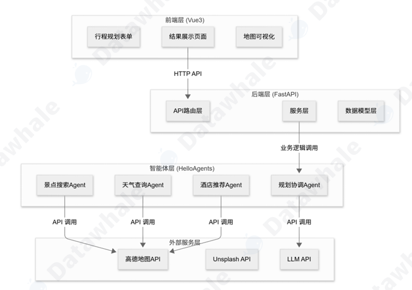

- 前端采用Vue3+TyprScript，负责用户交互以及功能展示，包括表单采集，结果展示以及行程可视化
- 后端采用FastAPI，负责路由，数据验证以及相关业务逻辑
- 智能体采用教程的HelloAgent框架，负责任务分解、工具调用、结果整合
- 外部服务主要是为智能体提供真实可靠的外部信息，包括地图信息，LLM服务等

信息流转的过程：收集用户填写的表单信息>后端验证数据>调用智能体系统>多智能体协作>MCP调用外部API>整合结果返回前端>前端渲染

项目目录结构：

```bash
helloagents-trip-planner/
├── backend/                         # 后端代码
│   ├── app/
│   │   ├── agents/                  # 智能体实现
│   │   ├── api/                     # API路由
│   │   ├── models/                  # 数据模型
│   │   ├── services/                # 服务层
│   │   └── config.py                # 配置文件
│   └── requirements.txt             # Python依赖
└── frontend/                        # 前端代码
    ├── src/
    │   ├── views/                   # 页面组件
    │   ├── services/                # API服务
    │   ├── types/                   # 类型定义
    │   └── router/                  # 路由配置
    └── package.json                 # npm依赖
```

#### 6.5.3 数据模型设计

##### 6.5.3.1 Web应用中的数据流转

项目的目标是构建一个Web应用，我们先了解一下数据是如何在整个过程中流转的。

用户在前端填写表单数据，通过HTTP请求发送给后端，后端接收到数据后，调用智能体进行处理，智能体又调用高德地图的API、Unspash API等外部服务，后端继续处理这些API返回的各种类型的数据然后返回给前端，前端再进行渲染。

整个过程数据流转：前端表单>HTTP请求>后端Python对象>外部API响应>后端Python对象>HTTP响应>前端TypeScript对象>前端页面展示。

数据经过了多层级的流转，要保证整个过程不出错，我们应该同一数据格式，也就是我们需要数据模型。

##### 6.5.3.2 Pydantic模型

由于各个API返回的数据格式可能不同，使用的参数字段也可能不同，在实际应用的过程中我们需要手动进行多次解析，不方便😭

其次，由于Python是弱类型的语言，在定义变量时不需要声明变量的类型，因此如果遇到数据类型的错误，往往不好排查。

维护性较差，如果我们想为某个接口新增一个字段，需要整个代码到处改，很麻烦。

Pydantic应运而生，它是Python的数据验证库，允许我们使用类来定义数据结构，自动处理验证、转换以及序列化，体现**面向对象**的编程思想：

```python
from pydantic import BaseModel,Field

class Location(BaseModel):
    longitude:float = Field(...,description="经度")
    latitude:float = Field(...,description="纬度")
    
class Attraction(BaseModel):
    name:srt
    location:Location
    ticket_price:int = 0
    
acttraction = Acttraction(
	name="宽窄巷子",
    location=Location(longitude=...,latitude=...)
    ticket_price=...
)

lng = attraction.location.longitude
```

好处😋：

- 如果传入错误的数据类型，Pydantic会立即报错
- 定义了数据类型后，IDE可以提供自动补全功能
- 当我们需要修改数据结构，只需要修改类定义，所有使用该类的地方会自动更新

##### 6.5.3.3 Pydantic的核心概念

Pydantic的基础是BaseModel类，所有的数据模型都要继承这个类，我们可以在类中指定每个字段的数据类型。

字段定义使用Field函数，可以指定**默认值、描述、验证规则**等，我们也可以使用Optional表示可选字段：

```python
from pydantic import BaseModel,Field
from typing import Optional,List

class Attraction(BaseModel):
    name:str = Field(...,description="...")
    rating:float = Field(default=0.0,ge=0,le=5)
    visit_duration:int = Field(default=60,gt=0)
    description:Optional[str] = None
```

同时，Pydantic还支持**嵌套**，即在一个数据模型中嵌套另一个数据模型：

```python
class DayPlan(BaseModel):
    date:str
    attractions:List[Attraction]
    hotel:Optional[Hotel] = None
```

Pydantic支持自定义验证器，我们可以使用该功能将API返回的数据格式进行验证和转换，例如使用**field_validator**装饰器将一个字符串转换为数字：

```python
from pydantic import field_validator

class WeatherIndo(BaseModel):
    temperature:int
    
    @field_validator('temperature',mode='before'):
        def parase_temperature(cls,v):
            if isinstance(v,str):
                v = v.replace('℃','').strip()
                return int(v)
            return v
```

数据格式的校验以及转换将发生在创建对象时，不需要在代码中手动修改了。

##### 6.5.3.4 自底向上的设计思想

我们使用自底向上的原则设计数据模型，先定义基础模型，再逐步组合出复杂结构，就像我们学习一样，总是从基础简单的部分入手，逐步深入😊

首先，我们来设计位置信息，定义一个Location类来表示经纬度坐标：

```python
class Location(BaseModel):
    longitude:float = Field(...,description="经度",ge=-180,le=180)
    latitude:float = Field(...,description="纬度",ge=-90,le=90)
```

接下来是景点信息，一个景点应该包括名称，地址，位置，游览时间，描述，评分，图片，门票价格等信息：

```python
class Acttraction(BaseModel):
    name:str = Field(...,description="景点名称")
    address:str = Field(...,description="地址")
    location:Location = Field(...,description="经纬度坐标")
    visit_duration:int = Field(...,description="建议游览时间",gt=0)
    description:str = Field(...,description="景点信息描述")
    category:Optional[str] = Field(default="景点",description="景点类别")
    rating:Optional[float] = Field(default=None,ge=0,le=5,description="景点评分")
    image_url:Optional[str] = Field(default=None,description="图片处理URL")
    ticket_price:int = Field(default=0,ge=0,description="门票价格（元）")
```

接下来我们定义餐饮信息和酒店信息，包含名称、地址、位置以及费用等信息：

```python
class Meal(BaseModel):
    type:str = Field(...,description="餐饮类型：bearkfast/lunch/dinner/snack")
    name:str = Field(...,description="餐饮名称")
    address:Optional[str] = Field(default=None,description="地址")
    location:Optional[Location] = Field(default=None,description="经纬度坐标")
    description:Optional[str] = Field(default=None,description="描述")
    estimated_cost:int = Field(default=0,description="预估费用（元）")
    
class Hotel(BaseModel):
    """酒店信息"""
    name: str = Field(...,description="酒店名称")
    address: str = Field(default="",description="酒店地址")
    location: Optional[Location] = Field(default=None,description="酒店位置")
    price_range: str = Field(default="",description="价格范围")
    rating: str = Field(default="",description="评分")
    distance: str = Field(default="",description="距离景点距离")
    type: str = Field(default="",description="酒店类型")
    estimated_cost: int = Field(default=0,description="预估费用(元/晚)")
```

预算信息是一个特殊的模型，不包含位置，包含各个费用的总和：

```python
class Budget(BaseModel):
    """预算信息"""
    total_attractions: int = Field(default=0,description="景点门票总费用")
    total_hotels: int = Field(default=0,description="酒店总费用")
    total_meals: int = Field(default=0,description="餐饮总费用")
    total_transportation: int = Field(default=0,description="交通总费用")
    total: int = Field(default=0,description="总费用")
```

我们将这些基础模型进行组合，构建单日行程，一个单日行程包含日期，描述，交通方式，住宿安排，酒店信息，景点信息以及餐饮列表：

```python
class DayPlan(BaseModel):
    date:str = Field(...,description="日期")
    day_index:int = Field(...,description="第几天")
    description: str = Field(...,description="当日行程描述")
    transportation:str = Field(...,description="交通方式")
    accommodation:str = Field(...,description="住宿安排")
    hotel:Optional[Hotel] = Field(default=None,description="酒店信息")
    attractions:List[Attraction] = Field(default_factory=list,description="景点列表")
    meals:List[Meal] = Field(default_factory=list,description="餐饮安排") # 默认表示一个空列表
```

接着我们处理天气信息，由于从高德API相应的数据格式不规范，我们使用Pydantic模型的自定义验证器处理：

```python
class WeatherInfo(BaseModel):
    """天气信息"""
    date: str = Field(...,description="日期")
    day_weather: str = Field(...,description="白天天气")
    night_weather: str = Field(...,description="夜间天气")
    day_temp: int = Field(...,description="白天温度(摄氏度)")
    night_temp: int = Field(...,description="夜间温度(摄氏度)")
    wind_direction: str = Field(...,description="风向")
    wind_power: str = Field(...,description="风力")
    
    @field_validator('day_temp','night_temp',mode='before')
    def parse_temperature(cls,v):
        """解析温度字符串："16°C" -> 16"""
        if isinstance(v,str):
            v = v.replace('°C','').replace('℃','').replace('°','').strip()
            try:
                return int(v)
            except ValueError:
				return 0
           return v
```

最后，我们定义完整的旅行计划，这是最顶层模型：

```python
class TripPlan(BaseModel):
    """旅行计划"""
    city: str = Field(...,description="目的地城市")
    start_date: str = Field(...,description="开始日期")
    end_date: str = Field(...,description="结束日期")
    days: List[DayPlan] = Field(default_factory=list,description="每日行程")
    weather_info: List[WeatherInfo] = Field(default_factory=list,description="天气信
    息")
    overall_suggestions: str = Field(...,description="总体建议")
    budget: Optional[Budget] = Field(default=None,description="预算信息")
```

```python 
class TripRequest(BaseModel):
    """旅行规划请求"""
    city: str = Field(..., description="目的地城市", example="北京")
    start_date: str = Field(..., description="开始日期 YYYY-MM-DD", example="2025-06-01")
    end_date: str = Field(..., description="结束日期 YYYY-MM-DD", example="2025-06-03")
    travel_days: int = Field(..., description="旅行天数", ge=1, le=30, example=3)
    transportation: str = Field(..., description="交通方式", example="公共交通")
    accommodation: str = Field(..., description="住宿偏好", example="经济型酒店")
    preferences: List[str] = Field(default=[], description="旅行偏好标签", example=["历史文化", "美食"])
    free_text_input: Optional[str] = Field(default="", description="额外要求", example="希望多安排一些博物馆")
    
    class Config:
        json_schema_extra = {
            "example": {
                "city": "北京",
                "start_date": "2025-06-01",
                "end_date": "2025-06-03",
                "travel_days": 3,
                "transportation": "公共交通",
                "accommodation": "经济型酒店",
                "preferences": ["历史文化", "美食"],
                "free_text_input": "希望多安排一些博物馆"
            }
        }
```

tips:warning:注意前者是响应模型，后者是请求模型（返回给客户端）。

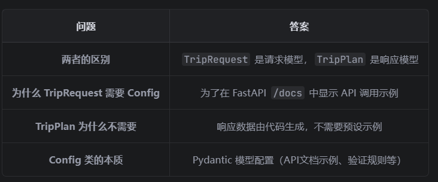

##### 6.5.3.5 数据模型在Web应用

在FastAPI中，Pydantic模型可以**直接用作请求和响应**的类型定义，FastAPI自动进行数据验证：

```python
# 1. 导入核心模块和自定义数据模型
from fastapi import FastAPI  # 导入FastAPI框架的核心类，用于创建Web应用实例
from app.models.schemas import TripPlanRequest,TripPlan  # 导入自定义的请求/响应数据模型（Pydantic模型）

# 2. 创建FastAPI应用实例
app = FastAPI()  # 实例化FastAPI，这是整个Web服务的核心入口

# 3. 定义POST接口
@app.post("/api/trip/plan",response_model=TripPlan)  # 装饰器：定义POST请求的接口路径，指定响应数据模型
async def create_trip_plan(request: TripPlanRequest) -> TripPlan:  # 异步接口函数，接收TripPlanRequest类型的请求体，返回TripPlan类型数据
    """
    创建旅行计划
    FastAPI自动：
    1. 验证请求数据(TripPlanRequest)
    2. 验证响应数据(TripPlan)
    3. 生成OpenAPI文档
    """
    # 4. 调用异步函数生成旅行计划（需提前实现generate_trip_plan函数）
    trip_plan = await generate_trip_plan(request)  # 等待异步函数执行完成，获取旅行计划结果
    # 5. 返回符合TripPlan模型的响应数据
    return trip_plan
```

接口接收的是符合 Pydantic 模型定义的 JSON 数据（自动解析为 Pydantic 模型实例），返回的是 Pydantic 模型实例（自动序列化为 JSON 数据）

#### 6.5.4 多智能体协作

旅游助手设计到多个任务，包括天气查询，景点信息查询，酒店信息查询等任务，如果我们使用单个Agent来完成可能遇到以下问题：

- **时间成本**，让单个智能体完成一次任务需要多次调用工具，每一次调用工具之间是**串行操作**，上一轮结束后才会轮到下一轮，总耗时会很长
- **提示词的复杂度急剧上升**，要想使用一个统一的提示词指挥智能体完成一个多步骤的任务，会导致提示词难以维护

因此，我们可以将复杂任务分解为多个步骤，让多个Agent扮演不同的角色完成各自的任务

##### 6.5.4.1 Agent角色设计

基于任务分解的原则，这里设计了四种Agent：

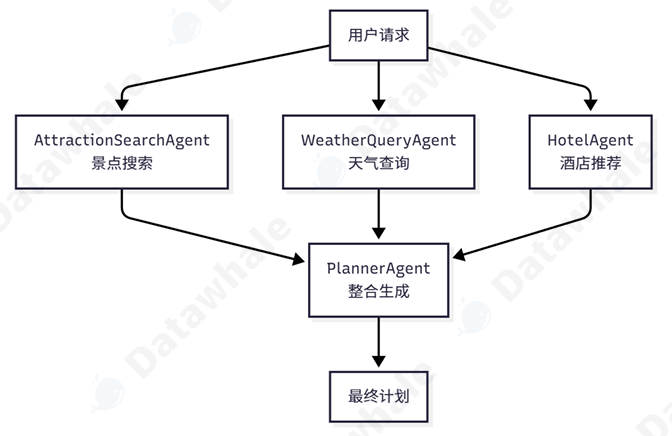

我们把整个任务分解后，将子任务分配给不同的Agent处理，接下来我们就只需要专注于每一个Agent的任务，并思考相应的输入输出是什么格式以及调用什么工具🤔

我们先来设计第一个AttractionSearchAgent，目标是根据用户喜好搜索景点：

```python
ATTRACTION_AGENT_PROMPT = """
你是一个旅游大师，十分擅长搜索景点

你可以调用工具，遵循以下格式：
[TOOL_CALL:amap_maps_text_search:keywords=景点,city=城市名称]

**示例:**- `[TOOL_CALL:amap_maps_text_search:keywords=景点,city=北京]`- `[TOOL_CALL:amap_maps_text_search:keywords=博物馆,city=上海]`

<strong>注意</strong>
- 你必须基于工具搜索结果，禁止编造
- 根据用户偏好{preferences}搜索{city}的景点
"""
```

接下来设计WeatherQueryAgent，它的任务只需要查询目标区域的天气信息即可：

```python
WEATHER_AGENT_PROMPT = '''
你是一个天气查询助手

你可以调用工具，遵循以下格式：
[TOOL_CALL:amap_maps_weather:city=城市名称]

请你开始查询{city}的天气信息
'''
```

HotelAgent的任务是搜索目标区域的酒店信息，需要指明城市名称以及住宿类型：

```python
HOTEL_AGENT_PROMPT = """
你是一个酒店查询助手

你可以调用工具，遵循以下格式：
[TOOL_CALL:amap_text_search:keywords=酒店,city=城市名称]

请你开始查询{city}的{accommodation}酒店信息
"""
```

最后我们整合以上三个Agent的输出结果，让PlannerAgent为我们规划最终行程：

````python
PLANNER_AGENT_PROMPT = """你是行程规划专家。你的任务是根据景点信息和天气信息,生成详细的旅行计划。

请严格按照以下JSON格式返回旅行计划:
```json
{
  "city": "城市名称",
  "start_date": "YYYY-MM-DD",
  "end_date": "YYYY-MM-DD",
  "days": [
    {
      "date": "YYYY-MM-DD",
      "day_index": 0,
      "description": "第1天行程概述",
      "transportation": "交通方式",
      "accommodation": "住宿类型",
      "hotel": {
        "name": "酒店名称",
        "address": "酒店地址",
        "location": {"longitude": 116.397128, "latitude": 39.916527},
        "price_range": "300-500元",
        "rating": "4.5",
        "distance": "距离景点2公里",
        "type": "经济型酒店",
        "estimated_cost": 400
      },
      "attractions": [
        {
          "name": "景点名称",
          "address": "详细地址",
          "location": {"longitude": 116.397128, "latitude": 39.916527},
          "visit_duration": 120,
          "description": "景点详细描述",
          "category": "景点类别",
          "ticket_price": 60
        }
      ],
      "meals": [
        {"type": "breakfast", "name": "早餐推荐", "description": "早餐描述", "estimated_cost": 30},
        {"type": "lunch", "name": "午餐推荐", "description": "午餐描述", "estimated_cost": 50},
        {"type": "dinner", "name": "晚餐推荐", "description": "晚餐描述", "estimated_cost": 80}
      ]
    }
  ],
  "weather_info": [
    {
      "date": "YYYY-MM-DD",
      "day_weather": "晴",
      "night_weather": "多云",
      "day_temp": 25,
      "night_temp": 15,
      "wind_direction": "南风",
      "wind_power": "1-3级"
    }
  ],
  "overall_suggestions": "总体建议",
  "budget": {
    "total_attractions": 180,
    "total_hotels": 1200,
    "total_meals": 480,
    "total_transportation": 200,
    "total": 2060
  }
}
```

**重要提示:**
1. weather_info数组必须包含每一天的天气信息
2. 温度必须是纯数字(不要带°C等单位)
3. 每天安排2-3个景点
4. 考虑景点之间的距离和游览时间
5. 每天必须包含早中晚三餐
6. 提供实用的旅行建议
7. **必须包含预算信息**:
   - 景点门票价格(ticket_price)
   - 餐饮预估费用(estimated_cost)
   - 酒店预估费用(estimated_cost)
   - 预算汇总(budget)包含各项总费用
"""
````

##### 6.5.4.2 协作流程

按照上一节的流程图，我们通过5个步骤完成这个任务：

```python
class TripPlannerAgent:
def __init__(self):
    self.attraction_agent = SimpleAgent(name="景点搜索"prompt=ATTRACTION_PROMPT)
    self.weather_agent = SimpleAgent(name="天气查询", prompt=WEATHER_PROMPT)
    self.hotel_agent = SimpleAgent(name="酒店推荐", prompt=HOTEL_PROMPT)
    self.planner_agent = SimpleAgent(name="行程规划", prompt=PLANNER_PROMPT)
    def plan_trip(self, request: TripPlanRequest) -> TripPlan:
    # 步骤1: 景点搜索
    attraction_response = self.attraction_agent.run(
    f"请搜索{request.city}的{request.preferences}景点"
    )
    # 步骤2: 天气查询
    weather_response = self.weather_agent.run(
    f"请查询{request.city}的天气"
    )
    # 步骤3: 酒店推荐
    hotel_response = self.hotel_agent.run(
    f"请搜索{request.city}的{request.accommodation}酒店"
    )
    # 步骤4: 整合生成计划
    planner_query = self._build_planner_query(
    request, attraction_response, weather_response, hotel_response
    )
    planner_response = self.planner_agent.run(planner_query)
    # 步骤5: 解析JSON
    trip_plan = self._parse_trip_plan(planner_response)
    return trip_plan
```

#### 6.5.5 MCP工具集成

观察一下官方的源代码：

```python
# 步骤1: 景点搜索Agent搜索景点
            print("📍 步骤1: 搜索景点...")
            attraction_query = self._build_attraction_query(request)
            attraction_response = self.attraction_agent.run(attraction_query)
            print(f"景点搜索结果: {attraction_response[:200]}...\n")

            # 步骤2: 天气查询Agent查询天气
            print("🌤️  步骤2: 查询天气...")
            weather_query = f"请查询{request.city}的天气信息"
            weather_response = self.weather_agent.run(weather_query)
            print(f"天气查询结果: {weather_response[:200]}...\n")

            # 步骤3: 酒店推荐Agent搜索酒店
            print("🏨 步骤3: 搜索酒店...")
            hotel_query = f"请搜索{request.city}的{request.accommodation}酒店"
            hotel_response = self.hotel_agent.run(hotel_query)
            print(f"酒店搜索结果: {hotel_response[:200]}...\n")
```

在多个步骤中都调用了run方法，run方法的底层又是多次调用高德地图的API，那么为什么不直接在Agent中调用API？

- 在当前HelloAgent框架中，Agent 通过识别提示词中的工具调用标记(比如 [TOOL_CALL:tool_name:arg1=value1] )来调用工具，如果直接调用，Agent就失去了自主决策的能力
- 解析响应困难，三方API的响应数据往往结构十分复杂，我们需要手动编写代码进行解析

##### 6.5.5.1 高德地图MCP集成

MCP(Model Context Protocol)是 Anthropic 提出的标准化协议，用于连接 LLM 和外部工具。核心目标是解决大模型与工具交互的**上下文管理和格式统一**问题。

MCP 要求所有外部工具必须先以**标准化格式声明自身能力**（需要提供结构化 Schema而非硬编码到提示词），大模型通过读取这份声明，自动理解工具的「名称、功能、入参、出参、调用约束」，无需人工编写提示词适配。

本项目使用的是amap-mcp-server。

```bash
用户请求
   │
   ▼
┌─────────────────────────────────────────────────────────────┐
│  1. Agent将Prompt + 用户请求 发送给 LLM                    │
│     (Prompt中包含了工具调用的格式规范)                       │
└─────────────────────────────────────────────────────────────┘
   │
   ▼
┌─────────────────────────────────────────────────────────────┐
│  2. LLM分析理解，判断需要调用工具                           │
│     返回格式化的工具调用指令                                │
│     (项目自定义格式: [TOOL_CALL:amap_maps_text_search:...] )│
└─────────────────────────────────────────────────────────────┘
   │
   ▼
┌─────────────────────────────────────────────────────────────┐
│  3. Agent框架解析LLM响应，提取工具名和参数                  │
│     转换为MCP协议的JSON-RPC格式                             │
└─────────────────────────────────────────────────────────────┘
   │
   ▼
┌─────────────────────────────────────────────────────────────┐
│  4. 通过JSON-RPC协议发送到MCP Server执行                    │
└─────────────────────────────────────────────────────────────┘
   │
   ▼
   结果返回
```

在HelloAgent框架中，为了遵循MCP要求的标准化Schema，框架通过Prompt+手动代码解析的方式构造了标准的Schema格式传入MCP服务器。

```bash
使用MCP协议
    │
    ▼
必须符合JSON-RPC 2.0格式 (这是MCP的"交通规则")
    │
    ▼
构造方式灵活选择:
    ├── 手动写JSON（最底层）
    ├── 使用SDK/框架（推荐，更便捷）
    └── 让MCP Server自动处理（最规范）
```

这里来详细介绍一下项目中智能体根据MCP协议调用工具的全流程：

假设假设用户想搜索北京的景点，AttractionSearchAgent 接收到查询"请搜索北京的历史文化 景点"。Agent 分析这个查询，决定调用 amap_maps_text_search 工具，参数是 keywords=景点，city=北 京。

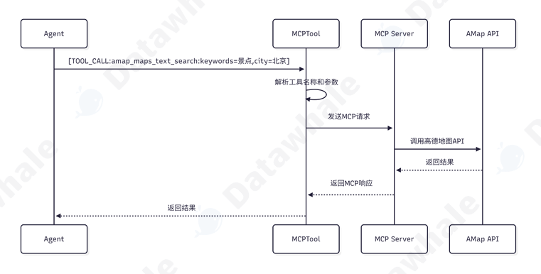

在这个过程中，[TOOL_CALL:amap_maps_text_search:keywords=景点，city=北京] 是**工具调用的标记**，框架底层负责解析并提取工具名称以及参数，调用对应的Tool。

框架底层将构造一个JSON-RPC格式的消息，通过stdin发送给Server：

```python
{
    "jsonrpc": "2.0",
    "method": "tools/call",
    "params": {
        "name": "amap_maps_text_search",
        "arguments": {
            "keywords": "景点",
            "city": "北京"
		}
	}
}
```

MCP服务器收到消息后解析参数，调用高德地图的API，接收响应结果。

高德地图的API返回包含多种参数的json格式数据，MCP服务器解析这些数据，提取关键字段，构造响应格式，通过stdout返回给客户端：

```python
{
  "jsonrpc": "2.0",
  "result": {
    "content": [
      {
        "type": "text",
        "text": "找到以下景点：\n1. 故宫博物院 - 地址：东城区景山前街4号\n2. 天坛公园 - 地址：
东城区天坛路\n..."
      }
    ]
  }
}
```

对于智能体而言，它只需要知道调用对应名称的搜索工具，其他细节都封装好了。

##### 6.5.5.2 共享MCP实例

在项目中，我们有三个智能体需要调用外部工具，我们应该为每个智能体都创建一个MCPTool实例吗？🤔

如果为每个智能体分别创建一个实例，意味着需要启动三个服务进程，每个进程独立调用API服务，可能会超过API的并发限制同时会占用更多资源。

因此，在本项目中，我们只启用一个MCPTool实例，所有智能体共享，所有的API调用都通过这个进程实现。我们只需要把MCP工具实例注册到每个智能体的工具列表中即可。

这样一来，即使我们有三个智能体在调用工具，但底层只有一个MCP服务器进程。（由于这里是串行执行的没有问题，但如果智能体是并行的，那么还是会存在资源竞争、API并发限制等问题，这是还是创建多个实例为优）

#### 6.5.6 Unsplash图片API集成

我们希望在前端界面向用户展示对应景点的图片，使用 Unsplash API 来搜索景点图片，由于它是免费的，效果不太好，后期建议使用商用API。

在项目中**直接封装为一个API路由**，因为它不参与智能体的决策。如果需要智能体决定是否需要图片，可以封装成Tool。

### 6.4 记忆与检索

在之前的章节中，我们已经学习到了智能体的基本架构，包括一个智能体系统的大脑（决策部分），工具调用能力（执行模块），要使智能体完全具备自主规划以及决策的能力，我们还需要赋予智能体记忆的能力。

智能体的记忆功能分为两个层面：

- 短期记忆：通过**存储当前任务的上下文信息**，包括对话历史、思考过程🤔、工具调用结果等内容；主要的实现方式包括：
  - LLM的上下文窗口，将所有历史信息直接放入Prompt中
  - 缓冲区（Buffer），一些成熟的框架（如LangChain）会使用不同类型的缓冲区来进行历史对话管理
- 长期记忆：说的即是将有参考价值、可复用的历史信息存入数据库中，在合适的时机进行检索，使用**RAG+向量知识库**是常用的方法，也可以使用**知识图谱**的方式存储一些关系复杂的依赖型知识

#### 6.4.1 为什么需要引入记忆

首先，LLM是一个无状态的交互模式，每一次用户的请求都是一次独立的计算，我们需要手动对用户与模型的上下文信息做拼接赋予模型记忆的能力。

同时，LLM一旦训练完成，每一次回答只会基于自身内部知识（也就是训练时得到的知识）进行回答，不能满足用户对于信息**实时、专业、来源可解释性**的需求😌，同时也不能满足知识更新的要求。

#### 6.4.2 记忆与RAG系统架构设计

在教程的架构中，记忆与RAG被设计为两个独立的工具，memory_tool 负责存储和维护对话过程中的交互信息， rag_tool 则负责从 用户提供的知识库中检索相关信息作为上下文。

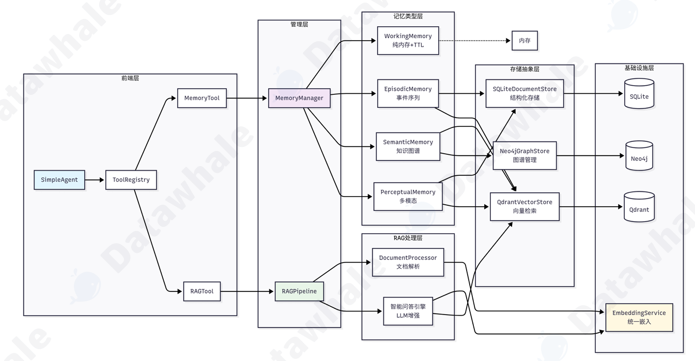

#### 6.4.3 记忆系统

根据人类的记忆过程来构建智能体的记忆系统，核心思想是**模仿人类大脑处理不同类型信息的方式**。以下是HelloAgent记忆系统的完整工作流程：

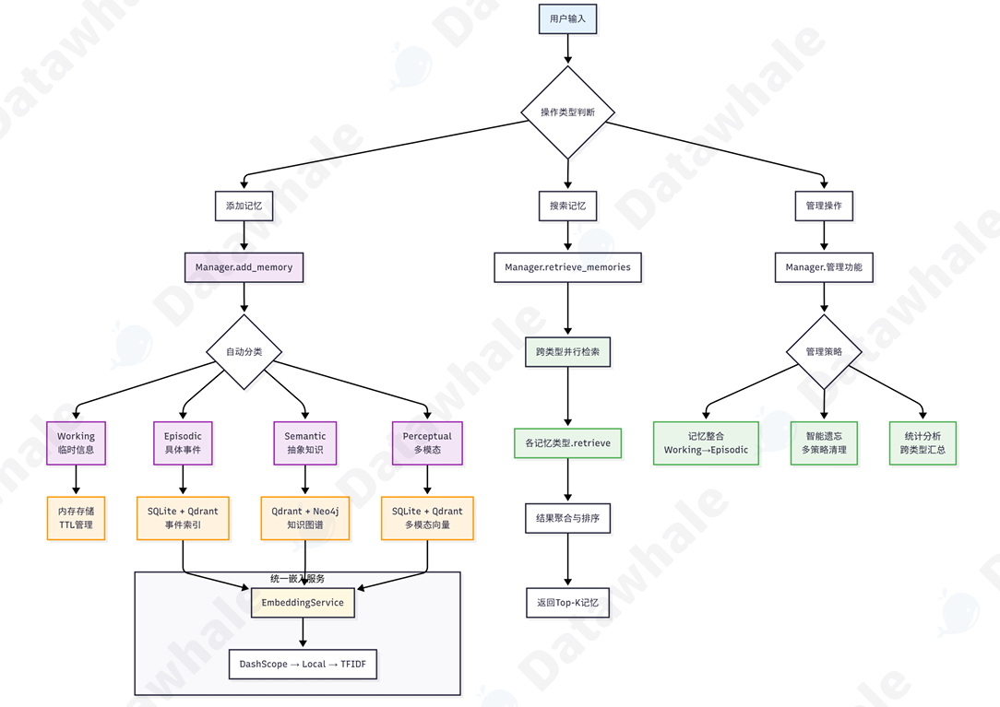

教程中对于长短期记忆划分为了4个更细致的模块，其中还包括了多模态记忆模块：

首先是**工作记忆** (Working Memory)，它扮演着智能体“**短期记忆**”的角色，主要用于存储当前对话的上下文 信息。为确保高速访问和响应，其容量被有意限制（例如，默认50条），并且生命周期与单个会话绑定，会 话结束后便会自动清理。 

其次是**情景记忆** (Episodic Memory)，它负责长期存储具体的**交互事件和智能体的学习经历**。与工作记忆不同，情景记忆包含了丰富的上下文信息，并支持按时间序列或主题进行回顾式检索，是智能体“复盘”和学习过往经验的基础。 

与具体事件相对应的是**语义记忆** (Semantic Memory)，它存储的是更为**抽象的知识、概念和规则**。例如， 通过对话了解到的用户偏好、需要长期遵守的指令或领域知识点，都适合存放在这里。这部分记忆具有高度 的持久性和重要性，是智能体形成“知识体系”和进行关联推理的核心。 

最后，为了与日益丰富的多媒体交互，我们引入了**感知记忆** (Perceptual Memory)。该模块专门处理图像、音频等**多模态信息**，并支持跨模态检索。其生命周期会根据信息的重要性和可用存储空间进行动态管理。

##### 6.4.3.1 MemoryTool

MemoryTool作为记忆系统的统一接口，支持不同分支的操作：

```python
def execute(self, action: str, **kwargs) -> str:
    """执行记忆操作
    支持的操作：
    - add: 添加记忆（支持4种类型: working/episodic/semantic/perceptual）
    - search: 搜索记忆- summary: 获取记忆摘要- stats: 获取统计信息
    - update: 更新记忆
    - remove: 删除记忆
    - forget: 遗忘记忆（多种策略）
    - consolidate: 整合记忆（短期→长期）
    - clear_all: 清空所有记忆
    """
    if action == "add":
    	return self._add_memory(**kwargs)
    elif action == "search":
    	return self._search_memory(**kwargs)
    elif action == "summary":
    	return self._get_summary(**kwargs)
```

操作一：add

通过回话id自动管理，支持多模态数据的判断，为每个记忆添加时间戳以及会话信息，同时通过importance参数控制当前信息的重要性，为后续检索提供依据。

```python 
# 1. 工作记忆 - 临时信息，容量有限
memory_tool.execute("add",
    content="用户刚才问了关于Python函数的问题",
    memory_type="working",
    importance=0.6
)
# 2. 情景记忆 - 具体事件和经历
memory_tool.execute("add",
    content="2024年3月15日，用户张三完成了第一个Python项目",
    memory_type="episodic",
    importance=0.8,
    event_type="milestone",
    location="在线学习平台"
)
# 3. 语义记忆 - 抽象知识和概念
memory_tool.execute("add",
    content="Python是一种解释型、面向对象的编程语言",
    memory_type="semantic",
    importance=0.9,
    knowledge_type="factual"
)
# 4. 感知记忆 - 多模态信息
memory_tool.execute("add",
    content="用户上传了一张Python代码截图，包含函数定义",
    memory_type="perceptual",
    importance=0.7,
    modality="image",
    file_path="./uploads/code_screenshot.png"
)
```

不同记忆类型（4种）需要传入对应的参数。

操作二：搜索记忆，一般需要指定记忆的类型进行检索，因为不同类型的记忆往往存在不同的数据库中。

```python
# 基础搜索
result = memory_tool.execute("search", query="Python编程", limit=5)
# 指定记忆类型搜索
result = memory_tool.execute("search",
query="学习进度",
memory_type="episodic",
limit=3
)
# 多类型搜索
result = memory_tool.execute("search",
query="函数定义",
memory_types=["semantic", "episodic"],
min_importance=0.5
)
```

使用时指定自己的query即可开始在记忆中，同时也可以指定memory_type/memory_types以及min_importance更精确地检索。

操作三：遗忘

框架支持基于**重要性，时间，容量**进行记忆遗忘。

```python
# 1. 基于重要性的遗忘 - 删除重要性低于阈值的记忆
memory_tool.execute("forget",
    strategy="importance_based",
    threshold=0.2
)
# 2. 基于时间的遗忘 - 删除超过指定天数的记忆
memory_tool.execute("forget",
    strategy="time_based",
    max_age_days=30
)
# 3. 基于容量的遗忘 - 当记忆数量超限时删除最不重要的
memory_tool.execute("forget",
    strategy="capacity_based",
    threshold=0.3
)
```

操作四：记忆整合

consolidate操作目的是将**短期记忆转换为长期记忆**，将重要性超过一定阈值的工作记忆进行转换。(可以看出importance对于记忆系统而言是一个很重要的参数)

```python
# 将重要的工作记忆转为情景记忆
memory_tool.execute("consolidate",
from_type="working",
to_type="episodic",
importance_threshold=0.7
)
# 将重要的情景记忆转为语义记忆
memory_tool.execute("consolidate",
from_type="episodic",
to_type="semantic",
importance_threshold=0.8
)
```

##### 6.4.3.2 MemoryManager

上一节介绍了MemoryTool，MemoryManager是什么呢？我也有点晕了😵

这是框架功能高度解耦的一大体现，是典型的 **Facade（外观）模式** ，MemoryTool 作为统一入口，隐藏了内部复杂的记忆系统细节，让用户可以简单直观地使用记忆功能。MemoryTool专注于**用户接口和参数处理**，而 MemoryManager则负责核心的**记忆管理逻辑**。

```python
Agent 用户
    │
    │ 1. 调用 add/search/其他操作
    ▼
MemoryTool (工具层)
    │   - 参数验证
    │   - 元数据预处理
    │   - 结果格式化
    ▼
MemoryManager (核心层)
    │   - 记忆生命周期管理
    │   - 跨类型协调
    │   - 重要性计算
    ▼
具体记忆类型 (WorkingMemory/EpisodicMemory/SemanticMemory/PerceptualMemory)
    │   - 存储/检索实现
    │   - 容量管理
    │   - 遗忘策略
    ▼
MemoryItem (数据模型)
```

MemoryTool在初始化时会创建一个MemoryManager实例，并根据配置启用不同类型的记忆模块。这种设计让用户可以根据具体需求选择启用哪些记忆类型。

##### 6.4.3.3 四种记忆类型

框架将之前提到的四种记忆类型进行了封装。

1.工作记忆：采用纯内存的存储方式，配合**TTL（Time To Live）机制**，追求的是快速访问以及定期清理。采用的是**混合检索策略**：先尝试TF-IDF向量检索，失败则回退至关键词检索。

2.情景记忆：设计目标是保持事件完整以及时间序列关系，采用**SQLite+Qdrant**混合存储方案，前者负责结构化数据存储，后者负责高效向量检索。

3.语义记忆：负责存储抽象概念，规则等，采用**neo4j+Qdrant**混合存储。语义记忆的评分公式为（框架自定义的评分算法）：(向量相似度 × 0.7 + 图相似度 × 0.3) × (0.8 + 重要性 × 0.4)。

4.感知机制：负责多模态数据的存储和检索，采用**模态分离**的存储策略，为不同模态 的数据创建独立的向量集合。感知记忆的评分公式为： (向量相似度 × 0.8 + 时间近因性 × 0.2) × (0.8 + 重要性 × 0.4)。

这里有一个例子体会一下：

```python
from hello_agents import SimpleAgent, HelloAgentsLLM, ToolRegistry
from hello_agents.tools import MemoryTool
# 创建具有记忆能力的Agent
llm = HelloAgentsLLM()
agent = SimpleAgent(name="记忆助手", llm=llm)
# 创建记忆工具
memory_tool = MemoryTool(user_id="user123")
tool_registry = ToolRegistry()
tool_registry.register_tool(memory_tool)
agent.tool_registry = tool_registry
# 体验记忆功能
print("=== 添加多个记忆 ===")
# 添加第一个记忆
result1 = memory_tool.execute("add", content="用户张三是一名Python开发者，专注于机器学习和
数据分析", memory_type="semantic", importance=0.8)
print(f"记忆1: {result1}")
# 添加第二个记忆
result2 = memory_tool.execute("add", content="李四是前端工程师，擅长React和Vue.js开发", 
memory_type="semantic", importance=0.7)
print(f"记忆2: {result2}")
# 添加第三个记忆
result3 = memory_tool.execute("add", content="王五是产品经理，负责用户体验设计和需求分析", 
memory_type="semantic", importance=0.6)
print(f"记忆3: {result3}")
print("\n=== 搜索特定记忆 ===")
# 搜索前端相关的记忆
print("
🔍
 搜索 '前端工程师':")
result = memory_tool.execute("search", query="前端工程师", limit=3)
print(result)
print("\n=== 记忆摘要 ===")
result = memory_tool.execute("summary")
print(result)
```

这里我有疑惑🤔，如果每次调用MemoryTool管理记忆都需要传入memory_type和importance，那么智能体的自主性如何体现呢？

其实框架底层是有自动计算两个参数的逻辑的：

1.在添加记忆初始化时会默认为工作记忆。

```python
def add_memory(
    self,
    content: str,
    memory_type: str = "working",  # 默认工作记忆
    importance: Optional[float] = None,  # None表示自动计算
    metadata: Optional[Dict[str, Any]] = None,
    auto_classify: bool = True  # 默认启用自动分类！
) -> str:
```

2.底层可以根据关键字自动判断记忆类型。

```python
def _classify_memory_type(self, content: str, metadata: Optional[Dict[str, Any]]) -> str:
    """根据内容自动判断记忆类型"""
    
    # 情景记忆关键词（时间相关、事件相关）
    episodic_keywords = ["昨天", "今天", "明天", "上次", "记得", "发生", "经历"]
    
    # 语义记忆关键词（知识相关）
    semantic_keywords = ["定义", "概念", "规则", "知识", "原理", "方法"]
    
    if any(kw in content for kw in episodic_keywords):
        return "episodic"      # 情景记忆
    elif any(kw in content for kw in semantic_keywords):
        return "semantic"      # 语义记忆
    else:
        return "working"       # 默认工作记忆
```

3.自动计算重要性(基于规则，如长度、关键字等)。

```python
def _calculate_importance(self, content: str, metadata: Optional[Dict[str, Any]]) -> float:
    importance = 0.5  # 基础重要性
    
    # 内容越长，可能越重要
    if len(content) > 100:
        importance += 0.1
    
    # 关键词检测
    important_keywords = ["重要", "关键", "必须", "注意", "警告", "错误"]
    if any(kw in content for kw in important_keywords):
        importance += 0.2
    
    # 元数据优先级
    if metadata:
        if metadata.get("priority") == "high":
            importance += 0.3
        elif metadata.get("priority") == "low":
            importance -= 0.2
    
    return max(0.0, min(1.0, importance))  # 限制在0-1之间
```

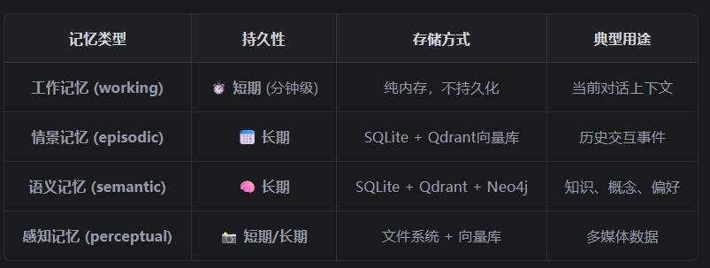

虽然框架底层只是基于简单的规则进行分类以及重要性计算，但保证了系统整体的鲁棒性以及智能性，后续可以思考如何优化计算机制。

我在Trea中询问了Kimi-K2.5，给出了一些优化方案：

- 结合框架已有的embedding模块，先定义每种记忆类型的原型描述，在对输入以及每种原型描述计算余弦相似度，得分最高的即是输入所属的记忆类型。（以下解释了什么是原型描述）

  ```py
  self.embedder = get_text_embedder()
          # 定义每种类型的原型描述
          self.prototypes = {
              "working": [
                  "当前正在进行的任务和对话上下文",
                  "临时性的即时信息",
                  "短期需要记住的内容"
              ],
              "episodic": [
                  "过去发生的具体事件和经历",
                  "特定时间点的交互历史",
                  "用户的个人经历和故事"
              ],
              "semantic": [
                  "通用知识和概念定义",
                  "事实性信息和规则",
                  "用户的长期偏好和属性"
              ]
          }
          # 预计算原型嵌入
          self.prototype_embeddings = self._compute_prototypes()
  ```

- 还可以基于LLM对输入进行智能分类与评估，主要工作是设计提示词，但我个人认为引入开放域可能导致输出的结果不稳定，因为对于一条消息的类型以及评分是很主观的，很多时候如果无法在提示词中清晰地定义评分准则，LLM每次输出的结果都是随机的，不可控。

  ```python
  import json
  from typing import Dict, Any
  
  class LLMBasedMemoryProcessor:
      """基于LLM的记忆智能处理"""
      
      def __init__(self, llm_client):
          self.llm = llm_client
      
      async def analyze_memory(self, content: str, context: Dict[str, Any] = None) -> Dict[str, Any]:
          """
          使用LLM进行深度分析
          """
          prompt = f"""分析以下记忆内容，输出JSON格式：
  
  内容：{content}
  上下文：{context or '无'}
  
  请分析：
  1. memory_type: 记忆类型 (working/episodic/semantic)
  2. importance: 重要性评分 (0.0-1.0)
  3. confidence: 分类置信度 (0.0-1.0)
  4. reasoning: 分析理由
  5. entities: 提取的实体列表
  6. relations: 实体关系
  7. ttl_minutes: 建议的存活时间（分钟）
  
  输出格式：
  {{
      "memory_type": "semantic",
      "importance": 0.85,
      "confidence": 0.92,
      "reasoning": "这是用户明确陈述的偏好信息...",
      "entities": ["用户", "Python"],
      "relations": ["用户-喜欢-Python"],
      "ttl_minutes": 10080
  }}"""
          
          response = await self.llm.generate(prompt)
          try:
              result = json.loads(response)
              return result
          except json.JSONDecodeError:
              # 降级处理
              return self._fallback_analysis(content)
      
      def _fallback_analysis(self, content: str) -> Dict[str, Any]:
          """降级到规则基础分析"""
          # 使用原有的关键词方法
          return {
              "memory_type": "working",
              "importance": 0.5,
              "confidence": 0.3,
              "reasoning": "LLM解析失败，使用默认规则"
          }
  ```

- 基于用户反馈以及自我学习的策略，目前没有看懂😂

曾经有伙伴在issues里提问，认为框架整体的代码量很大，很难重写和复现，询问作者有什么好的建议。

作者回复：

- HelloAgents的开发是不断迭代和完善的过程，你也可以想想现在缺少什么，应该怎么使得它变得更好，也可以直接提交PR到框架源码，这也是学习的初衷
- 一个好的思路是建立在现在的实现基础，想想怎么让他变得更好，而不是从头开始实现

我的反思🤔：很多时候学习不需要过于关注底层细节的实现，因为我们还是初级开发人员，更多的是聚焦在实际应用场景中如何优化某个功能模块。

#### 6.4.4 RAG

这也是老生常谈的东西了~😄

先来回顾一下基本概念：检索增强生成（Retrieval-Augmented Generation，RAG）是一种结合了信息检索和文本生成的技术。它的 核心思想是：在生成回答之前，先从外部知识库中检索相关信息，然后将检索到的信息作为上下文提供给大 语言模型，从而生成更准确、更可靠的回答。

个人认为RAG最突出的一点是解决了知识专业性以及可追溯性的问题，我们可以看到模型是基于什么材料回答的问题。但是RAG是基于向量相似检索的，这有一个致命缺点：**向量检索的本质是“相似性检索”而不是“相关性检索”。**在使用时我们可以发现有时检索结果的相似度很高，但在语义上却与查询不相关，也就解释了这个问题。这也被成为“**语义偏移**”。

目前的RAG正朝着模块化的方向发展，作为一个可插拔的独立模块嵌入到项目中。

##### 6.4.4.1 RAG系统的工作原理

在HelloAgent框架中，专门为RAG集成了一套完整的工作流程。

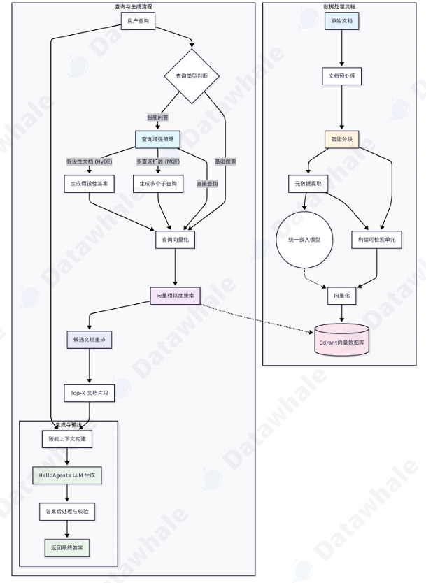

框架对于RAG系统的设计与Memory系统有异曲同工之处，也是各个模块高度解耦，有一套完整的pipeline：

```bash
用户层：RAGTool统一接口（作为整个RAG系统的入口，暴露简洁的接口）
↓
应用层：智能问答、搜索、管理
↓  
处理层：文档解析、分块、向量化
↓
存储层：向量数据库、文档存储
↓
基础层：嵌入模型、LLM、数据库
```

1.多模态文档载入

框架中使用MarkItDown作为统一的文档转换引擎，几乎支持所有常见文档格式，可以将多种模态的输入转换为Markdown格式，进而同一分块、向量化以及存储。

我们来了解一下这个引擎：

基础功能是可以十分便捷地将原始文档内容提取出来并转换为markdown格式：

```python
from markitdown import MarkItDown

with open(r"./本科生成绩单-5120222559.pdf","rb") as f:
    md = MarkItDown()
    result = md.convert_stream(f)  
    print(result.text_content)
```

还可以集成LLM能力，我们可以在处理图像时，让LLM生成图像描述：

```python
from markitdown import MarkItDown
from openai import OpenAI

client = OpenAI(
    api_key = "sk-gQ0uGwtDGRTkq63uRpuYgRc8kYDHzS0a4OXFcVdqfpXk61bD",
    base_url = "https://api.moonshot.cn/v1",
)
md = MarkItDown(llm_client=client, llm_model="kimi-k2.5")
result = md.convert("example.png")
print(result.text_content)
```

需要注意：模型必须支持图片上传，也就是需要**多模态模型**

2.智能分块

经过MarkItDown转换后，所有文档统一为Markdown格式，系统基于**Markdown的标题结构**（#、##、###等）进行精确的语义分割。

```bash
标准Markdown文本 → 标题层次解析 → 段落语义分割 → Token计算分块 → 重叠策略优化 → 向量化准备
       ↓                ↓              ↓            ↓           ↓            ↓
   统一格式          #/##/###        语义边界      大小控制     信息连续性    嵌入向量
   结构清晰          层次识别        完整性保证    检索优化     上下文保持    相似度匹配
```

接下来基于token的数量分块以及控制重叠部分（overlap），最后再对每个分块进行向量化处理。

3.嵌入与向量存储

嵌入模型是RAG的核心，可以更好地理解每个分块的语义信息，会很大程度上影响模型的检索效果。框架实现了统一的嵌入模型接口，支持调用API接口、本地嵌入模型以及TF-IDF算法（兜底）。

这里回顾一下TF-IDF算法：

```bash
TF-IDF = 词频–逆文档频率
1. TF（Term Frequency）词频,某个词在这篇文档里出现的次数越多，越重要。
2. IDF（Inverse Document Frequency）逆文档频率,某个词在整个语料库里到处都出现（比如 “的”“是”“在”），就不重要。
```

##### 6.4.4.2 高级检索策略

RAG的检索优化是一个热门话题~

RAG的检索原理是基于向量相似度的数学方法，我们这里主要通过**优化Prompt**的方式，让Query更“像”数据库中的内容

在框架中实现了三种检索策略：多查询扩展（MQE），假设文档嵌入（HyDE）以及统一的检索扩展框架。

1.MQE

一种通过生成语义等价的多样化查询以提高检索召回率。核心原理基于：同一个问题可以有多个不同的表述，**不同的表述可能会匹配到不同的相关文档**（这也反映了向量检索的特点，是基于向量之间的相似度而非语义关系），简单而言就是换个说法😃

这种优化方式一般适用于模糊查询以及设计专业术语的查询。

```python
prompt = [
{"role": "system", "content": "你是检索查询扩展助手。生成语义等价或互补的多样化查
询。使用中文，简短，避免标点。"},
{"role": "user", "content": f"原始查询：{query}\n请给出{n}个不同表述的查询，每
行一个。"}]
```

2.HyDE

核心思想是：**用答案找答案**，通过Prompt让LLM先根据用户的Query生成一些假设性的答案，再去检索。这样做更容易匹配到关键术语、概念和表述风格。

```python
 prompt = [
            {"role": "system", "content": "根据用户问题，先写一段可能的答案性段落，用于向量检
索的查询文档（不要分析过程）。"},
            {"role": "user", "content": f"问题：{query}\n请直接写一段中等长度、客观、包含关
键术语的段落。"}
        ]
```

3.扩展检索（非通用，框架自定义功能）

HelloAgents将MQE和HyDE两种策略整合到统一的扩展检索框架中。系统通过enable_mqe和 enable_hyde参数让用户可以根据具体场景选择启用哪些策略：对于需要高召回率的场景可以同时启用两种策略，对于性能敏感的场景可以只使用基础检索。

### 6.5 上下文工程

如果我们期望智能体在真实复杂的实际场景中稳定地思考和行动，我们需要一套工程化方法，为模型构造恰当的上下文。上下文工程主要提高模型调用时的复用性，鲁棒性以及效率。

框架中包含上下文构建器以及两个配套的工具：

- ContextBuilder ( hello_agents/context/builder.py )：上下文构建器，实现 GSSC (Gather Select-Structure-Compress) 流水线，提供统一的上下文管理接口 
- NoteTool ( hello_agents/tools/builtin/note_tool.py )：结构化笔记工具，支持智能体进行持久 化记忆管理 
- TerminalTool ( hello_agents/tools/builtin/terminal_tool.py )：终端工具，支持智能体进行 文件系统操作和即时上下文检索（特别注意权限安全的问题）

这些工具是智能体实现**长程任务**的关键。

#### 6.5.1 上下文VS提示词

提示词工程关注的是提示词本身如何编写以获得更优的结果；而上下文工程则是关注一个**信息集合**，不仅包含提示词，还包含进入上下文窗口的所有信息（外部工具调用结果，系统指令，外部知识库）。

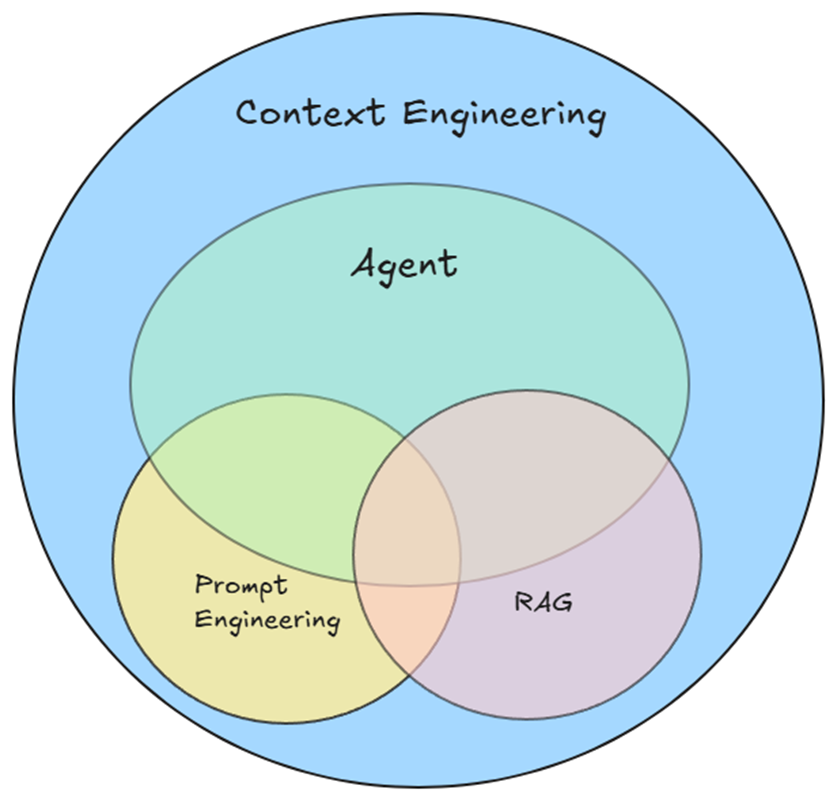

在LLM落地的早期，那时主要针对单轮对话或者说某一个特定的任务做精调式的提示优化；当智能体出现时，这个任务过程中需要更多轮次，跨越更大的时间范围，因此需要管理整个上下文状态，包括**System Prompt，ToolCalling，MCP，History Prompt**等。

上下文是一种有限的资源，我们通过上下文工程决定哪些token（**数量少但信息密度高**）真正进入上下文已获得最优效果。

本节围绕以下组件开展工程化建设：

- 系统提示：目标明确，清洗直白。将提示词分区、分功能模块组织
- 工具：接口定义清晰，功能边界描述清晰，返回格式明确
- Few-Shot：少量示例引导模型

#### 6.5.2 上下文检索与智能体搜索

我们刚才提到上下文是一种资源，因此我们需要仔细决定哪些token真正进入上下文。

在工程实践的过程中，经历了从“推理前一次性检索”到“**及时（JIT，just in time）上下文**”的过程，后者通过维护轻量引用（通过工具动态加载相关数据）而非加载所有数据。例如，模型在文件数据分析时，可以调用相关工具执行终端命令获取分析结果而非把整个数据块放到上下文中。

允许智能体自主导航与检索还能实现**渐进式披露**（progressive disclosure）：每一步交互都会产生新的上下文，反过来指导下一步决策——文件大小暗示复杂度、命名暗示用途、时间戳暗示相关性（当然模型能不能读懂这些暗示很大程度上取决于模型本身的智能程度）。

在实际上下文工程中，一般采用混合检索的策略：前置加载少量高价值上下文，然后允许智能体按需自主调用工具探索。可以在项目的根目录放置一个“约定文件”（类似于Claude.md）。

#### 6.5.3 长程任务的上下文工程

在长程任务中，我们的核心目标聚焦于上下文的连贯性、目标一致性。可以结合这些工程手段：**压缩整合**（Compaction）、**结构化笔记**（Structured  note-taking）与**子代理架构**（Sub-agent architectures）。

- 压缩整合：
  - 当上下文即将达到上限时，对这个上下文进行总结，得到一个新的上下文。
  - 目的是保留决策性上下文，丢弃部分实现细节。
  - 先确保召回（不遗漏关键信息），再优化精确度（冗余信息）。
- 结构化笔记：
  - 也称为“智能体记忆”，将关键信息以固定频率写入上下文外的**持久化存储**，在需要时拉回。
  - 以极低的上下文开销维持持久状态与依赖关系。例如维护 TODO 列表、项目 NOTES.md，例如Trea中每次执行任务时的任务清单表？
- 子代理框架：
  - 主代理进行整体规划，多个子代理在各自的上下文窗口中完成任务，最后返回给主代理进行整合。
  - 适合并行探索的复杂任务。

以上的这些工程手段，在使用Trea的过程中均有体现。

#### 6.5.4 上下文管理器

ContextBuilder是框架设计的上下文管理器，遵循“简单高效”的设计理念，以“相关性+新进性”进行选择。

上下文管理器解决了以下几个问题：

- 统一入口：为使用者提供一个统一的接口，将上下文管理的逻辑抽象为**可复用的流水线**。
- 固定格式：提供**固定的上下文模版**，便于调试和测试，采用分区组织的模版结构。
- 最小规则：不引入来源/优先级等分类维度，保证简洁；基于**相关性以及新近性**足以应对大部分场景。

ContextPacket是信息的基本单元，包含内容、时间戳、token数量以及相关性等属性。

```python
class ContextPacket:
    """候选信息包
    Attributes:
    content: 信息内容
    timestamp: 时间戳
    token_count: Token 数量
    relevance_score: 相关性分数(0.0-1.0)
    metadata: 可选的元数据
    """
```

ContextConfig是管理上下文配置的核心类：

```python
class ContextConfig:
    """上下文构建配置
    Attributes:
        max_tokens: 最大 token 数量
        reserve_ratio: 为系统指令预留的比例(0.0-1.0)
        min_relevance: 最低相关性阈值
        enable_compression: 是否启用压缩
        recency_weight: 新近性权重(0.0-1.0)
        relevance_weight: 相关性权重(0.0-1.0)
    """
```

ContextBuilder 的核心是 GSSC(Gather-Select-Structure-Compress)流水线,将上下文构建分为4个清晰的过程，即**获取-选择-结构化-压缩**。

1.gather

收集候选信息：

```python
def _gather(
    self,
    user_query: str,
    conversation_history: Optional[List[Message]] = None,
    system_instructions: Optional[str] = None,
    custom_packets: Optional[List[ContextPacket]] = None
) -> List[ContextPacket]:
    """汇集所有候选信息
    Args:
        user_query: 用户查询
        conversation_history: 对话历史
        system_instructions: 系统指令
        custom_packets: 自定义信息包
    Returns:
        List[ContextPacket]: 候选信息列表
    """
```

基本流程：添加系统指令--从记忆系统检索--从RAG系统检索--添加历史对话。

2.select

根据相关性与新近性对候选信息进行评分和选择：

```python
def _select(
    self,
    packets: List[ContextPacket],
    user_query: str,
    available_tokens: int
) -> List[ContextPacket]:
    """选择最相关的信息包
    Args:
        packets: 候选信息包列表
        user_query: 用户查询(用于计算相关性)
        available_tokens: 可用的 token 数量
    Returns:
        List[ContextPacket]: 选中的信息包列表
    """
```

基本流程：分离系统指令--计算系统指令token--计算综合得分（相关性得分+新近性得分）--分数排序--贪心选择，直到token上限。

这里给出源码中有关相似性得分计算的两个函数：

```python
def _calculate_relevance(self, content: str, query: str) -> float:
        """计算内容与查询的相关性
        使用简单的关键词重叠算法。在生产环境中,可以替换为向量相似度计算。
    Args:
    content: 内容文本
    query: 查询文本
    Returns:
    float: 相关性分数(0.0-1.0)
    """
    # 分词(简单实现,可以使用更复杂的分词器)
    content_words = set(content.lower().split())
    query_words = set(query.lower().split())
    if not query_words:
    return 0.0
    # Jaccard 相似度
    intersection = content_words & query_words
    union = content_words | query_words
    return len(intersection) / len(union) if union else 0.0
    def _calculate_recency(self, timestamp: datetime) -> float:
    """计算时间近因性分数
    使用指数衰减模型,24小时内保持高分,之后逐渐衰减。
    Args:
    timestamp: 信息的时间戳
    Returns:
    float: 新近性分数(0.0-1.0)
    """
    import math
    age_hours = (datetime.now() - timestamp).total_seconds() / 3600
    # 指数衰减:24小时内保持高分,之后逐渐衰减
    decay_factor = 0.1  # 衰减系数
    recency_score = math.exp(-decay_factor * age_hours / 24)
    return max(0.1, min(1.0, recency_score))  # 限制在 [0.1, 1.0] 范围内
```

这两个函数从**内容（context）以及时间（time_stamp）**两个维度的加权对候选信息列表进行了选择。

3.structure

将选择的信息组织成结构化的上下文模版，按照分区的原则进行组织。

```python
def _structure(self, selected_packets: List[ContextPacket], user_query: str) -> str:
    """将选中的信息包组织成结构化的上下文模板
    Args:
        selected_packets: 选中的信息包列表
        user_query: 用户查询
    Returns:
        str: 结构化的上下文字符串
    """
     # 按类型分组
    system_instructions = []
    evidence = []
    context = []
    for packet in selected_packets:
        packet_type = packet.metadata.get("type", "general")
        if packet_type == "system_instruction":
            system_instructions.append(packet.content)
        elif packet_type in ["rag_result", "knowledge"]:
            evidence.append(packet.content)
        else:
            context.append(packet.content)
    # 构建结构化模板
    sections = []
    # [Role & Policies]
    if system_instructions:
        sections.append("[Role & Policies]\n" + "\n".join(system_instructions))
    # [Task]
    sections.append(f"[Task]\n{user_query}")
    # [Evidence]
    if evidence:
        sections.append("[Evidence]\n" + "\n---\n".join(evidence))
    # [Context]
    if context:
        sections.append("[Context]\n" + "\n".join(context))
    # [Output]
    sections.append("[Output]\n请基于以上信息,提供准确、有据的回答。")
    return "\n\n".join(sections)
```

根据packet_type来确定候选信息列表的信息类型（ContextPacket类的metadata属性包含了类型信息），并根据类型（如system_instructions）构造上下文模版中的对应分区（如[Role & Policies]），这样就得到了一个具有明确分区的**上下文结构化模版**。

4.compress

最后对超出上限的上下文进行压缩：

```python
def _compress(self, context: str, max_tokens: int) -> str:
    """压缩超限的上下文
    Args:
        context: 原始上下文
        max_tokens: 最大 token 限制
    Returns:
        str: 压缩后的上下文
    """
```

源码是保留分区的前提下利用简单截断的策略进行压缩，也可以使用其他方法。

下面展示一个ContextBuilder流水线的使用：

```python
from hello_agents.context import ContextBuilder,ContextConfig
from hello_agents.tools import MemoryTool,RAGTool
from hello_agents.cores.message import Message
from datetime import datetime

# 1.初始化
memory_tool = MemoryTool(user_id="123")
rag_tool = RAGTool(konwledge_base_path="./konwledge")

# 2.创建一个ContextBuilder实例
config = ContextConfig(
	max_tokens=3000,
    reserve_ratio=0.2,
    min_relevance=0.2,
    enable_compress=True
)

builder = ContextBuilder(
	memory_tool=memory_tool,
    rag_tool=rag_tool,
    config=config
)

# 3.模拟历史对话
conversation_history = [
Message(content="我正在开发一个数据分析工具", role="user", 
timestamp=datetime.now()),
Message(content="很好!数据分析工具通常需要处理大量数据。您计划使用什么技术栈?", 
role="assistant", timestamp=datetime.now()),
Message(content="我打算使用Python和Pandas,已经完成了CSV读取模块", role="user", 
timestamp=datetime.now()),
Message(content="不错的选择!Pandas在数据处理方面非常强大。接下来您可能需要考虑数据清洗和转
换。", role="assistant", timestamp=datetime.now()),
]
        
# 4.添加一些记忆
memory_tool.run({
    "action":"add",
    "content":"用户正在开发数据分析工具，使用Python和Pandas",
    "memory_type":"semantic",
    "importance":0.8
}) 
        
memory_tool.run({
    "action":"add",
    "content":"已经完成csv读取模块开发",
    "memory_type":"episodic",
    "importance":0.7
})
        
# 5.构建上下文
context = builder.build(
	user_query="如何优化Pandas内存占用？",
    conversation_history=conversation_history,
    system_instructions="你是一位资深的Python工程师，你需要结合用户问题给出可行方案"
)     
        
print("=" * 80)
print("构建的上下文:")
print("=" * 80)
print(context)
print("=" * 80)    
```

经过上述过程可以得到以下结果(经历了完整的获取-选择-结构化的全过程)：

```bash
================================================================================
构建的上下文:
================================================================================
[Role & Policies]
你是一位资深的Python数据工程顾问。你的回答需要:1) 提供具体可行的建议 2) 解释技术原理 3) 给出代码示
例
[Task]
如何优化Pandas的内存占用?
[Evidence]
Pandas内存优化的核心策略包括:
1. 使用合适的数据类型(如category代替object)
2. 分块读取大文件
3. 使用 chunksize 参数--
数据类型优化可以显著减少内存占用。例如,将int64降级为int32可以节省50%的内存。
[Context]
user: 我正在开发一个数据分析工具
assistant: 很好!数据分析工具通常需要处理大量数据。您计划使用什么技术栈?
user: 我打算使用Python和Pandas,已经完成了CSV读取模块
assistant: 不错的选择!Pandas在数据处理方面非常强大。接下来您可能需要考虑数据清洗和转换。
记忆: 用户正在开发数据分析工具,使用Python和Pandas
记忆: 已完成CSV读取模块的开发
[Output]
请基于以上信息,提供准确、有据的回答。
```

接下来就可以把上下文管理器嵌入到Agent中了：

```python
		# 1. 使用 ContextBuilder 构建优化的上下文
        optimized_context = self.context_builder.build(
            user_query=user_input,
            conversation_history=self.conversation_history,
            system_instructions=self.system_prompt
        )
        # 2. 使用优化后的上下文调用 LLM
        messages = [
            {"role": "system", "content": optimized_context},
            {"role": "user", "content": user_input}
        ]
        response = self.llm.invoke(messages)
```

注意这里的system_prompt已经变成了上下文管理器这个类的一个实例。

#### 6.5.5 NoteTool

前面提到的MemoryTool已经提供了强大的记忆管理能力，但主要针对的是对话式记忆；对于需要长期追踪、结构化管理的内容，我们可以使用NoteTool。

适用场景：1.长期项目追踪 2.研究任务进度管理 3.与ContextBuilder融合

我有点没看明白这个NoteTool是一个什么组件🤔，可能有点类似于Claude.md?作为项目的整体说明从而无需每次输入到上下文中。

存储格式主要分为md格式以及索引文件：
```python
--
id: note_20250119_153000_0
title: 项目进展 - 第一阶段
type: task_state
tags: [refactoring, phase1, backend]
created_at: 2025-01-19T15:30:00
updated_at: 2025-01-19T15:30:00--
# 项目进展 - 第一阶段
## 完成情况
已完成数据模型层的重构,主要改动包括:
1. 统一了实体类的命名规范
2. 引入了类型提示,提升代码可维护性
3. 优化了数据库查询性能
```

```python
{
"note_20250119_153000_0": {
"id": "note_20250119_153000_0",
"title": "项目进展 - 第一阶段",
"type": "task_state",
"tags": ["refactoring", "phase1", "backend"],
"created_at": "2025-01-19T15:30:00",
"updated_at": "2025-01-19T15:30:00",
"file_path": "./notes/note_20250119_153000_0.md"
}
}
```

第一种形式人类可读性强，第二种形式通过管理笔记的索引快速定位笔记。

该工具的核心操作也是增删改查，主要是对笔记进行管理。

同时，该工具可以与ContextBuilder深度集成，即将检索到的笔记转换为ContextPackct，然后加入上下文构造器中:

```python
 # 2. 将笔记转换为 ContextPacket
    note_packets = self._notes_to_packets(relevant_notes)
    # 3. 构建优化的上下文
    context = self.context_builder.build(
        user_query=user_input,
        conversation_history=self.conversation_history,
        system_instructions=self._build_system_instructions(),
        custom_packets=note_packets
    )
```

这样我们就把笔记也添加进了上下文，现在的上下文模版中包含系统提示词，task（用户的任务），历史对话内容，输出要求以及笔记。

#### 6.5.6 TerminalTool

由于智能体的上下文是一种有限资源，如果需要文件操作时，我们希望智能体能够自主调用工具在**保证安全的前提下**执行终端命令，像人类一样分析文档，框架中通过TerminalTool这个工具进行完成。

提到终端操作，肯定无法脱离安全性的考略，我们可以结合Trea的使用来得到一些安全策略的启发：

- 命令白名单，我们将安全、可执行的命令写入白名单，智能体只能从这些命令中选择，无法越权使用
- 工作环境隔离，在早期的Trea中，智能体是可以访问用户的工作目录并执行内容的，当时是通过用户点击授权的方式给予智能体执行权限；但现在智能体的行动完全限制在一个独立于工作目录的沙箱中，智能体没有读写权限
- 超时控制+输出大小限制，防止陷入死循环以及内存溢出

运用subprocess库来执行命令：

```python
result = subprocess.run(
            command,
            shell=True,
            cwd=str(self.current_dir),  # 在当前工作目录执行
            capture_output=True,
            text=True,
            timeout=self.timeout,
            env=os.environ.copy()
        )
```

可以做什么呢：1.探索式导航2.文件分析3.代码库分析

框架的设计思想是“万物皆工具”，TerminalTool可以与其他模块进行交互。

- 可以与MemoryTool交互，将终端命令执行结果存到记忆系统中：

  ```python
  structure = terminal.run({"command":"tree -L 2 src"})
  
  memory_tool.run({
      "action":"add",
      "content":f"项目结构：\n{structure}",
      "memory_type":"semantic",
      "importance":0.8,
      "metadata":{"type":"project_structure"}
  })
  ```

- 可以与NoteTool协作，将结果结构化为笔记：

  ```python
  # 发现一个性能瓶颈
  log_analysis = terminal.run({"command": "grep 'slow query' app.log | tail -n 10"})
  # 记录为 blocker 笔记
  note_tool.run({
  "action": "create",
  "title": "数据库慢查询问题",
  "content": f"## 问题描述\n发现多个慢查询,影响系统性能\n\n## 日志分析
  \n```\n{log_analysis}\n```\n\n## 下一步\n1. 分析慢查询SQL\n2. 添加索引\n3. 优化查询逻辑",
  "note_type": "blocker",
  "tags": ["performance", "database"]
  })
  ```

- 与ContextBuilder协作，将结果作为上下文的一部分：

  ```python
  # 探索代码库
  code_structure = terminal.run({"command": "ls -R src"})
  recent_changes = terminal.run({"command": "git log --oneline -10"})
  # 转换为 ContextPacket
  from hello_agents.context import ContextPacket
  from datetime import datetime
  packets = [
  ContextPacket(
  content=f"代码库结构:\n{code_structure}",
  timestamp=datetime.now(),
  token_count=len(code_structure) // 4,
  relevance_score=0.7,
  metadata={"type": "code_structure", "source": "terminal"}
  ),
  ContextPacket(
  content=f"最近提交:\n{recent_changes}",
  timestamp=datetime.now(),
  token_count=len(recent_changes) // 4,
  relevance_score=0.8,
  metadata={"type": "git_history", "source": "terminal"}
  )
  ]
  # 在构建上下文时包含这些信息
  context = context_builder.build(
  user_query="如何重构用户服务模块?",
  custom_packets=packets
  )
  ```

### 6.6 智能体通信协议

通过上面几节的学习，我们基本构建了一个功能完备的单体智能体，但现实环境中往往需要智能体与外部环境以及相互之间通信，这时候就需要用到智能体的通信协议：MCP（用于智能体与外部工具通信）、A2A（智能体之间点对点协作）、ANP（构建大规模智能体网络）。

#### 6.6.1 为什么需要通信协议

回顾以下代码：

```python
from hello_agents import ReActAgent, HelloAgentsLLM
from hello_agents.tools import CalculatorTool, SearchTool
llm = HelloAgentsLLM()
agent = ReActAgent(name="AI助手", llm=llm)
agent.add_tool(CalculatorTool())
agent.add_tool(SearchTool())
# 智能体可以独立完成任务
response = agent.run("搜索最新的AI新闻，并计算相关公司的市值总和")
```

智能体通过调用我们预先编写的工具类实现工具调用，但存在以下问题：

- 复用性差：许多功能有相似的逻辑，每次都编写，复用性差
- 工作量大：对于功能需求多的Agent，我们对每一个功能都编写一个工具类会是工作量大大提升
- 协作缺失：当涉及到多智能体协作时，我们只能通过手动编排来协调它们的工作

通信协议提供了一套**标准化的接口规范**，让智能体用统一的方式访问各种外部服务，类似于TCP/IP协议。

#### 6.6.2 MCP

MCP指的是模型上下文协议，是一套标准化智能体与外部资源的通信方式，MCP制定统一的协议规范，让所有**服务以相同的方式访问**。

MCP的设计思想是**上下文共享**，智能体和工具之间共享丰富的上下文。可以实现**动态扩展**，MCP相当于为智能体连接了一个远程工具市场，可以自由选择调用的工具。

##### 6.6.2.1 MCP协议工作原理

MCP协议采用三层架构，以Claude Desktop为例：

- 宿主层：Claude Desktop作为Host，负责与Claude模型交互
- 客户端：当Claude模型决定使用某种工具时，Host中的内置MCP Client激活并与MCP Server建立连接，发送工具调用请求
- 服务器端：对应工具被调用，执行工具内部逻辑并返回结果

以智能体查找本地文件系统为例，下图展示了MCP的完整工作流程：

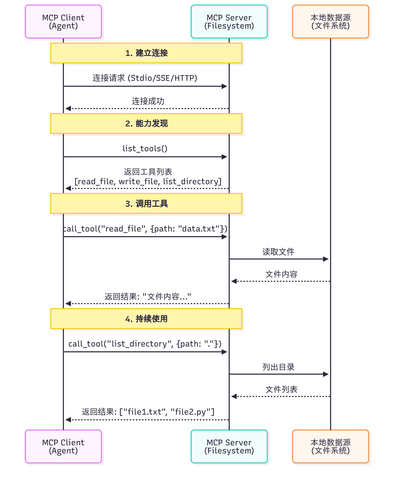

智能体如何决定调用哪些工具？使用MCP会经历以下阶段：

- 工具发现阶段：MCP客户端连接到服务器后，会先调用list_tools()**获取可用工具及其相关信息**（包括名称，功能，参数说明等）
- 上下文构建阶段：Client会将工具列表转换为LLM能够理解的格式并添加到上下文中（🤔：这也就是为什么MCP要求工具提供方格式化声明自身能力，目的是解析工具的功能和调用方法并构建上下文）
- 模型推理：LLM分析用户问题以及可用工具描述，决定要调用哪个工具，该决策**基于工具描述和当前上下文**
- 工具执行：LLM决定调用某个工具，Client会向Server发送请求并执行所选工具并获取结果（实际上执行工具的不是LLM而是执行人类定义的逻辑）
- 结果整合：LLM获取并整合执行结果，进行下一步规划或输出

该过程完全自动化，LLM根据工具描述自动选择工具，并非我们实现写死需要调用什么工具

这里再解释一下工具调用与MCP的区别：

工具调用时LLM的固有能力，目的是解决“**模型何时调用工具**”，对于不同的模型厂商（每个厂商对于工具调用的实现方式可能并不一致）以及不同功能，我们需要手动编写对应的工具函数，而MCP可以解决适配问题，同时提供丰富的别人编写好的工具能力，不用我们再次编写

##### 6.6.2.2 MCP客户端

首先连接到MCP客户端，支持多种连接方式，最常用的是**Stdio**（本地进程通信，以启动Client子进程的方式运行Server实现通信）以及**SSE**（远程HTTP连接）。

连接成功后查询服务器提供了哪些工具，调用list_tools()，代码底层返回的是一个标准的json格式数据。

```python
return [
            {
                "name": tool.name,
                "description": tool.description or "",
                "input_schema": tool.inputSchema if hasattr(tool, 'inputSchema') else {}
            }
            for tool in tools
        ]
```

在调用工具时，需要提供工具名称以及符合JSON Schema的参数,在调用工具时应该加上**重试或者容错机制**避免直接报错：

```python
async def use_tools():
    client = MCPClient(["npx", "-y", "@modelcontextprotocol/server-filesystem", "."])

    async with client:
        # 读取文件(工具名称以及符合JSON Schema的参数)
        result = await client.call_tool("read_file", {"path": "my_README.md"})
        print(f"文件内容：\n{result}")

        # 列出目录
        result = await client.call_tool("list_directory", {"path": "."})
        print(f"当前目录文件：{result}")

        # 写入文件
        result = await client.call_tool("write_file", {
            "path": "output.txt",
            "content": "Hello from MCP!"
        })
        print(f"写入结果：{result}")

asyncio.run(use_tools())
```

通过MCP Server可以获取预定义的提示词模版，Client可以通过调用list_prompts和get_prompt得到MCP服务器中内置的提示词模版以及传入名称使用对应的提示词模版：

```python
# 列出可用提示
prompts = client.list_prompts()
print(f"可用提示：{[p['name'] for p in prompts]}")

# 获取提示内容
prompt = client.get_prompt("code_review", {"language": "python"})
print(f"提示内容：{prompt}")
```

完整示例：

```python
from hello_agents.tools import MCPTool

github_tool = MCPTool(server_command=["npx","-y","@modelcontextprotocol/server-github"])

print("可用工具：")
re = github_tool.run({"action":"list_tools"})
print(re)

print("正在搜索仓库：")
re = github_tool.run({
    "action":"call_tool",
    "tool_name":"search_repositories",
    "arguments":{
        "query":"AI agents language:python",
        "page":1,
        "perpage":3
    }
})

print(re)
```

##### 6.6.2.3 在智能体中使用MCP

在上面的演示代码中是在连接到MCP服务器后写死调用逻辑，而在实际应用中我们希望智能体能够自主调用相应的工具，框架使用MCPTool将该功能集成到智能体中。

我们可以通过指定MCP服务器名称的方式连接到对应的工具服务：

```python
fs_tool = MCPTool(
	name="filesystem",
    description="访问本地文件系统",
    server_command=["npx", "-y", "@modelcontextprotocol/server-filesystem", "."]
)

agent.add_tool(fs_tool)
```

tips:warning:当需要使用多个MCP服务器时，我们必须为每个MCPTool指定不同的名称，这个名称**name会作为前缀**添加到展开的工具前。

一般而言的使用流程：实例化子任务智能体--连接MCP服务器--注册MCP工具--调用工具--整合结果。

##### 6.6.2.4 MCP社区生态

MCP是目前最热门的智能体通信协议，拥有丰富的社区生态，官方和社区开发者已经编写了大量现成的MCP服务，涵盖了文件系统、数据库操作、各类API服务等。

#### 6.6.3 A2A 

A2A由谷歌团队提出，核心理念是实现智能体之间的点对点通信，框架更加关注**智能体之间**的协作。

A2A的设计思想是**对等通信**，每个智能体可以发起请求也可以响应其他智能体的请求，这种设计避免了中心化协调器的瓶颈，让智能体网络更加灵活。

##### 6.6.3.1 A2A的设计思想

在一个多智能体系统中，MCP可以很好地解决智能体与外部工具的交互，但智能体之间也需要交互与协作。

A2A的核心思想是对等通信，而并没有使用传统的中央调度器，原因：

- 中央节点失效会导致整个系统瘫痪
- 所有通信需要中央节点进行调度，限制了并发
- 对智能体系统的扩展需要对中央节点进行修改，可扩展性差

A2A协议采用点对点架构，允许智能体之间直接通信，核心是**任务（Task）和工件（Artifact）**。

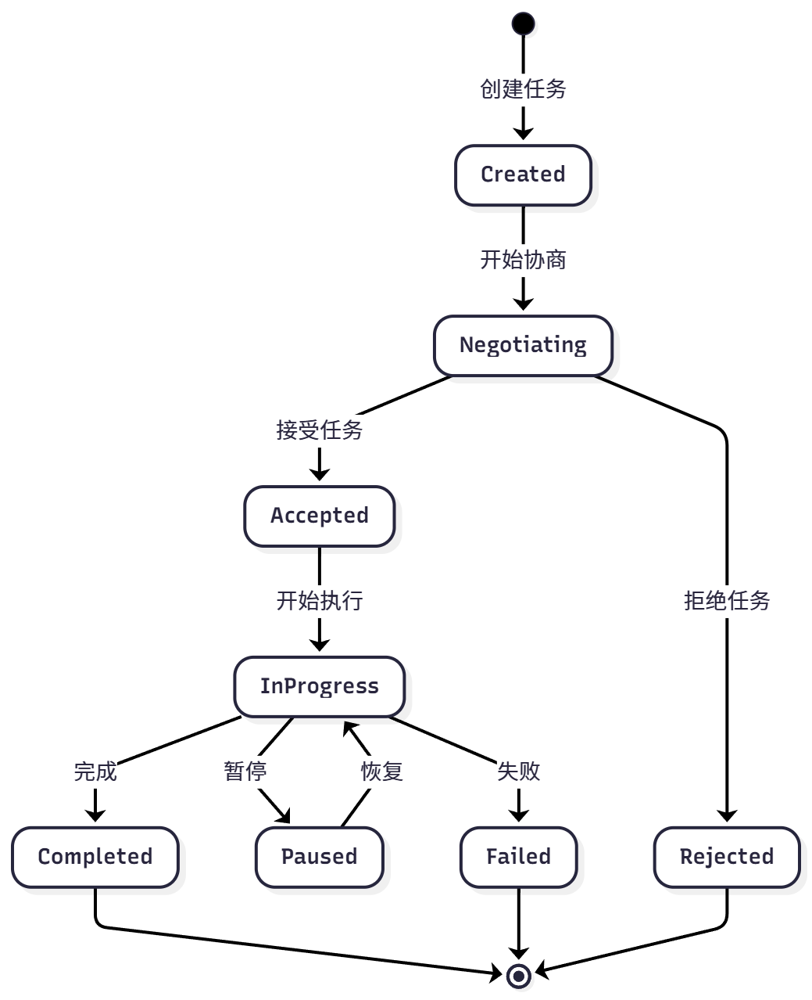

以上是A2A协议下任务的生命周期，包括创建、协商、代理、执行、完成、失败等状态。

A2A 请求生命周期是一个序列，详细说明了请求遵循的四个主要步骤：**代理发现、身份验证、发送消息 API 和发送消息流 API**。

A2A现有实现大部分为示例代码，框架选择继承a2a-sdk来实现部分功能。

##### 6.6.3.2 使用A2A工具

A2A是让智能体既能发请求，又能响应请求，所以我们需要创建A2A Agent服务器和客户端。

首先是服务器(**定义技能并启动一个服务**)：

```python
from hello_agents.protocols import A2AServer
import threading
import time

# 创建研究员Agent服务
researcher = A2AServer(
    name="researcher",
    description="负责搜索和分析资料的Agent",
    version="1.0.0"
)

# 定义技能
@researcher.skill("research")
def handle_research(text: str) -> str:
    """处理研究请求"""
    import re
    match = re.search(r'research\s+(.+)', text, re.IGNORECASE)
    topic = match.group(1).strip() if match else text
    
    # 实际的研究逻辑（这里简化）
    result = {
        "topic": topic,
        "findings": f"关于{topic}的研究结果...",
        "sources": ["来源1", "来源2", "来源3"]
    }
    return str(result)

# 在后台启动服务
def start_server():
    researcher.run(host="localhost", port=5000)

if __name__ == "__main__":
    server_thread = threading.Thread(target=start_server, daemon=True)
    server_thread.start()
    
    print("✅ 研究员Agent服务已启动在 http://localhost:5000")
    
    # 保持程序运行
    try:
        while True:
            time.sleep(1)
    except KeyboardInterrupt:
        print("\n服务已停止")
```

接着是创建客户端与服务器通信(实际上是**调用服务器Agent的能力**)：

```python
from hello_agents.protocols import A2AClient

# 创建客户端连接到研究员Agent
client = A2AClient("http://localhost:5000")

# 发送研究请求
response = client.execute_skill("research", "research AI在医疗领域的应用")
print(f"收到响应：{response.get('result')}")

# 输出：
# 收到响应：{'topic': 'AI在医疗领域的应用', 'findings': '关于AI在医疗领域的应用的研究结果...', 'sources': ['来源1', '来源2', '来源3']}
```

有了CS架构，我们可以创建一个网络：

```python
from hello_agents.protocols import A2AServer, A2AClient
import threading
import time

# 1. 创建多个Agent服务
researcher = A2AServer(
    name="researcher",
    description="研究员"
)

@researcher.skill("research")
def do_research(text: str) -> str:
    import re
    match = re.search(r'research\s+(.+)', text, re.IGNORECASE)
    topic = match.group(1).strip() if match else text
    return str({"topic": topic, "findings": f"{topic}的研究结果"})

writer = A2AServer(
    name="writer",
    description="撰写员"
)

@writer.skill("write")
def write_article(text: str) -> str:
    import re
    match = re.search(r'write\s+(.+)', text, re.IGNORECASE)
    content = match.group(1).strip() if match else text
    
    # 尝试解析研究数据
    try:
        data = eval(content)
        topic = data.get("topic", "未知主题")
        findings = data.get("findings", "无研究结果")
    except:
        topic = "未知主题"
        findings = content
    
    return f"# {topic}\n\n基于研究：{findings}\n\n文章内容..."

editor = A2AServer(
    name="editor",
    description="编辑"
)

@editor.skill("edit")
def edit_article(text: str) -> str:
    import re
    match = re.search(r'edit\s+(.+)', text, re.IGNORECASE)
    article = match.group(1).strip() if match else text
    
    result = {
        "article": article + "\n\n[已编辑优化]",
        "feedback": "文章质量良好",
        "approved": True
    }
    return str(result)

# 2. 启动所有服务
threading.Thread(target=lambda: researcher.run(port=5000), daemon=True).start()
threading.Thread(target=lambda: writer.run(port=5001), daemon=True).start()
threading.Thread(target=lambda: editor.run(port=5002), daemon=True).start()
time.sleep(2)  # 等待服务启动

# 3. 创建客户端连接到各个Agent
researcher_client = A2AClient("http://localhost:5000")
writer_client = A2AClient("http://localhost:5001")
editor_client = A2AClient("http://localhost:5002")

# 4. 协作流程
def create_content(topic):
    # 步骤1：研究
    research = researcher_client.execute_skill("research", f"research {topic}")
    research_data = research.get('result', '')
    
    # 步骤2：撰写
    article = writer_client.execute_skill("write", f"write {research_data}")
    article_content = article.get('result', '')
    
    # 步骤3：编辑
    final = editor_client.execute_skill("edit", f"edit {article_content}")
    return final.get('result', '')

# 使用
result = create_content("AI在医疗领域的应用")
print(f"\n最终结果：\n{result}")
```

tips:apple:这里代码编排在了一起，看似和我直接设计三个智能体然后以层级式的方式将前一个智能体的输出作为后一个的输入没什么区别，但实际上每个智能体已经部署为了一个独立的服务，智能体之间是**低耦合且通过标准协议通信**的，这样对于**跨语言开发，扩展，可监测性**有很大提升，有点微服务的感觉。

#### 6.6.4 ANP

ANP目前是概念性协议框架，没有成熟生态，核心理念是构建大规模智能体网络的基础设施。

ANP的设计哲学是**去中心化服务发现**。

#### 6.6.5 HelloAgent的通信协议架构

框架采用三层设计，包括：协议实现层、工具封装层以及智能体集成层。

- 协议实现层：包含三种协议的具体实现，MCP使用FastMCP库实现、A2A使用a2a-sdk实现、ANP目前停留在概念阶段
- 工具封装层：将协议实现封装成Tool接口，提供统一的run方法
- 智能体集成层：智能体与协议集成，通过Tool这个类来调用

### 6.7 Agent Skills

在之前的章节中，我们提到了MCP，它是模型与外部世界交互的统一接口。既然已经有了MCP，为什么需要Skills，什么是Skills呢🤔

我们从工程实践入手，先看一下以下的示例👀：

```python
from hello_agents import ReActAgent, HelloAgentsLLM
from hello_agents.tools import MCPTool

llm = HelloAgentsLLM()
agent = ReActAgent(name="数据分析助手", llm=llm)

# 连接到数据库 MCP 服务器
db_mcp = MCPTool(server_command=["python", "database_mcp_server.py"])
agent.add_tool(db_mcp)

# 智能体现在可以访问数据库了
response = agent.run("查询员工表中薪资最高的前10名员工")
```

这是一个简单的需求，智能体可以很好地完成，但真实场景中，往往涉及复杂需求：

```python
# 一个更复杂的需求
response = agent.run("""
分析公司内部谁的话语权最高？
需要综合考虑：
1. 管理层级和下属数量
2. 薪资水平和涨薪幅度
3. 任职时长和稳定性
4. 跨部门影响力
""")
```

在当前需求中，智能体需要多次调用工具并结合对结果进行综合性分析，并且每次查询的结果会影响下一次的查询，这时就很容易遇到以下问题：

- 上下文爆炸，MCP服务器会通过多种工具的JSON Schema，当建立连接时会被添加到系统提示词中，导致上下文爆炸
- 能力限制，**MCP仅解决了智能体连接外部的问题，并没有解决智能体如何使用的问题**；如何高效且安全地使用工具极大程度上取决于模型本身的智能程度

有开发者评论说："Skills 和 MCP 是两种东西，Skills 是领域知识，告诉模型该如何做，本质上是**高级 Prompt**；而 MCP 对接外部工具和数据。"

🤔我认为这个说法不够准确，MCP也可以通过Schema声明使用方法，Skills和MCP的核心区别应该体现在渐进式披露上。但实际上Skills确实能够更加明确智能体的职责，MCP还需要自制提示词：

```bash 
# MCP 提供对 GitHub 的标准化访问
github_mcp = MCPTool(server_command=["npx", "-y", "@modelcontextprotocol/server-github"])

# MCP 暴露的工具（简化示例）：
# - list_pull_requests(repo, state)
# - get_pull_request_details(pr_number)
# - list_pr_comments(pr_number)
# - create_pr_comment(pr_number, body)
# - get_file_content(repo, path, ref)
# - list_pr_files(pr_number)

--------------------------------------------------

---
name: code-review-workflow
description: 执行标准的代码审查流程，包括检查代码风格、安全问题、测试覆盖率等
---

# 代码审查工作流

## 审查清单

当执行代码审查时，按以下步骤进行：

1. **获取 PR 信息**：调用 `get_pull_request_details` 了解变更背景
2. **分析变更文件**：调用 `list_pr_files` 获取文件列表
3. **逐文件审查**：
   - 对于 `.py` 文件：检查是否符合 PEP 8，是否有明显的性能问题
   - 对于 `.js/.ts` 文件：检查是否有未处理的 Promise，是否使用了废弃的 API
   - 对于测试文件：验证是否覆盖了新增的代码路径
4. **安全检查**：
   - 是否硬编码了敏感信息（密钥、密码）
   - 是否有 SQL 注入或 XSS 风险
5. **提供反馈**：
   - 严重问题：使用 `create_pr_comment` 直接评论
   - 建议改进：在总结中提出

## 公司特定规范

- 所有数据库查询必须使用参数化查询
- API 端点必须有权限验证装饰器
- 新功能必须附带单元测试（覆盖率 > 80%）

## 示例评论模板

**严重问题**：

⚠️ 安全风险：第 45 行直接拼接 SQL 字符串，存在注入风险。
建议改用参数化查询：`cursor.execute("SELECT * FROM users WHERE id = ?", (user_id,))`

```

#### 6.7.1 Agent Skills的设计理念

Agent Skills是一种标准化的程序性知识封装格式。如果说MCP提供了“手”来操作工具，那么Skills就提供了“操作手册”，引导Agent正确使用工具。核心思想：**连接性（Connectivity）与能力（Capability）应该分离**。

#### 6.7.2 渐进式披露

Skills解决以上两个问题的方式是**渐进式披露机制**。该机制将技能信息分为三个层次，智能体按需逐步加载，遵循“每次提供解决当前任务的最小化信息、工具、权限和能力”原则。

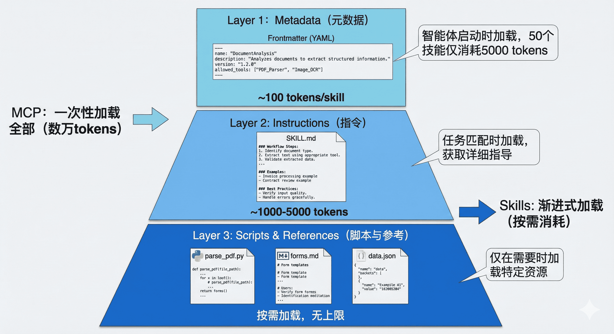

第一层：元数据

在Skills中，每个技能都存放在一个独立的文件夹中，核心是一个名为 `SKILL.md` 的 Markdown 文件。这个文件必须以 YAML 格式的 Frontmatter 开头，定义技能的基本信息。

当智能体启动时，它会扫描所有已安装的技能文件夹，**仅读取每个 `SKILL.md` 的 Frontmatter 部分**，将这些元数据加载到系统提示词中。

💡可以这样理解：元数据层是“技能名片”，目的是让模型了解有哪些能力，至于具体怎么做，在第二层中实现。而MCP则需要加载完整的技能指令和对应的 MCP 工具 Schema。更简单的说就是MCP加载的工具有一些是用不上的，添加到System Prompt会浪费上下文。

举个例子🌰：

```python
---
name: mysql-employees-analysis
description: >
  将中文业务问题转换为SQL查询并分析MySQL employees示例数据库。
  适用于员工信息查询、薪资统计、部门分析、职位变动历史等场景。
  当用户询问关于员工、薪资、部门的数据时使用此技能。
version: 1.0.0
allowed_tools: [execute_sql]
tags: [database, mysql, sql, employees, analysis]
---
```

第二层：技能主体

当智能体决定使用某个技能时，会读取某个特定技能的完整SKILL.md文件，将详细的使用说明添加到System Prompt中，此时智能体获得的是**针对当前所需技能**（而非MCP服务器中的所有工具描述）的完整说明。

第三层：附加资源

对于更复杂的技能，`SKILL.md` 可以引用同一文件夹下的其他文件：脚本、配置文件、参考文档等。智能体**仅在需要时才加载这些资源**。

tips:warning:**这意味着每个 Agent Skill（智能体技能）都必须对应一个独立的文件夹，且该文件夹中必须包含一个名为 SKILL.md 的核心文件以及附属资源（如果有）** 。

例如，一个 PDF 处理技能的文件结构可能是：

```bash
skills/pdf-processing/
├── SKILL.md              # 主技能文件
├── parse_pdf.py          # PDF 解析脚本
├── forms.md              # 表单填写指南（仅在填表任务时加载）
└── templates/            # PDF 模板文件
    ├── invoice.pdf
    └── report.pdf
```

如果只是解析，那么Agent只会调用parse_pdf.py，不会使用forms.md。

关键优势：

- 极大扩展知识容量：如果智能体需要分析大量数据（如1GB的数据文件），那么智能体可以执行当前技能文件夹下的附属资源脚本来获取数据分析结果，把这些结果放到上下文而非加载整个数据集合。
- 确定性执行：复杂的计算、转换逻辑已在附属资源脚本中执行，无需LLM额外生成，降低不确定性，提高整体的鲁棒性。

Agent Skills VS MCP：

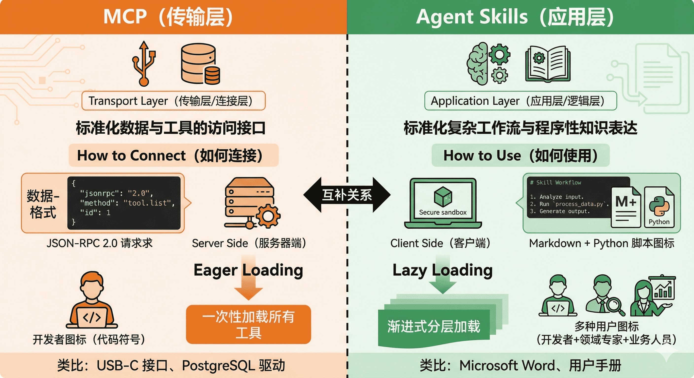

MCP是一种**Eager Loading（急切加载）**的管理策略，而Skills是**Lazy Loading（惰性加载）**。

#### 6.7.3 Skills + MCP混合架构

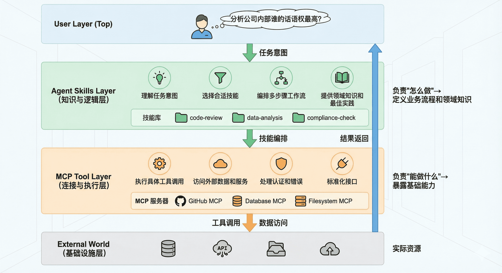

这种架构的优势是：

- **关注点分离**：MCP 专注于"能力"，Skills 专注于"智慧"
- **成本优化**：渐进式加载大幅降低 token 消耗
- **可维护性**：业务逻辑（Skills）与基础设施（MCP）解耦
- **复用性**：同一个 MCP 服务器可以被多个 Skills 使用

#### 6.7.4 Skills设计规范

根据Anthropic官方文档的指导，编写有效Skills需要遵循以下原则：

1.精准的description

这是智能体了解技能的唯一标识，在设计时应该**明确适用范围，能于其他技能区分开来**。

2.模块化以及单一职责

一个Skills专注于一个任务，这样更好编写提示词以适配特定任务。

3.**确定性优先原则**

对于复杂或需要执行的任务，我们可以在附属文件中编写相应脚本然后在SKILLS.md中指导智能体即可，可以大幅降低出错的概率。

#### 6.7.5 挑战与风险

Skills在发展的过程中也会遇到挑战与风险：

- Skills包含可执行的脚本，存在代码注入的风险
- 三方技能可信度难以验证
- 随着Skills的增加，同样会出现上下文爆炸的问题，亟需更加智能的技能检索机制
- Skills格式尚未统一，又可能出现不同厂商不同格式需要单独进行适配的问题

## 七、技术附录

### 7.1 Playwrite

Playwright 是微软于 2020 年 1 月 31 日开源的**浏览器自动化与端到端（E2E）测试工具**，核心是用一套 API 控制主流浏览器，解决现代 Web 应用测试痛点。

典型用途

1. **端到端测试**：模拟用户真实操作，验证整个应用流程（登录、购物、表单提交等）
2. **Web 自动化**：爬虫、数据采集、批量操作、UI 自动化
3. **兼容性测试**：一套脚本在多浏览器 / 多设备上验证表现一致

### 7.2 OpenClaw

2025 年底开源的 AI Agent 框架，GitHub 星标超 28 万，是当前最火的本地执行型 Agent 底座。

核心技术架构（专业拆解）

OpenClaw 是**执行层框架**，不内置大模型，而是作为统一网关，连接 “大脑” 与 “手脚”，形成完整执行闭环：

1. 大脑层（LLM 网关）
   - 接入 GPT、Claude、DeepSeek、Kimi 等主流大模型，负责**任务理解、规划、推理、纠错**。
   - 支持多模型切换与混合调用，提升复杂任务成功率。
2. 执行层（数字手脚）
   - **API 执行**：通过官方接口操作文件、邮件、数据库、飞书 / 钉钉等，稳定高效。
   - **键鼠模拟（RPA）**：对无接口的老软件，模拟真人点击、输入，实现全系统覆盖。
   - **沙箱安全**：默认在隔离环境运行，降低误操作风险。
3. 技能层（Skills）
   - 可插拔的执行模块（如 Excel 分析、PPT 生成、邮件汇总、代码编写），用户可自定义或安装社区插件。
4. 记忆层
   - 短期上下文记忆 + 长期用户偏好记忆，越用越 “懂你”，减少重复配置。

### 7.3 Len Space播客

### 7.4 旅游助手扩展思路

1.在知乎、小红书、B站等平台获取旅游相关资讯，如旅游攻略，景点介绍等，将其作为参考知识存入向量数据库，结合用户的需求提取具有重叠部分的内容，这样既解决了个性化的问题又可以利用优质攻略资源。😃

### 7.5 TCP/IP协议

**TCP/IP 是互联网最核心的一套通信规则集合**，所有设备（电脑、手机、服务器）想连上网、互相收发数据，都必须遵守它。

1. IP 协议（Internet Protocol）

**负责：地址定位 + 数据包转发**

- 给每个设备分配 **IP 地址**

- 把数据切成一个个**数据包（Packet）**

- 只负责：**发到哪个地址，走哪条路**

- 不保证：数据包不丢、不乱序、不重复

通过IP把资源发送到目标地址，**主要目的是定位**

2. TCP 协议（Transmission Control Protocol）

**负责：可靠传输 + 纠错 + 顺序保证**

作用像**可靠快递，带签收、重发、排序**。

- 在 IP 的基础上，建立**可靠连接**
- 三次握手建立连接
- 保证：
  - 数据不丢失
  - 不乱序
  - 不重复
  - 出错重传

**TCP 保证数据完整、有序、可靠。**

三次握手：

标准流程（客户端 ↔ 服务器）

第一次握手：客户端 → 服务器

- 客户端发：`SYN`
- 意思：**我想和你建立连接**

第二次握手：服务器 → 客户端

- 服务器发：`SYN + ACK`
- 意思：
  - `ACK`：收到你的请求
  - `SYN`：**我也想和你建立连接**

第三次握手：客户端 → 服务器

- 客户端发：`ACK`
- 意思：**收到你的同意，连接正式建立**

为什么是三次而不是两次🤔：

两次只能确认：客户端能发，服务器能收；不能确认服务器能不能发，客户端能不能收

四次挥手：

主要流程：我关了 → 收到 → 我也关了 → 收到，彻底断开

TCP是双全工通信（两条独立通道），双方都可以发送数据，关闭连接时需要保证双方都发完了。

### 7.6 交叉编码器

交叉编码器常常用于重排模型，简单而言它的流程是将两段待比较的文本拼接在一起形成一个整体，模型可以“看到”👀这个整体的语义（也就可以理解前后两部分的语义），最后输出一个相关性得分。

### 7.7 Restful API

什么是 RESTful API

简单说：**RESTful API 是一种设计风格、一套接口规范**，用来让前端 / 客户端和后端服务器之间更规范、更清晰地交互数据。

| HTTP 方法 | 作用            | 典型用法                   |
| --------- | --------------- | -------------------------- |
| GET       | 查询 / 获取资源 | GET /users 获取用户列表    |
| POST      | 新建资源        | POST /users 创建用户       |
| PUT       | 全量更新资源    | PUT /users/1 修改用户 1    |
| DELETE    | 删除资源        | DELETE /users/1 删除用户 1 |

### 7.8 异步

异步是一种并发编程模型，核心思想是在等待I/O时切换任务，而不是阻塞线程。Python中通过`asyncio`库和`async/await`语法实现。

在Agent开发中，异步非常重要。比如我们同时调用多个工具或并行调用LLM，如果用同步方式，一个请求慢就会拖垮整体。异步可以让我们在一个事件循环里高效调度多个协程，提升吞吐量。

举个实际例子：在开发配货建议Agent时，可能需要同时查询SAP库存、飞书文档中的促销政策、以及历史销售数据。如果串行执行，耗时是三者之和；如果用`asyncio.gather`并发执行，耗时只取决于最慢的那个。这样能显著提升用户体验。

当然，异步也带来复杂性，比如需要小心处理共享状态、避免阻塞事件循环（比如不要在协程里做CPU密集型计算），以及正确管理异常和超时。我们通常会结合`asyncio.timeout`、`asyncio.TaskGroup`（Python 3.11+）来保证健壮性。

1. **协程（Coroutine）**
   用`async def`定义的函数，调用时返回一个协程对象，不会立即执行。需要通过`await`等待其执行完成。
2. **事件循环（Event Loop）**
   负责调度和执行协程。它维护一个任务队列，循环取出就绪的任务执行，遇到`await`就挂起当前任务，切换到其他任务。
3. **可等待对象**
   `await`后面可以跟协程、`Future`、`Task`等。`asyncio.create_task()`可以把协程包装成任务，让它在后台并发执行。

### 7.9 HTTP VS gRPC

**HTTP**：基于文本、通用、简单、跨平台友好，适合**API 接口、浏览器、前后端交互**。

**gRPC**：基于 HTTP/2、Protobuf、二进制协议，性能更强，适合**微服务内部通信、高性能场景**。

| 对比项     | HTTP                         | gRPC                         |
| ---------- | ---------------------------- | ---------------------------- |
| 传输协议   | HTTP/1.1、HTTP/2             | 基于 HTTP/2                  |
| 数据格式   | 文本（JSON/XML）             | 二进制（Protobuf）           |
| 性能       | 一般                         | 高（更小、更快）             |
| 调用方式   | 请求 - 响应                  | 请求 - 响应 + 多种流式       |
| 可读性     | 人类可读                     | 不可读                       |
| 浏览器支持 | 原生支持                     | 需 grpc-web 或代理           |
| 接口约束   | 弱约束（REST 风格）          | 强约束（.proto 契约）        |
| 适用场景   | 对外 API、前后端、第三方对接 | 微服务内部、高性能、流式场景 |

### 7.10 ComfyUI

**ComfyUI** 是一款**开源、节点式、全流程可控**的 Stable Diffusion（及各类生成式 AI 模型）可视化操作界面与推理引擎，主打**灵活、高效、可定制**，是当前专业 AI 创作与研发的主流工具。是一款图像节点式生成工具。

所有操作（加载模型、提示词、采样、ControlNet、后期、输出）均为**独立节点**

拖拽连线构建**数据流图**，直观看到每一步逻辑

支持**分支、并行、循环、条件判断**，可做复杂 pipeline（如同时跑 3 种风格、批量处理）

工作流可**保存 / 导出 / 分享**（JSON / 图片元数据），一键复用他人流程

### 7.11 Python中的深拷贝和浅拷贝

| 方式     | 顶层对象修改 | 嵌套对象修改 | 适用场景                   |
| -------- | ------------ | ------------ | -------------------------- |
| 直接赋值 | 影响原数据   | 影响原数据   | 同一个数据的不同别名       |
| 浅拷贝   | 不影响       | **影响**     | 无嵌套的简单数据，节省内存 |
| 深拷贝   | 不影响       | 不影响       | 有嵌套，需要完全独立的数据 |

```python
import copy

# 原始数据：包含 顶层元素 + 嵌套列表
original = [1, 2, [3, 4]]

# ========== 1. 浅拷贝 ==========
shallow = original.copy()

# 修改浅拷贝的 顶层元素
shallow[0] = 99
print("浅拷贝-修改顶层：", original)  # [1, 2, [3, 4]] → 原数据不变

# 修改浅拷贝的 嵌套列表
shallow[2].append(5)
print("浅拷贝-修改嵌套层：", original)  # [1, 2, [3, 4, 5]] → 原数据被改了！

# ========== 2. 深拷贝 ==========
deep = copy.deepcopy(original)
deep[2].append(6)
print("深拷贝-修改嵌套层：", original)  # [1, 2, [3, 4, 5]] → 原数据完全不变
```

浅拷贝 (Shallow Copy)

- 方式：`列表.copy()` / `切片[:]` / `dict.copy()` / `copy.copy()`
- 效果：**只复制顶层对象**，嵌套的可变对象（列表里的列表）**共用**
- 结论：改顶层不影响原数据，改嵌套层会影响

深拷贝 (Deep Copy)

- 方式：`copy.deepcopy()`
- 效果：**递归复制所有层级**，完全创建新对象，和原对象彻底无关
- 结论：无论怎么修改，都不会影响原数据

