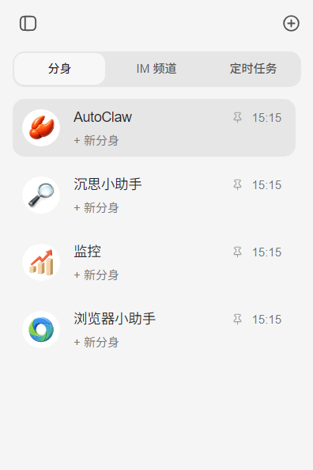
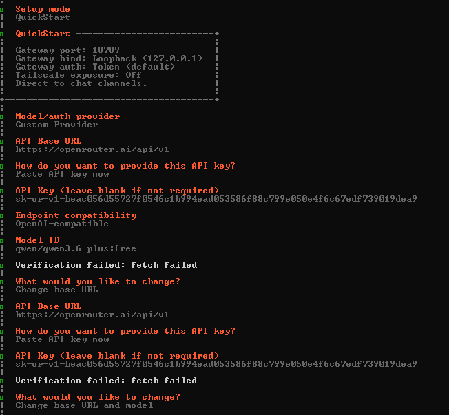

# OpenClaw学习笔记

最近“龙虾”在网络上很火爆，它是一种智能体工具，这里开一个新坑，对其进行系统性的学习与实践，冲冲冲！😊

## 一、安装与入门指南

### 1.1 封装式安装

在Windows操作系统下，我们直接前往官网下载客户端进行安装：https://autoglm.zhipuai.cn/autoclaw（这里使用的是智谱的封装版桌面应用）。

这里没有从官方的repo源码构建，使用的是一键安装的方式，无需安装Node.js，无需配置API KEY，同时内部预置了多种热门Skills，能够快速上手。



在界面左侧有四个默认的分身：

| 分身              | 一句话介绍           | 怎么用                                               |
| :---------------- | :------------------- | :--------------------------------------------------- |
| **AutoClaw**      | 通用助手，什么都能干 | 直接描述你的目标                                     |
| **沉思小助手**    | 深度调研             | 在提示词的【】中填入调研方向                         |
| **监控**          | 定时提醒             | 填入时间和监控对象（如股票代码）主要用于完成定时任务 |
| **Browser Agent** | 浏览器操作           | 描述你想让它在网页上做的事                           |

### 1.2 手动安装

我们在Windows操作系统下手动安装：

首先打开powershell（管理员模式），运行以下命令(推荐安在D盘)：

```bash
Set-ExecutionPolicy -ExecutionPolicy RemoteSigned -Scope CurrentUser
iwr -useb https://openclaw.ai/install.ps1 | iex
```

接下来验证一下版本：

```bash
openclaw --version
```

openclaw要求Node.js版本≥22.14.0，按照提示进行升级。

安装完成后按照向导要求进行配置：



接下来验证运行状态：

```bash
openclaw status
```


### 1.3 快速开始

这里我们通过一个小案例进行体验，切换到Browser Agent分身，输入我们的需求：

```bash
到小红书搜索关于西南科技大学的最热门的笔记，选五个整理一下笔记的内容、点赞数和前三条评论到Excel里，放在桌面就行，名字叫“笔记整理”。
```

首次完成该任务智能体会提醒我们安装浏览器扩展，我们按照要求安装即可。

接下来智能体会单独打开浏览器，同时让我们登录自己的小红书账号。

最后等待任务完成...

我们就可以在桌面看到整理好的Excel文件了😊

仅仅这一个小的任务，就花费了300积分（101k的token），贵~

智能体的任务执行速度也比较慢，感觉不太好用。